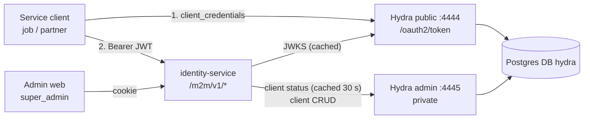
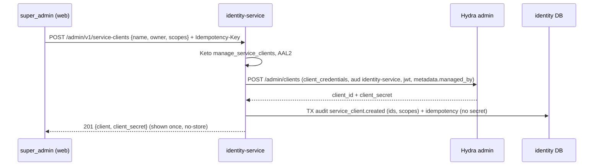

# Architecture — Machine-to-machine access with Ory Hydra

## 1. Context

- **Hydra** is used only as an OAuth2 authorisation server for
  `client_credentials`. No login/consent app, no OIDC for people. First-party
  apps keep using Kratos sessions (ADR-0002 still holds for them).
- **identity-service** is the resource server: it verifies JWTs offline
  (JWKS), enforces audience + scope, and is the only component that talks to
  the Hydra admin API (client management, client-status lookups).

## 2. Planes (credential bound to plane)

| Plane | Prefix | Credential | Authorisation |
| --- | --- | --- | --- |
| Customer | `/v1/*` | Kratos session token (Bearer) | self |
| Admin | `/admin/v1/*` | Kratos cookie, AAL2 | Keto `Console:main` |
| **Machine** | `/m2m/v1/*` | **Hydra JWT (Bearer)** | **OAuth2 scope per route** |

A Hydra JWT on `/v1` fails Kratos whoami → 401. A Kratos token on `/m2m` isn't
a JWT → 401. The machine middleware never falls back to Kratos.

## 3. Token verification (RFC 9068 / RFC 8725 practices)

1. `Authorization: Bearer <jwt>`. Anything else → 401 `invalid_token`.
2. Parse the header. `alg` must be RS256 or ES256. `kid` is required.
3. Verify the signature with the key from the cached JWKS. On an unknown
   `kid`, refresh the JWKS at most once per 10 s.
4. Check the claims:
   - `iss` equals `M2M_ISSUER`;
   - `aud` contains `identity-service`;
   - `exp`, `nbf` and `iat` pass with a 30 s leeway;
   - `client_id` is present;
   - `scp` is an array.
5. Check client status: look the client up through the Hydra admin API
   (`GET /admin/clients/{id}`), cached 30 s, with deletes purging the cache
   entry. If the client is gone, return 401. If Hydra is unreachable and there
   is no cache entry, return 503.
6. Check that the route's scope is in `scp`. If not, return 403
   `insufficient_scope`.
7. Rate limit per client: 600 requests/min, otherwise 429.

The principal is `MachinePrincipal{ClientID, Scopes}`. Logs and metrics carry
`client_id`, never the token.

## 4. Service-client management

- The metadata `{managed_by: "identity-service", owner, created_by}` marks the
  clients we own. List and get only show those.
- **Rotate**: generate a 32-byte random secret, `PUT` the client with it, and
  return the secret once. The previous secret stops working immediately.
- **Delete**: `DELETE` the client and purge the status cache. Other replicas
  pick it up within 30 s.
- **Idempotent replay** returns the client without the secret, since secrets
  are never stored. Clients should retry with rotate instead.
- **Ordering**: these follow the audited-mutation strategy (`app/mutation.go`):
  audit INSERT, then the Hydra call, then COMMIT. Create works the same way
  as the admin invite: reserve the key, call Hydra, then a tx, with
  compensation (delete the client) if the tx fails.

## 5. Keto

New permit `manage_service_clients` = `super_admins` only.

## 6. Compose

| Service | Notes |
| --- | --- |
| `hydra-db` | One-shot `postgres:16-alpine` job. Idempotently creates role `hydra` and DB `hydra` (works on existing volumes) |
| `hydra-migrate` | `migrate sql up -e --yes` |
| `hydra` | `serve all --dev`, which allows plain HTTP locally, the same as Kratos (never `--dev` in production; TLS is terminated at the ingress there). Public `4444` on the host, admin `127.0.0.1:4445`. Config `deploy/ory/hydra/hydra.yml` with `strategies.access_token: jwt`, `ttl.access_token: 5m`, issuer `http://localhost:4444` |

identity-service settings:
- `HYDRA_ADMIN_URL=http://hydra:4445`;
- `M2M_JWKS_URL=http://hydra:4444/.well-known/jwks.json`;
- `M2M_ISSUER=http://localhost:4444`;
- `M2M_AUDIENCE=identity-service`.

## 7. Failure behaviour

| Failure | Result |
| --- | --- |
| Hydra down | New tokens can't be issued. Existing tokens keep working while the JWKS and client status are cached; otherwise the call fails with 503 |
| JWKS key rotated | Unknown `kid`, so the service refreshes the JWKS, rate-limited |
| Client deleted | 401 within 30 s |
