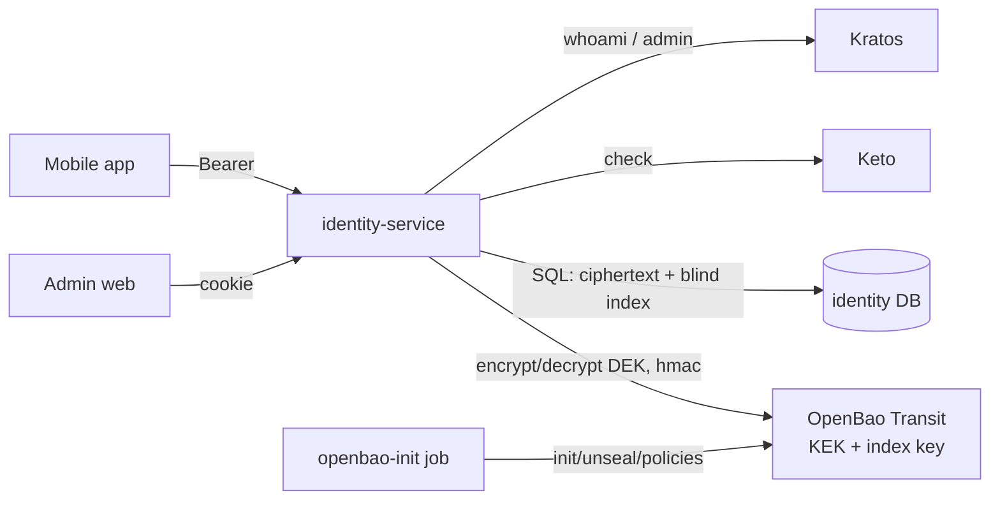
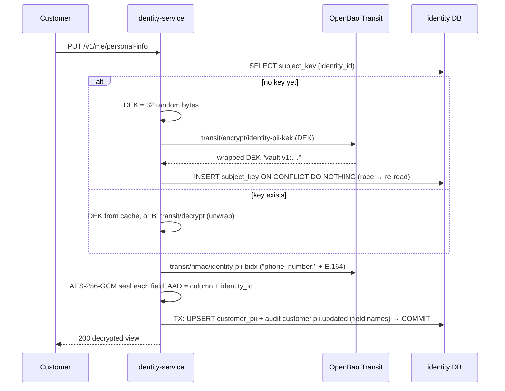

# Architecture — Encrypted personal information

## 1. Context

The service is the **only** place plaintext PII exists, and only in memory for
the duration of a request. PostgreSQL holds ciphertext, wrapped data keys and
keyed hashes. OpenBao holds the key-encryption key (KEK) and the blind-index
key; neither is exportable.

## 2. Envelope encryption (NIST SP 800-57, SP 800-38D)

- **One DEK per customer** (`subject_key`), identified by a random `key_id`.
  The per-subject key makes erasure a single DELETE (crypto-shredding) and
  limits the blast radius of a leaked DEK to one person.
- **Ciphertext format** (`bytea`): `0x01 ‖ nonce(12) ‖ ciphertext ‖ tag(16)`.
  The leading byte is the format version.
- **AAD**: `identity-service/customer_pii/<column>/<identity_id>/v1`. A
  ciphertext copied to another column or row fails authentication.
- **DEK cache**: in-process LRU keyed by `key_id`, TTL 5 min, max 10 000
  entries, evicted on erase. Because a re-created key gets a new `key_id`,
  another replica's stale cache entry can never decrypt new data.

## 3. Blind index (CipherSweet / "searchable encryption" pattern)

`phone_bidx = HMAC-SHA256(index_key, "phone_number:" ‖ E.164)` computed by
OpenBao (`transit/hmac`), stored as raw 32 bytes plus `bidx_key_version`.
Equality lookup only; the domain prefix prevents cross-field correlation.
Only `phone_number` is indexed. Lookups send the phone in the request body,
never in the URL (URLs end up in access logs).

## 4. Access model

| Actor | Operation | Control |
| --- | --- | --- |
| Customer | read / replace / erase own PII | Bearer session, `kind=customer`, verified email for writes |
| supporter, admin, super_admin | masked view, phone lookup | Keto `view_customers`, AAL2 admin gate |
| admin, super_admin | full reveal | Keto `reveal_customer_pii` + reason (10–200 chars); audit row committed **before** the response |

Masking happens in the domain layer on decrypted values, so the masked shape
is the same everywhere. Revealed responses carry `Cache-Control: no-store`
(already global).

## 5. Erasure (GDPR Art. 17 — crypto-shredding)

`DELETE /v1/me/personal-info` → TX: audit `customer.pii.erased`, `DELETE
subject_key` (cascades to `customer_pii`) → COMMIT → evict cache. Ciphertext
left in WAL, replicas or backups is unreadable once its wrapped DEK is gone
from every copy; backups age out within the retention window ("put beyond
use"). The KEK itself is shared and is not destroyed.

## 6. Key lifecycle

| Event | Who | How |
| --- | --- | --- |
| KEK creation | openbao-init | `aes256-gcm96`, `exportable=false`, `allow_plaintext_backup=false` |
| KEK rotation | operator token | `transit/keys/identity-pii-kek/rotate` (`make kek-rotate`) |
| Re-wrap DEKs | `identity-service keys rewrap` (app token) | batches of 100, `transit/rewrap`, optimistic UPDATE `WHERE wrapped_dek = old`; idempotent |
| Retire old KEK versions | operator | `min_decryption_version` after re-wrap |
| Index key rotation | — | not supported in v1 (needs a re-index job); documented |

## 7. Local infra (Docker Compose)

- `openbao` (`openbao/openbao:2.4.1`): `file` storage on volume `openbao-data`,
  TCP listener without TLS on the compose network, host port `127.0.0.1:8200`.
- `openbao-init` (one-shot, same image): initialise (1 share, local only) →
  store init output on volume `openbao-keys` → unseal → enable transit →
  create keys → write policies `identity-service` and `identity-pii-operator`
  → write a periodic app token to volume `openbao-app-token`. Every run is
  idempotent and unseals after restarts.
- `identity-service` mounts `openbao-app-token` read-only and renews its
  periodic token itself. It depends on `openbao-init` completing.
- Production: auto-unseal (cloud KMS), TLS, Kubernetes auth instead of a token
  file, or a cloud KMS provider behind the same `KeyManager` port.

## 8. Failure behaviour

| Failure | Behaviour |
| --- | --- |
| OpenBao down / sealed | PII endpoints → 503 `pii_unavailable`; cached DEKs still serve reads until TTL; readiness unaffected |
| Decrypt authentication failure | 500 `internal`, log `pii_decrypt_failed` with identity id + column only |
| Token expired | Renewal loop logs `openbao_token_renew_failed`; requests fail closed (503) |

## 9. Compliance mapping

| Control | GDPR | Decree 13/2023/ND-CP | OWASP ASVS 4 | NIST |
| --- | --- | --- | --- | --- |
| Field-level AEAD encryption | Art. 32(1)(a) | Art. 26, 28 (sensitive data measures) | V6.2.1–6.2.5, V8.3.7 | SP 800-38D |
| KEK in KMS, non-exportable | Art. 32 | Art. 26 | V6.4.1–6.4.2 | SP 800-57 Pt 1 |
| Masking + JIT reveal + audit | Art. 5(1)(c), 25 | Art. 3 (minimisation) | V8.3.4, V7.1 | — |
| Crypto-shredding erasure | Art. 17 | Art. 16 (right to delete) | V8.3.2 | SP 800-88 (crypto erase) |
| Blind index (no plaintext search) | Art. 25 | — | V6.2.x | — |
