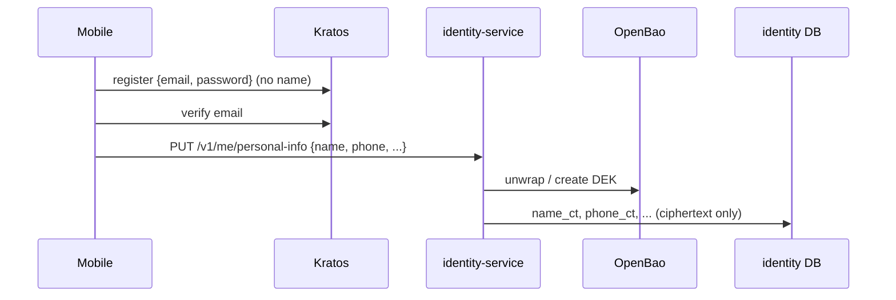

# Architecture — Customer name as encrypted PII

## Where customer personal data lives (after)

| Data | Store | At rest |
| --- | --- | --- |
| email (login identifier) | Kratos DB (`identities.traits`, credential identifiers, verifiable/recovery addresses, courier messages) | plaintext — required by Kratos; DB isolation + volume/backup encryption (accepted risk, 06-security) |
| **name {first, last}** | identity DB `customer_pii.name_ct` | **AES-256-GCM under the customer DEK** (new) |
| phone, DOB, address, national id | identity DB `customer_pii.*_ct` | AES-256-GCM (unchanged) |
| display_name (nickname), avatar, locale | identity DB `profile` | plaintext, class *internal* — must not be the real name |

Kratos `customer` schema: `traits = {email}` only. `admin` schema unchanged.

## Flows



Migration (one-shot CLI, idempotent):

```mermaid
sequenceDiagram
  participant M as pii migrate-kratos-names
  participant K as Kratos admin
  participant DB as identity DB
  loop customers with traits.name (paged)
    M->>DB: erased? / has name_ct?
    alt neither
      M->>DB: BEGIN; audit customer.pii.name_migrated; set name_ct (create DEK if none); COMMIT
    end
    M->>K: PATCH identity [test /traits/name = old, remove /traits/name]
  end
```

Crash between COMMIT and PATCH → name still in Kratos, PII has it → re-run takes branch "has name" and only strips.

## Rollout order

1. DB migration 0005 (`name_ct`). 2. identity-service with the name field and CLI.
3. Kratos with the new `customer` schema. 4. Run `pii migrate-kratos-names`.
Between 3 and 4 identities still carrying `name` can log in but a settings
update would fail schema validation; keep the window short (locally `./dev up`
does 1–4 in one go).
