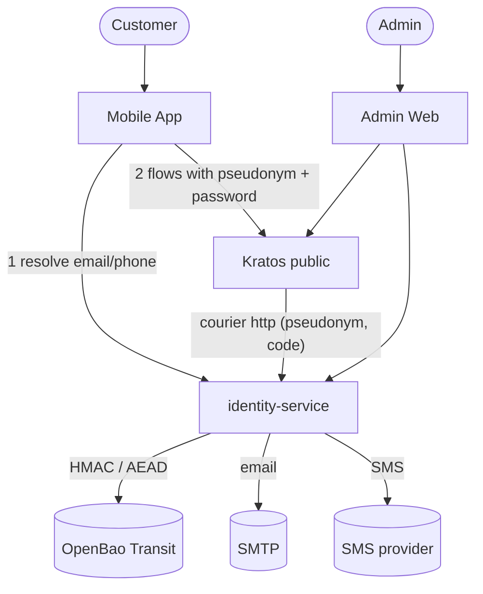
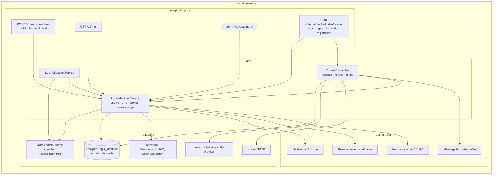
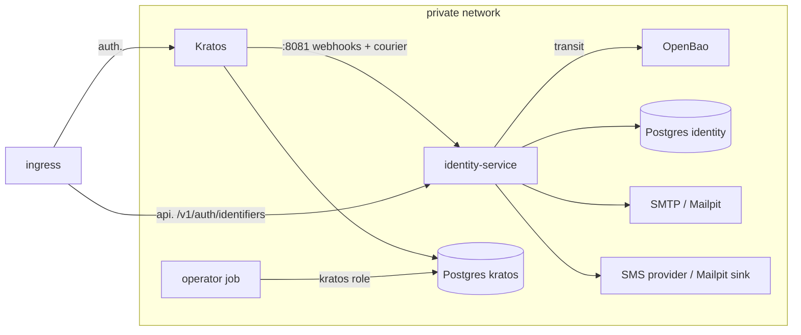

# Architecture — Pseudonymous customer login identifiers

Inputs: requirements.md (PLI-*), feasibility-assessment.md (spikes S1–S6),
constraint-register.md (HC-*, R-*).

## 1. Options considered

| Option | Summary | Trade-offs | Verdict |
| --- | --- | --- | --- |
| **A. Resolve-then-submit** | Client calls `POST /v1/auth/identifiers` → gets the pseudonym → runs the Kratos native flow directly with the pseudonym. Kratos courier `http` → identity-service resolves and delivers | + Passwords/codes never touch our code (HC-01). + No Kratos fork. − One extra round trip per flow. − Resolve is an oracle (rate-limited, R-02). − Registration/sign-in depend on identity-service (R-01) | **Chosen** |
| B. Body-rewriting reverse proxy in front of Kratos public | Proxy parses every self-service request and swaps the identifier | Passwords transit our code; must re-implement Kratos error/flow semantics, CSRF passthrough; exactly the rejected "option D" of 01-overview §1.5 | Rejected (HC-01) |
| C. Ciphertext trait + HMAC identifier in Kratos | Kratos stores `login_id = HMAC` and `contact_ct = AEAD(address)` in traits | Ciphertext lives in a DB we cannot crypto-shred by ledger; two traits to keep consistent; clients would need the ciphertext (or a proxy) at registration; courier still needs our resolution | Rejected — strictly more complex than A with no gain |
| D. identity-service as the customers' OIDC IdP (Kratos `oidc` method) | Customers authenticate at our IdP; Kratos sees only a subject | We would store and verify passwords (forbidden), plus OAuth2 lifecycle | Rejected (HC-01, ADR-0002) |

Vault encryption sub-options:

| Option | Verdict |
| --- | --- |
| **Direct Transit AEAD** with dedicated key `identity-login-kek`, `associated_data` = context (S6) | **Chosen** — value ≤ 320 B; batch decrypt per admin page; no DEK cache needed |
| Per-customer DEK (`subject_key`, ADR-0011) | Rejected — the address must be stored **before** the identity exists (registration), and the login contact must survive a personal-info erase |
| Per-entry DEK (envelope) | Rejected — two round trips for no added property over direct AEAD on a tiny value |

## 2. Context (C4 L1 delta)



## 3. Components (C4 L2/L3 delta)



### Responsibilities

| Component | Owns | Never |
| --- | --- | --- |
| `domain/login` | Typed identifier, normalisation, pseudonym format (`<b32>@login.invalid`), masking, message templates | I/O |
| `LoginIdentifierService` | Resolve (HMAC), persist on registration, bind to identity, decrypt for owner / admin (masked / reveal), lookup by contact, purge unbound & orphaned rows | Accept passwords; log values |
| `CourierDispatcher` | Validate courier payload, dedupe, resolve pseudonym recipients, render localised messages, route to email/SMS, pass admin (plaintext) recipients through | Persist codes; forward Kratos bodies for pseudonym recipients |
| `LoginMigrationService` | Rewrite legacy customers (`traits.email`) to `traits.login_id` with the two-patch protocol | Touch admin identities |
| OpenBao | `identity-login-pseudonym` (HMAC, v1 pinned), `identity-login-kek` (aes256-gcm96) | Export keys |
| Kratos | Credentials and addresses keyed by pseudonym; flow logic; courier queue + retry | Hold any customer address |
| Mobile | Ask resolve before each identifier-taking flow; show contact from `/v1/me` | Hold any key |

## 4. Data model (identity DB, migration `0006`)

```sql
CREATE TABLE login_identifier (
  pseudonym       bytea PRIMARY KEY CHECK (octet_length(pseudonym) = 32), -- raw HMAC
  kind            text  NOT NULL CHECK (kind IN ('email','phone')),
  value_ct        text  NOT NULL,          -- Transit "vault:vN:…" (AEAD)
  kek_version     int   NOT NULL,
  identity_id     uuid  UNIQUE,            -- NULL until bound
  bound_at        timestamptz,
  legacy_verified boolean NOT NULL DEFAULT false, -- migration only
  created_at      timestamptz NOT NULL DEFAULT now(),
  CHECK ((identity_id IS NULL) = (bound_at IS NULL))
);
CREATE INDEX login_identifier_unbound ON login_identifier (created_at) WHERE identity_id IS NULL;

CREATE TABLE courier_dispatch (
  dedupe_key  bytea PRIMARY KEY CHECK (octet_length(dedupe_key) = 32),
  created_at  timestamptz NOT NULL DEFAULT now()
);
```

- AEAD associated data: `"identity-service/login/v1" ‖ 0x00 ‖ kind ‖ 0x00 ‖ hex(pseudonym)`
  — a ciphertext moved to another row or relabelled with another kind fails (PLI-NFR-03).
- HMAC input: `"login-id/v1" ‖ 0x00 ‖ kind ‖ 0x00 ‖ normalised value`; Transit
  `hmac/identity-login-pseudonym/sha2-256`, `key_version=1`.
- Pseudonym string: `base32_lower_nopad(hmac) + "@login.invalid"` (52 chars local part, S1).
- Column grants follow migration 0004's pattern: the service role gets
  SELECT/INSERT/UPDATE/DELETE on both tables, nothing else.

## 5. Key flows

### 5.1 Registration (mobile)

```mermaid
sequenceDiagram
  autonumber
  participant A as Mobile
  participant S as identity-service
  participant B as OpenBao
  participant K as Kratos public
  participant M as SMTP/SMS
  A->>S: POST /v1/auth/identifiers {type, value, purpose: registration}
  S->>S: normalise, IP limits
  S->>B: hmac(pseudonym key) ; encrypt(login kek, AD)
  S->>S: INSERT login_identifier ON CONFLICT DO NOTHING
  S-->>A: {identifier: "<b32>@login.invalid"}
  A->>K: POST /self-service/registration {traits.login_id, password}
  K->>S: pre-registration webhook (parse:true) {login_id}
  S-->>K: 200 (row exists) | 400 messages on #/traits/login_id
  K->>K: persist identity, session
  K->>S: after-registration webhook {identity_id, login_id} → bind row
  K->>S: courier http {recipient: pseudonym, verification_code}
  S->>S: dedupe, decrypt address, render vi/en
  S->>M: email or SMS
```

### 5.2 Sign-in / recovery / verification

Client → resolve (`purpose: sign_in|recovery|verification`, no write) →
Kratos flow with the pseudonym. Recovery to an unknown pseudonym sends nothing
(S2b). Re-authentication in settings uses `session.identity.traits.login_id`.

### 5.3 Courier dispatch decision

```mermaid
flowchart TD
  in[courier payload] --> v{api key ok · schema ok}
  v -- no --> r401[401/400]
  v -- yes --> d{dedupe key seen < 24h?}
  d -- yes --> ok200[200, nothing sent]
  d -- no --> p{recipient is pseudonym?}
  p -- no --> adm{template identity schema = admin?}
  adm -- yes --> send_admin[render from Kratos subject/body → SMTP]
  adm -- no --> refuse[422 + metric courier_plaintext_customer<br/>(legacy customer: pass through until migrated, see §7)]
  p -- yes --> row{vault row?}
  row -- no --> u[422 + courier_unresolved_total]
  row -- yes --> bind{row bound to other identity?}
  bind -- yes --> c[409 + metric]
  bind -- no --> dec[decrypt → render own template → email/SMS]
  dec -- provider error --> e5[502 → Kratos retries]
  dec -- ok --> mark[INSERT dedupe key] --> ok
```

Dedupe key = `SHA-256(template_type ‖ 0x00 ‖ recipient ‖ 0x00 ‖ code)` (no
Kratos message id, HC-08). It is written **after** a successful send; a crash
between send and insert may cause one duplicate (at-least-once).

### 5.4 Admin

- List/detail: Kratos admin list → pseudonyms → one batch `transit/decrypt`
  → mask in domain → response `login: {type, masked}`.
- Lookup: body `{login: {type, value}}` → resolve pseudonym → Kratos admin
  `credentials_identifier=<pseudonym>` → schema check.
- Reveal: existing reveal use case gains field `login`; audit lists the field name only.

### 5.5 Migration (existing customers)

Per customer identity whose trait is not a pseudonym:
1. Resolve the pseudonym of the old email; upsert vault row **bound** to the
   identity with `legacy_verified` = old address verified.
2. PATCH `replace /traits/login_id` + `remove /traits/email` guarded by a
   read-compare (identity re-read, email unchanged).
3. If `legacy_verified`, PATCH `/verifiable_addresses/0/{verified,status}` (S4b).
4. Audit `customer.login.migrated` (no value).
Re-runs detect state by trait shape and redo step 3 when the row says
`legacy_verified` and Kratos says unverified.

Kratos schema rollout: `customer.v2.json` accepts **either** legacy
`email` **or** `login_id` (oneOf) during the migration window, then a final
`customer.v2.json` requiring `login_id` only. Details in technical spec.

## 6. Deployment



- Compose: Kratos `courier.delivery_strategy: http` → `__IDENTITY_WEBHOOK_BASE_URL__/internal/hooks/kratos/courier`
  with the existing webhook API key; Kratos no longer needs `COURIER_SMTP_CONNECTION_URI`.
- OpenBao init: create `identity-login-pseudonym` (hmac) and `identity-login-kek`
  (aes256-gcm96), `deletion_allowed=false`, `exportable=false`; app policy adds
  `transit/hmac/identity-login-pseudonym/*`, `transit/encrypt|decrypt/identity-login-kek`.
- Operator job `kratos-scrub` (SQL with the kratos role): deletes
  `courier_messages` (+ dispatches) older than 7 days and any row whose
  recipient is not a pseudonym once migration has completed; plus
  scheduled `kratos cleanup sql --keep-last 24h`.

## 7. Failure modes

| Failure | Behaviour |
| --- | --- |
| OpenBao down | Resolve 503; pre-registration webhook 503 → Kratos returns a generic flow error; courier 503 → Kratos retries; `/v1/me` 503; admin list shows `login: null` + `login_unavailable: true` (list stays usable) |
| identity-service down | Customer flows fail at resolve (app shows "service unavailable"); courier messages queue in Kratos and retry; admin login unaffected |
| SMTP/SMS provider error | 502 to Kratos → retry up to `courier.message_retries` (set 10); metric + alert |
| Vault row missing for a registered pseudonym | Courier 422 + metric; purge job cannot bind → alert `login_identifier_orphan_identity` |
| Legacy (unmigrated) customer receives a code | Dispatcher passes plaintext through **only** while `LOGIN_MIGRATION_COMPLETE=false`; afterwards refuses (customer must be migrated) |
| Migration crash | Idempotent re-run (§5.5) |
| HMAC key lost | Total customer login outage (R-03) — key backup procedure mandatory |

## 8. Non-functional targets

| Target | Value |
| --- | --- |
| Resolve p95 | < 60 ms (local) |
| `/v1/me` p95 | < 80 ms warm |
| Admin list | +1 Transit call per page |
| Abuse | resolve 20/min & 200/day per IP; registration purpose 5/min per IP; global 600/min circuit |
| Logs | No address, pseudonym or code in any log line |

## 9. Security amendments (normative — supersede §4–§7 where they conflict)

From the security review (§10). Spike **S7** (Kratos v26.2.0): with
`selfservice.methods.profile.enabled: false` a settings submit with
`method: profile` returns **404 "endpoint disabled"**, and password settings
keep working. Neither client uses the profile method today
(`SettingsPage.tsx`: "Profile traits are managed by invitation").

| # | Amendment |
| --- | --- |
| A1 (SEC-01) | **Disable the Kratos `profile` settings method** globally. `login_id` can then only be set at registration (pre-persist checked) or by our admin API (migration). Binding happens **only** (a) in the after-registration webhook and (b) lazily on `/v1/me`, both after confirming through the authoritative identity (`whoami` / Kratos admin) that `traits.login_id` equals the row's pseudonym; a row bound to another **existing** identity is never re-bound |
| A2 (SEC-02) | Migration window protocol: **phase 1** ship service + transitional schema (`oneOf` legacy `email` \| `login_id`) + pre-registration webhook that **rejects any `traits.email`** and, while `LOGIN_MIGRATION_PHASE != complete`, decrypts the row and rejects when Kratos admin finds a legacy identity with `credentials_identifier = <plaintext>` (message id = Kratos's duplicate-identifier message, no new signal). **Phase 2** run the migration CLI. **Phase 3** final schema (`login_id` only) and `LOGIN_MIGRATION_PHASE=complete`. Admin lookup queries both forms until phase 3 |
| A3 (SEC-03) | Dispatcher quotas **per recipient pseudonym**: 5/h, 20/day; per SMS country prefix and a **global daily SMS budget** (config) with alert; phone numbers outside `LOGIN_PHONE_ALLOWED_COUNTRIES` (default `84`) are rejected at resolve (`validation_failed: unsupported_country`). Over quota ⇒ **200 + drop + metric** (no Kratos retry) |
| A4 (SEC-04) | Courier webhook has **its own API key** (`KRATOS_COURIER_API_KEY`). `template_type` allow-list; `code` must match `^[0-9]{6}$`; URLs are never taken from the payload; **all** messages (admin included) are rendered from our templates. A non-pseudonym recipient is sent **only** after Kratos admin `GetIdentity(template_data.identity.id)` confirms schema `admin` (or, in migration phases 1–2, a legacy customer) **and** the recipient equals that identity's address. A pseudonym recipient requires the row to be bound to `template_data.identity.id` — or unbound and the identity's `login_id` (via Kratos admin) equals the pseudonym, in which case it binds first |
| A5 (SEC-05) | Client IP from the trusted proxy hop only (existing `TRUSTED_PROXY_HOPS`), IPv6 bucketed by /64; separate budgets per purpose; no global hard circuit on `sign_in` (per-IP only); the app stores its own pseudonym in secure storage after first sign-in and re-uses it. App attestation is a follow-up (accepted risk "DB dump + oracle reverses targeted addresses", owner platform lead) |
| A6 (SEC-06) | Bind re-binds a row whose bound identity **no longer exists** in Kratos (admin 404). Purge also deletes rows bound to missing identities (erasure path for any out-of-band deletion) |
| A7 (SEC-07) | HMAC/KEK keys: backup via OpenBao storage snapshots + escrowed unseal/recovery keys, restore drill documented; `deletion_allowed=false`; app policy grants only `hmac`/`encrypt`/`decrypt`(+`rewrap`) — no config/rotate/export/backup. Compromise procedure: create `identity-login-pseudonym-v2` key, run `pii rekey-logins` (decrypt vault → v2 HMAC → Kratos PATCH two-patch protocol), switch resolve |
| A8 (SEC-08) | Global cap on new vault inserts (config, default 120/min) + alert on unbound-row count. Squatting an unverified account is unchanged from today (victim can recover it: the recovery code goes to the real address) — recorded as accepted risk |
| A9 (SEC-09) | Dedupe key = `HMAC-SHA256(COURIER_DEDUPE_SECRET, template_type ‖ 0 ‖ recipient ‖ 0 ‖ code)`; reserve row (`state=pending`) → send → `state=sent`; on send failure delete the reservation; a pending row older than 2 min may be retaken |
| A10 (SEC-10) | `login_identifier.last_validated_at` set by the pre-registration webhook; purge deletes unbound rows only `WHERE identity_id IS NULL AND last_validated_at < now() - 24h` with `FOR UPDATE SKIP LOCKED`, after the Kratos check |
| A11 (SEC-11) | Permanent courier failures (unknown row, bad payload, over quota, unbindable) ⇒ 200 + drop + metric + error log with sanitised code; 5xx only for transient (OpenBao/SMTP/SMS/DB) |
| A12 (SEC-12) | Redaction keys added: `value`, `identifier`, `login`, `login_id`, `recipient`, `to`, `code`, `template_data`, `request_headers`, `subject`, `body`, `html_body`; key-manager errors are wrapped with op names only |
| A13 (SEC-13) | `kek_version` derived from the `vault:vN:` prefix on write; `identity-service keys rewrap` extended to `login_identifier`; `min_decryption_version` procedure same as the PII KEK |
| A14 (SEC-14) | Accepted risks added to 06-security §6.7: password-similarity check sees only the pseudonym; resolve oracle; admin lookup is charged on the existing per-actor lookup limiter and audited (`customer.login.lookup`, no value — named like `customer.pii.lookup`, D4) |

Data-model delta from the amendments:

```sql
ALTER TABLE login_identifier ADD COLUMN last_validated_at timestamptz NOT NULL DEFAULT now();
-- courier_dispatch gains state ('pending','sent') and updated_at
```

## 10. Security review record

Reviewer: `security-agent`, architecture stage, 2026-10-04. 3 blocking,
5 major, 6 minor. Disposition:

| Finding | Severity | Disposition |
| --- | --- | --- |
| SEC-01 settings-flow `login_id` change | blocking | Fixed — A1 (verified by spike S7) |
| SEC-02 migration-window collision / plaintext registrations | blocking | Fixed — A2 |
| SEC-03 SMS pumping / mail bombing | blocking | Fixed — A3 |
| SEC-04 courier payload trust | major | Fixed — A4 |
| SEC-05 oracle + limiter weaknesses | major | Fixed — A5; attestation deferred as accepted risk |
| SEC-06 stale bindings | major | Fixed — A6 |
| SEC-07 key backup / rotation | major | Fixed — A7 |
| SEC-08 squatting / vault spam | major | Partly fixed — A8; squatting accepted (unchanged from today) |
| SEC-09 dedupe key brute force | minor | Fixed — A9 |
| SEC-10 purge race | minor | Fixed — A10 |
| SEC-11 retry storms | minor | Fixed — A11 |
| SEC-12 log leaks | minor | Fixed — A12 |
| SEC-13 KEK rotation | minor | Fixed — A13 |
| SEC-14 accepted risks | minor | Fixed — A14 |
