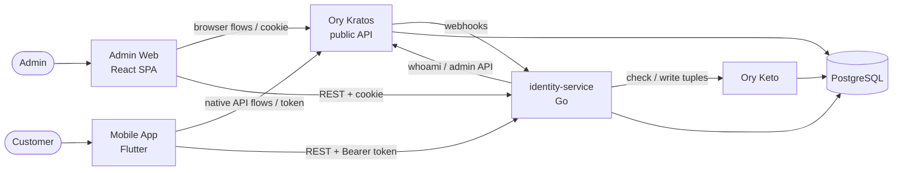

# go-ory-auth-example — Documentation

Design docs for a first-party identity platform built on the **Ory stack**
(Kratos + Keto), a **Go** identity service, **PostgreSQL**, a **React** admin
website and a **Flutter** mobile app.

> Status: **Draft v0.1 (2026-10-03)** — design only, no code yet. Every
> expensive-to-reverse choice is recorded as an ADR with its alternatives.

## TL;DR

- **Ory Kratos** owns identities, passwords, MFA, email verification, recovery
  and sessions. Our code never stores or sees a password hash.
- **Admin web (React SPA)** uses Kratos **browser flows** (cookies). Sign-in only;
  admins are invited, never self-registered. MFA (AAL2) is mandatory.
- **Mobile (Flutter)** uses Kratos **native API flows** (session token). Customers
  can register, verify email, sign in and recover passwords.
- **identity-service (Go)** is our API: it validates every request against
  Kratos, authorizes with **Ory Keto**, and owns app data (profiles, audit log).
- **PostgreSQL**: one cluster, one database per component (`kratos`, `keto`,
  `identity`). No component reads another one's tables.
- **No OAuth2 server (Hydra) in v1** — first-party apps don't need it. It can
  be added later without breaking clients ([ADR-0002](adr/0002-kratos-sessions-over-oauth2.md)).

## Reading order

| # | Document | What it answers |
| --- | --- | --- |
| 1 | [Architecture overview](architecture/01-overview.md) | Goals, context, the big picture, options considered |
| 2 | [Components](architecture/02-components.md) | What each box does, owns, and must never do |
| 3 | [Authentication & authorization flows](architecture/03-auth-flows.md) | Sequence diagrams for every login/registration path |
| 4 | [Data architecture](architecture/04-data.md) | Databases, identity schemas, tables, ownership |
| 5 | [Deployment](architecture/05-deployment.md) | Local Docker Compose and production topology |
| 6 | [Security](architecture/06-security.md) | Threat model, controls, ASVS checklist |
| 7 | [Cross-cutting concerns](architecture/07-cross-cutting.md) | Observability, config, errors, testing |
| 8 | [PII protection](architecture/08-pii-protection.md) | Envelope encryption, blind index, masking/reveal, crypto-shredding, key lifecycle |
| 8 | [Design principles](principles/01-design-principles.md) | The rules every change must respect |
| 9 | [Go backend guidelines](principles/02-backend-go.md) | Service layout, libraries, coding rules |
| 10 | [Admin web guidelines](principles/03-admin-web-react.md) | React SPA structure and auth handling |
| 11 | [Mobile guidelines](principles/04-mobile-flutter.md) | Flutter structure and auth handling |
| 12 | [API guidelines](principles/05-api-guidelines.md) | REST conventions, errors, versioning |
| 13 | [identity-service API](api/identity-service-api.md) | Endpoint-level contract (v1) |
| 14 | [Repository structure](repository-structure.md) | Monorepo layout |
| 15 | [ADRs](adr/README.md) | Every significant decision and why |
| 16 | [Roadmap](roadmap.md) | Build order (walking skeleton → features) |

## Glossary

| Term | Meaning |
| --- | --- |
| **Identity** | A Kratos record (UUID, schema id, traits, credentials, state). |
| **Traits** | Identity attributes defined by a JSON schema (e.g. email, name). |
| **Identity schema** | JSON schema defining traits; we use `customer` and `admin`. |
| **Browser flow** | Kratos self-service flow for browsers; protected by cookies + CSRF token. |
| **API (native) flow** | Kratos self-service flow for native apps; returns a session token. |
| **Session** | Kratos authenticated session; cookie `ory_kratos_session` or a session token. |
| **AAL** | Authenticator Assurance Level: `aal1` = one factor, `aal2` = MFA. |
| **Relation tuple** | Keto fact, e.g. `Role:admin#members@User:<id>`. |
| **Customer** | End user of the mobile app. |
| **Admin** | Operator using the admin web. Roles: `super_admin`, `admin`, `support`. |
