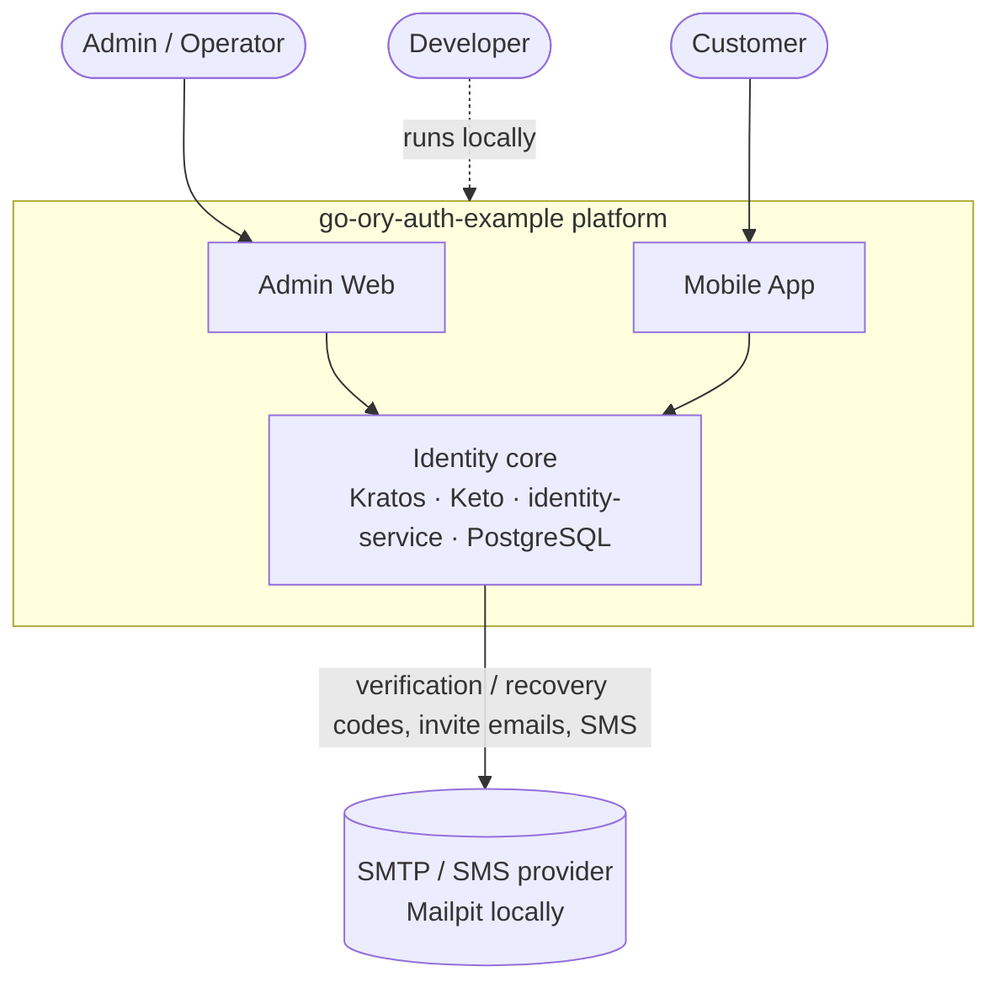
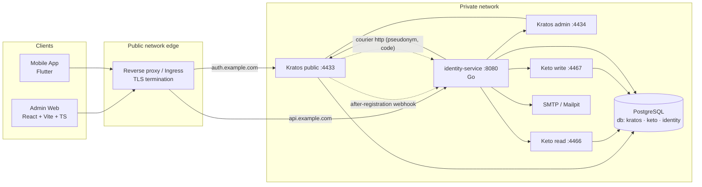

# 1. Architecture Overview

## 1.1 Goals

| Goal | Measured by |
| --- | --- |
| One identity foundation for two first-party clients | Admin web and mobile app authenticate against the same Kratos |
| Never hand-roll credential handling | No password, hash or MFA secret ever stored by our code |
| Admins are strongly protected | Admin APIs require `admin` schema + Keto role + AAL2 |
| Customers self-serve | Register, verify, sign in, recover, edit profile from the app |
| Easy to run and reason about | `docker compose up` brings the full stack up in < 2 min |
| Evolvable | OAuth2 (Hydra), social login, passkeys, more services can be added without client rewrites |

Non-goals (v1): third-party OAuth2 clients, multi-tenancy, billing,
passwordless (code-only) login, production cloud provisioning. Customers can
sign in with an email **or a phone number**. Kratos only ever stores an
opaque handle for it ([ADR-0013](../adr/0013-pseudonymous-customer-login-identifiers.md)),
and identity-service signs customers in on their behalf
([ADR-0014](../adr/0014-customer-login-through-identity-service.md)).
SMS goes through a provider port (a Mailpit sink locally).

## 1.2 System context (C4 level 1)

## 1.3 Containers (C4 level 2)

Only **Kratos public** and **identity-service** are reachable from the
internet. Kratos admin, Keto, PostgreSQL and the webhook endpoints live on the
private network (see [05-deployment](05-deployment.md)).

## 1.4 Key architectural decisions

| ADR | Decision |
| --- | --- |
| [0001](../adr/0001-monorepo.md) | Monorepo for service, clients, infra and docs |
| [0002](../adr/0002-kratos-sessions-over-oauth2.md) | Kratos sessions, not OAuth2/Hydra, for first-party apps |
| [0003](../adr/0003-browser-flows-web-native-flows-mobile.md) | Browser flows for the SPA, native API flows for Flutter |
| [0004](../adr/0004-single-kratos-two-identity-schemas.md) | One Kratos, two identity schemas (`customer` selectable, `admin` not) |
| [0005](../adr/0005-keto-for-authorization.md) | Ory Keto for authorization |
| [0006](../adr/0006-session-validation-in-service.md) | Session validation in Go middleware with short cache; no Oathkeeper in v1 |
| [0007](../adr/0007-database-per-component.md) | One PostgreSQL cluster, one database + role per component |
| [0008](../adr/0008-profile-provisioning.md) | Profile provisioning via webhook + idempotent lazy upsert |
| [0009](../adr/0009-go-service-architecture.md) | Hexagonal Go service: chi, pgx + sqlc, goose, oapi-codegen |
| [0010](../adr/0010-contract-first-api.md) | Contract-first OpenAPI 3.0.3, RFC 9457 errors |
| [0011](../adr/0011-envelope-encryption-for-pii.md) | Envelope encryption with OpenBao Transit for customer PII |
| [0012](../adr/0012-hydra-for-machine-to-machine.md) | Ory Hydra for machine-to-machine access |
| [0013](../adr/0013-pseudonymous-customer-login-identifiers.md) | Kratos stores only pseudonyms of customer emails/phones; identity-service keeps the encrypted address and delivers codes ([diagrams](10-pseudonymous-login.md)) |
| [0014](../adr/0014-customer-login-through-identity-service.md) | Customer sign-in, registration and recovery start go through identity-service; random Kratos handles, HMAC lookup key in the vault (no resolve oracle) |

## 1.5 Options considered for the overall shape

| Option | Summary | Verdict |
| --- | --- | --- |
| **A. Kratos sessions + Keto + Go API** | Clients talk to Kratos for self-service flows and to the Go API with the Kratos session | **Chosen** — simplest correct model for first-party apps; matches Ory guidance |
| B. Kratos + Hydra (OAuth2/OIDC everywhere) | Both clients do Authorization Code + PKCE; API validates JWT access tokens | Rejected for v1 — forces the system browser on mobile, adds consent/token lifecycle; revisit when third-party clients appear |
| C. Kratos + Oathkeeper gateway | Oathkeeper authenticates and mints JWTs for upstreams | Deferred — valuable with several backend services; one service doesn't justify another hop |
| D. Go service proxies all auth (BFF for both) | Clients only talk to Go; Go calls Kratos | Rejected — reimplements Kratos flows, CSRF and error handling; passwords transit our code. ADR-0014 later adopts a **narrow** form for customers only: identity-service drives Kratos API flows for sign-in, registration and recovery start (no CSRF to relay); everything else stays direct |

## 1.6 Quality attributes

| Attribute | Target | How |
| --- | --- | --- |
| Security | OWASP ASVS L2 for auth/session | Kratos defaults, AAL2 for admins, private admin APIs, audit log |
| Latency | p95 < 150 ms authenticated call | Session cache (≤ 30 s), pooled DB, no N+1 |
| Availability | Single region; graceful when Kratos is slow | Timeouts + circuit breaker on Ory calls; `/readyz` reflects dependencies |
| Operability | One-command local stack; pinned versions | Docker Compose, migrations as jobs |
| Evolvability | Add Hydra / services without client rewrites | Clients only depend on Kratos public + our versioned API |
