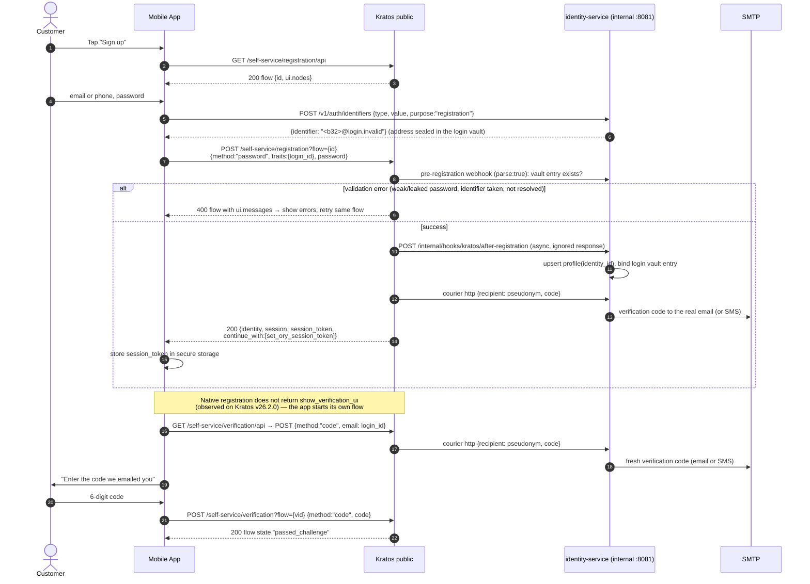
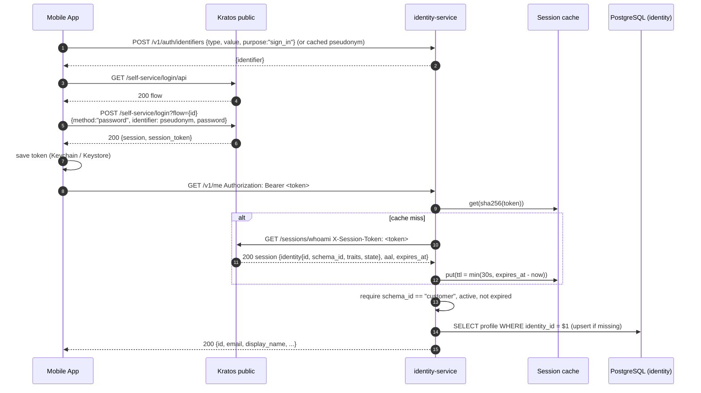
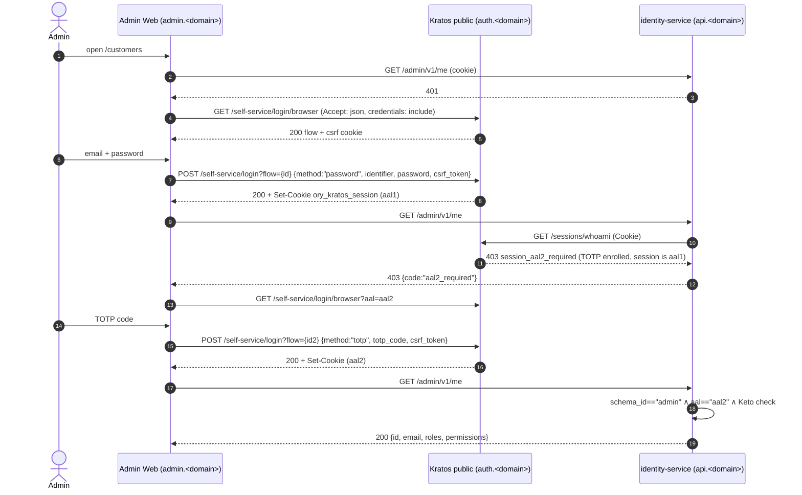
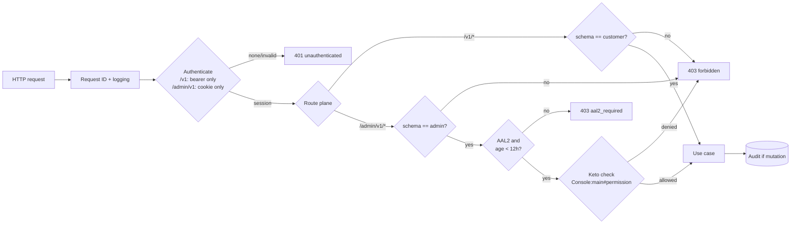
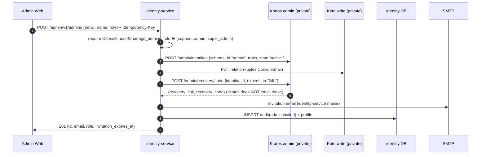

# 3. Authentication & Authorization Flows

Ground rule ([ADR-0003](../adr/0003-browser-flows-web-native-flows-mobile.md)):

| Client | Kratos flow type | Credential carried to our API |
| --- | --- | --- |
| Admin Web (browser) | **Browser flows** (`/self-service/*/browser`, AJAX with `Accept: application/json`, `credentials: "include"`) | Cookie `ory_kratos_session` (HttpOnly, Secure, SameSite=Lax, non-persistent, domain = dedicated platform apex, see [05-deployment](05-deployment.md#52-production-topology)) — **only** credential accepted on `/admin/v1/*` |
| Mobile (native) | **API flows** (`/self-service/*/api`) | `Authorization: Bearer <session_token>` — **only** credential accepted on `/v1/*` |

Credentials are **bound to their plane**: identity-service rejects a bearer
token on `/admin/v1/*` and a cookie on `/v1/*` (`401`). This stops an admin from
obtaining a long-lived native-flow token and using it against the admin API,
bypassing browser/CSRF controls.

> Ory docs: *never use API flows to implement browser applications* — they
> remove CSRF protection. Conversely, never embed browser flows in a mobile WebView.

All passwords go **directly from the client to Kratos public**. They never pass
through identity-service.

Customers never send their email or phone number to Kratos (ADR-0013).
Before every flow that takes an identifier, the app resolves it through
`POST /v1/auth/identifiers` and gives Kratos the returned pseudonym
`<base32>@login.invalid`. Kratos sends codes through its `http` courier to
identity-service, which delivers them to the real address (§3.11).

---

## 3.1 Customer registration (mobile) + email verification



Notes
- Registration uses the default schema `customer`; the app may pass
  `?identity_schema=customer` explicitly. The `admin` schema is **not
  selectable**, so self-registering as admin is impossible.
- The `session` hook signs the user in immediately. Endpoints that need a
  verified address return `403 email_not_verified` until verification passes.
- If the webhook fails, the profile is created lazily on the first API call
  ([ADR-0008](../adr/0008-profile-provisioning.md)).

## 3.2 Customer login (mobile) and calling the API



Token lifecycle: Kratos sessions are long-lived for mobile (`session.lifespan`,
e.g. 30 days). `/sessions/whoami` does **not** extend a session. Extension
happens by a refresh login (`/self-service/login/api?refresh=true`) or by
identity-service calling Kratos admin `PATCH /admin/sessions/{id}/extend`, both
gated by `session.earliest_possible_extend`. v1: the app re-authenticates when
the session expires. On `401` the app clears the token and returns to sign-in.

## 3.3 Password recovery (mobile)

```mermaid
sequenceDiagram
  autonumber
  participant A as Mobile App
  participant K as Kratos public
  participant M as SMTP
  A->>K: GET /self-service/recovery/api
  A->>K: POST /self-service/recovery?flow={id} {method:"code", email: pseudonym}
  Note over A,K: the pseudonym comes from POST /v1/auth/identifiers {purpose:"recovery"}
  K->>M: recovery code via identity-service courier (sent only if the account exists; response is identical either way)
  A->>K: POST /self-service/recovery?flow={id} {method:"code", code}
  K-->>A: 200 continue_with [set_ory_session_token, show_settings_ui]<br/>(requires feature_flags.use_continue_with_transitions: true)
  A->>K: POST /self-service/settings?flow={sid} {method:"password", password}
  K-->>A: 200 settings saved
```

Recovery is configured to revoke other sessions (`revoke_active_sessions`
after recovery).

## 3.4 Admin login (browser) with mandatory MFA



- Kratos is configured with `session.whoami.required_aal: highest_available`
  (set explicitly, it is also the default) and
  `selfservice.flows.settings.required_aal: highest_available`. whoami therefore
  answers **`403 session_aal2_required`** (not 200, not 401) for an AAL1 session
  of an identity that has TOTP. The verifier maps that to our `aal2_required`;
  it must never treat it as `401`, or the admin loops on the login page.
- **TOTP enrolment happens inside the invitation**: the invite recovery code
  opens a privileged settings flow where the new admin sets a password **and**
  enrols TOTP in the same session (§3.6). An admin identity with no TOTP gets
  `mfa_enrollment_required` only within 24 h of the invite. After that the
  service disables the identity, so someone with a stolen password can't enrol
  their own second factor. `/admin/v1/me` is the only admin endpoint reachable
  at AAL1.
- **Wrong population on the wrong client is blocked at Kratos**: an
  interrupting after-login `web_hook` (`can_interrupt: true`) rejects
  `customer` identities on browser flows and `admin` identities on API flows
  ([ADR-0004](../adr/0004-single-kratos-two-identity-schemas.md); spike S3
  verifies support in the pinned Kratos release). If it's unavailable, the
  fallback is that every `/admin/*` call returns `403 not_admin` and the web
  logs the session out.
- Admin sessions are capped at **12 h since `authenticated_at`**. Once the cap
  is passed, the service revokes the session through Kratos admin
  `DELETE /admin/sessions/{id}` and doesn't stop at returning 403. The admin
  cookie is non-persistent (`session.cookie.persistent: false`).

## 3.5 Request authorization pipeline (identity-service)



Permission per endpoint is declared next to the route (see
[API contract](../api/identity-service-api.md)); routes without a declared
permission fail closed at startup.

## 3.6 Admin invites another admin



- Kratos returns the admin-created recovery link and code in the API response
  and does not send them. identity-service sends the invitation through its own
  mailer. The link never appears in an API response or a log.
- `role` is a closed enum mapped server-side to a relation
  (`support → supporters`, `admin → admins`, `super_admin → super_admins`).
  Client input never forms a tuple directly. The service forbids changing your
  own role and removing the last `super_admin`.
- New admin path: open link, set password, enrol TOTP in the same privileged
  session, then the first AAL2 login.

The first `super_admin` is created by `identity-service admin bootstrap`
(same steps, run once from a trusted shell; it prints the link to the
operator's terminal only).

## 3.7 Admin disables a customer

1. `POST /admin/v1/customers/{id}/disable` (permission `manage_customers`).
   The target must have `schema_id == customer`; otherwise `404`. The same
   check applies to every `/customers/{id}/*` endpoint.
2. Kratos admin `PATCH /admin/identities/{id}` → `state: inactive`.
3. Kratos admin `DELETE /admin/identities/{id}/sessions` (revoke all).
4. Purge local session cache for that identity; audit `customer.disabled`.
5. Residual risk: other replicas may accept the old token for ≤ cache TTL (30 s).

## 3.8 Logout

| Client | Steps |
| --- | --- |
| Mobile | `DELETE /self-service/logout/api` body `{session_token}` → delete token from secure storage |
| Admin Web | `GET /self-service/logout/browser` → `{logout_url}` → navigate/fetch `logout_url` → cookie cleared |

## 3.9 Handling Kratos flow responses (both clients)

| Response | Meaning | Client action |
| --- | --- | --- |
| `200` | Success | Continue (`continue_with` may request verification / redirect) |
| `400` + flow | Validation error | Re-render the **same** flow with `ui.messages` / node messages |
| `401` | No session (settings flow) | Go to login |
| `403` `session_aal2_required` | Need second factor | Start login flow with `aal=aal2` |
| `403` `security_csrf_violation` (web) | Stale CSRF | Restart flow |
| `410` | Flow expired | Start a new flow |
| `422` `browser_location_change_required` | Redirect required (e.g. OIDC later) | Follow `redirect_browser_to` |

Always render messages by their `id` (stable Kratos message ids) so the UI can
be localised (Vietnamese / English) without parsing English text.

## 3.10 Future: OAuth2 / OIDC with Ory Hydra

When a third-party client or SSO across products is needed, add Hydra with
Kratos as its login & consent provider. Existing clients keep using Kratos
sessions; only new clients use OAuth2, and identity-service learns to accept
Hydra JWT access tokens in addition to sessions
([ADR-0002](../adr/0002-kratos-sessions-over-oauth2.md)).

## 3.11 Pseudonymous customer login identifiers (ADR-0013)

| Step | Who | What |
| --- | --- | --- |
| Resolve | App → identity-service `POST /v1/auth/identifiers` | Normalise (email lower-cased, phone E.164 with the default country `84`), compute HMAC in OpenBao, return `<base32>@login.invalid`. Only `purpose: registration` stores the address (encrypted). Rate limited per IP (IPv6 per /64). |
| Register | App → Kratos | `traits.login_id = pseudonym`. The pre-registration webhook (`response.parse: true`) rejects a pseudonym without a vault entry (4049002), a legacy `email` trait (4049001) and, during the migration window, an address that a legacy customer already uses (4000007). |
| Bind | Kratos → after-registration webhook (or lazily on `GET /v1/me`) | The vault entry is bound to the identity id. The binding uses only the authoritative `login_id` from Kratos. |
| Deliver | Kratos courier `http` → `POST /internal/hooks/kratos/courier` (courier key) | Checks that the payload's identity really has this recipient, decrypts the address, renders the vi/en message and sends email or SMS. Duplicates are dropped (keyed hash), as are messages over quota (5/h and 20/day per recipient, SMS budget). Permanent failures get 204, transient ones 503, which makes Kratos retry. |
| Show | `GET /v1/me` / admin views | The owner sees `login {type, value}`. Admins see `login {type, masked}`. A reveal (`fields: ["login"]`) is audited. |

The Kratos `profile` settings method is disabled, so a customer cannot repoint
`login_id`. Admin identities keep their plaintext work email; their Kratos
mail also goes through the courier webhook, which sends it only to the
admin's own address.
