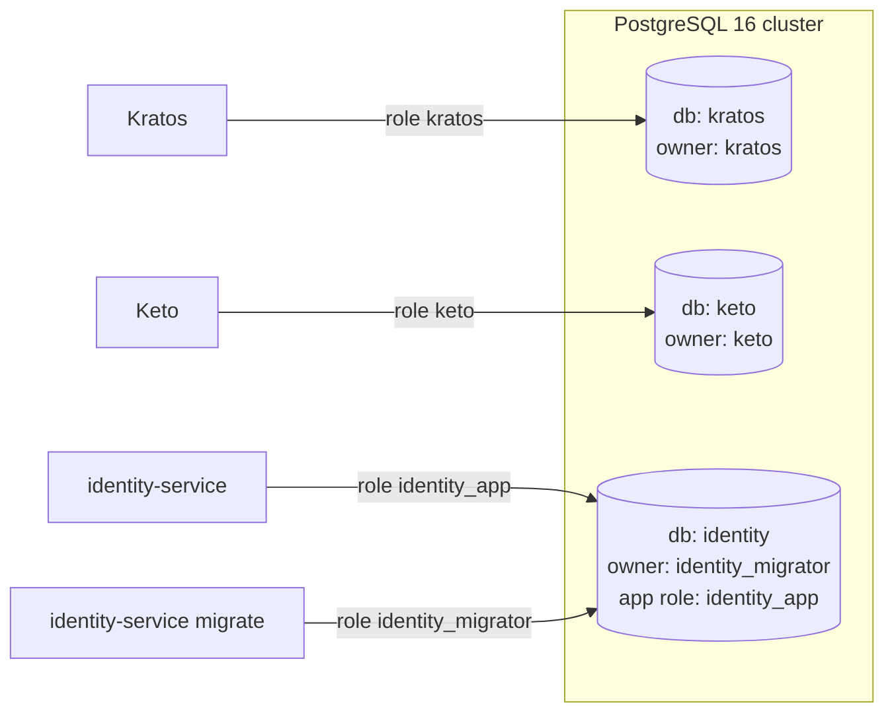

# 4. Data Architecture

## 4.1 Ownership

| Data | Source of truth | Others may |
| --- | --- | --- |
| Credentials, MFA secrets, sessions | Kratos (`kratos` DB) | Nothing — never read |
| Traits (email, name) | Kratos | Read via Kratos API (session payload or admin API) |
| Identity state (active / inactive) | Kratos | Change via Kratos admin API |
| Roles / permissions | Keto (`keto` DB) | Check / write via Keto API |
| Profile (display name, avatar, locale, preferences) | identity-service (`identity` DB) | Read via `/v1/me`, `/admin/v1/customers/{id}` |
| Admin audit log | identity-service | Read via `/admin/v1/audit-events` |

**The Kratos identity id (UUID) is the only key shared across stores.** Nothing
is copied between stores except that id; when a list view needs email +
profile, identity-service joins in memory (Kratos admin list → profile batch
`WHERE identity_id = ANY($1)`).

## 4.2 PostgreSQL layout



| Database | Login role(s) | Schema managed by |
| --- | --- | --- |
| `kratos` | `kratos` | `kratos migrate sql -e --yes` (job/init container) |
| `keto` | `keto` | `keto migrate up --yes` |
| `identity` | `identity_migrator` (DDL), `identity_app` (DML only) | goose migrations in `services/identity-service/db/migrations` |

Connection rules (all services): `sslmode=require` outside local dev, explicit
`application_name`, credentials from env/secret store, statement timeout 5 s,
idle-in-transaction timeout 10 s.

## 4.3 Identity schemas (Kratos)

`customer` — default, `selfservice_selectable: true`:

```json
{
  "$id": "https://schemas.example.com/customer.v1.json",
  "$schema": "http://json-schema.org/draft-07/schema#",
  "title": "Customer",
  "type": "object",
  "properties": {
    "traits": {
      "type": "object",
      "properties": {
        "email": {
          "type": "string", "format": "email", "maxLength": 320,
          "title": "Email",
          "ory.sh/kratos": {
            "credentials": { "password": { "identifier": true }, "code": { "identifier": true, "via": "email" } },
            "verification": { "via": "email" },
            "recovery": { "via": "email" }
          }
        },
        "name": {
          "type": "object",
          "properties": {
            "first": { "type": "string", "maxLength": 100, "title": "First name" },
            "last":  { "type": "string", "maxLength": 100, "title": "Last name" }
          }
        }
      },
      "required": ["email"],
      "additionalProperties": false
    }
  }
}
```

`admin` — `selfservice_selectable: false` (created only through the admin API).
Same `email`/`name` traits, except that the `email` trait has **no
`credentials.code` identifier**. Admins authenticate only with password + TOTP
(or lookup secret) and never with an email OTP. Recovery/verification `via: email`
stays. Keeping the traits otherwise identical keeps UI code shared. The
**schema id** is what distinguishes the populations.

Kratos config excerpt:

```yaml
identity:
  default_schema_id: customer
  schemas:
    - id: customer
      url: file:///etc/config/kratos/identity-schemas/customer.v1.json
      selfservice_selectable: true
    - id: admin
      url: file:///etc/config/kratos/identity-schemas/admin.v1.json
      selfservice_selectable: false
```

Schema evolution: schemas are versioned files (`customer.v1.json`,
`customer.v2.json`). Add a new schema id for breaking changes and migrate
identities via the admin API; never edit a schema in a way that invalidates
existing identities.

`metadata_public` is **not** used for roles (Keto is the source); it may hold
non-sensitive flags later (e.g. `onboarding_done`).

## 4.4 identity database (v1)

```sql
-- 0001_init.sql (goose)
CREATE TABLE profile (
  identity_id   uuid        PRIMARY KEY,               -- Kratos identity id
  kind          text        NOT NULL CHECK (kind IN ('customer','admin')),
  display_name  text        CHECK (char_length(display_name) <= 100),
  avatar_url    text        CHECK (char_length(avatar_url) <= 2048),
  locale        text        NOT NULL DEFAULT 'vi-VN' CHECK (char_length(locale) <= 35),
  preferences   jsonb       NOT NULL DEFAULT '{}'::jsonb,
  created_at    timestamptz NOT NULL DEFAULT now(),
  updated_at    timestamptz NOT NULL DEFAULT now(),
  deleted_at    timestamptz
);
CREATE INDEX profile_kind_created_idx ON profile (kind, created_at DESC) WHERE deleted_at IS NULL;

CREATE TABLE audit_event (
  id                bigint      GENERATED ALWAYS AS IDENTITY PRIMARY KEY,
  occurred_at       timestamptz NOT NULL DEFAULT now(),
  actor_identity_id uuid        NOT NULL,
  action            text        NOT NULL,      -- e.g. customer.disabled, admin.invited
  target_type       text        NOT NULL,      -- customer | admin | role
  target_id         text        NOT NULL,
  request_id        text        NOT NULL,
  client_ip         inet,
  details           jsonb       NOT NULL DEFAULT '{}'::jsonb   -- never PII beyond ids
);
CREATE INDEX audit_event_occurred_idx ON audit_event (occurred_at DESC, id DESC);
CREATE INDEX audit_event_target_idx   ON audit_event (target_type, target_id, occurred_at DESC);

CREATE TABLE idempotency_key (
  key           text        NOT NULL,
  actor_identity_id uuid    NOT NULL,
  request_hash  bytea       NOT NULL,
  response_code int         NOT NULL,
  response_body jsonb       NOT NULL,
  created_at    timestamptz NOT NULL DEFAULT now(),
  PRIMARY KEY (actor_identity_id, key)
);

-- privileges
GRANT SELECT, INSERT, UPDATE ON profile TO identity_app;
GRANT SELECT, INSERT ON audit_event TO identity_app;           -- append-only
GRANT SELECT, INSERT, DELETE ON idempotency_key TO identity_app;
```

Design notes (from the team's PostgreSQL rules):
- `timestamptz` everywhere; enums as `text + CHECK`; constraints by default.
- `profile` PK is the Kratos UUID (generated by Kratos, so `uuid` is justified);
  internal tables use `bigint` identity.
- Provisioning is `INSERT … ON CONFLICT (identity_id) DO NOTHING` — idempotent
  for webhook retries and lazy creation.
- `audit_event` is append-only by grant; keyset pagination on
  `(occurred_at, id)`; partition by month when it exceeds ~10 M rows.
- Soft delete (`deleted_at`) for profiles; hard delete on GDPR-style erasure
  after the Kratos identity is deleted.
- `idempotency_key` rows expire after 24 h (periodic cleanup job).

### Encrypted personal information (migration 0003)

| Table | Holds | Notes |
| --- | --- | --- |
| `subject_key` | `key_id`, `identity_id` (unique), `wrapped_dek` (`vault:vN:…`), `kek_name`, `kek_version`, `rewrapped_at` | One data key per customer. Deleting the row is the erasure |
| `customer_pii` | `phone_ct`, `phone_bidx` (32 bytes), `bidx_key_version`, `dob_ct`, `address_ct`, `national_id_ct` | Composite FK `(identity_id, key_id)` → `subject_key` with `ON DELETE CASCADE` |

`identity_app` can SELECT, INSERT, UPDATE and DELETE on `subject_key`, but
only SELECT, INSERT and UPDATE on `customer_pii`. Details are in
[08-pii-protection](08-pii-protection.md).

## 4.5 Data lifecycle

| Event | Kratos | identity DB | Keto |
| --- | --- | --- | --- |
| Customer registers | identity created | profile inserted (webhook / lazy) | — |
| Admin invited | identity (schema admin) | profile + audit | role tuple |
| Customer disabled | `state=inactive`, sessions revoked | audit | — |
| Customer deleted (erasure) | identity deleted | profile hard-deleted; audit keeps only ids | tuples deleted |
| Admin role changed | — | audit | tuple replaced |
| Customer erases PII | — | `subject_key` deleted (crypto-shred, cascades to `customer_pii`), audit `customer.pii.erased` | — |

## 4.6 Backups

- Nightly base backup + WAL archiving (PITR) for the whole cluster; restores
  tested monthly.
- `kratos` contains credential hashes → backups are encrypted at rest and
  access-controlled like production.
- Restoring `identity` → run `identity-service pii reapply-erasures` before
  serving traffic (erasure ledger, 08-pii-protection §8.5). OpenBao storage is
  backed up separately; losing the KEK loses all PII.
