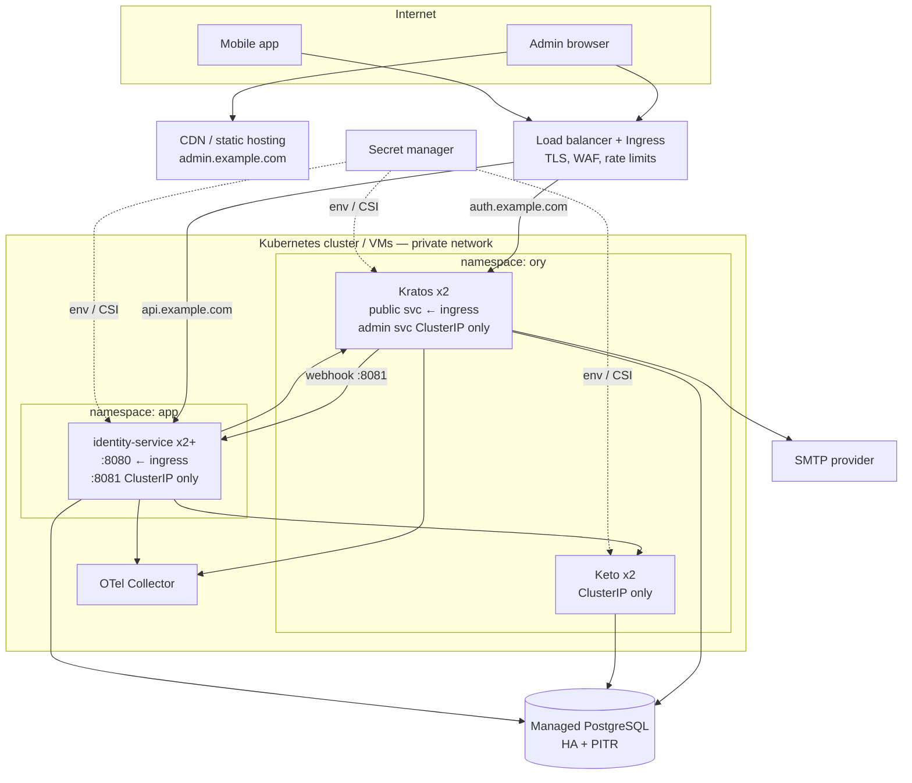

# 5. Deployment

## 5.1 Local development (Docker Compose)

One command: `make up` (wraps `docker compose -f deploy/compose/docker-compose.yml up -d`).

| Service | Image | Host port | Notes |
| --- | --- | --- | --- |
| `postgres` | `postgres:16-alpine` | 5432 | init script creates DBs `kratos`, `keto`, `identity` and roles |
| `kratos-migrate` | `oryd/kratos:<pinned>` | — | `migrate sql -e --yes`, runs once |
| `kratos` | `oryd/kratos:<pinned>` | 4433 public, 4434 admin | `serve --dev --watch-courier` locally only |
| `keto-migrate` | `oryd/keto:<pinned>` | — | `migrate up --yes` |
| `keto` | `oryd/keto:<pinned>` | 4466 read, 4467 write | loads `namespaces.keto.ts` |
| `mailpit` | `axllent/mailpit` | 8025 UI, 1025 SMTP | catches verification / recovery mail |
| `hydra-db` | `postgres:16-alpine` | — | one-shot: idempotently creates role and DB `hydra` |
| `hydra-migrate` | `oryd/hydra:v26.2.0` | — | `migrate sql up -e --yes` |
| `hydra` | `oryd/hydra:v26.2.0` | 4444 public, 127.0.0.1:4445 admin | client_credentials only. Networks `hydra` (identity-service only) and `hydra-db` |
| `openbao` | `openbao/openbao:2.4.1` | 127.0.0.1:8200 | Transit KEK and blind-index key for PII; `file` storage volume |
| `openbao-init` | `openbao/openbao:2.4.1` | — | one-shot: init, unseal, keys, policies, app token (re-runs on every `up`) |
| `identity-service` | built from `services/identity-service` | 8080 public, 8081 webhooks, 9090 ops | `migrate up` then `serve` |
| `admin-web` | Vite dev server (run on host) | 5173 | `pnpm dev` in `apps/admin-web` |
| mobile | emulator / device (run on host) | — | `flutter run --dart-define-from-file=env/local.json` |

Pin every Ory image to an exact release tag (never `latest`) and upgrade
deliberately (read the release notes, run migrations as a separate step).

Local addressing:

| From | Kratos public | identity-service |
| --- | --- | --- |
| Browser (admin web) | `http://localhost:4433` | `http://localhost:8080` |
| Android emulator | `http://10.0.2.2:4433` | `http://10.0.2.2:8080` |
| iOS simulator | `http://localhost:4433` | `http://localhost:8080` |
| Physical device | `http://<LAN-IP>:4433` (or a tunnel) | `http://<LAN-IP>:8080` |

Cookies ignore ports, so `localhost:5173` (admin web) and `localhost:4433`
(Kratos) share the session cookie. Kratos `serve.public.cors` allows
`http://localhost:5173` with credentials.

Seed: `make seed` runs `identity-service admin bootstrap --email admin@example.local`
and prints the recovery link (open Mailpit to see emails).

## 5.2 Production topology

| Host | Routes to | Exposed paths |
| --- | --- | --- |
| `admin.example.com` | static SPA bundle | all |
| `auth.example.com` | Kratos **public** | `/self-service/*`, `/sessions/whoami`, `/.well-known/*`, `/schemas/*` |
| `api.example.com` | identity-service `:8080` | `/v1/*`, `/admin/v1/*` (never `/internal/*`, `/metrics`) |

**Cookie scope.** The Kratos cookie has to reach `auth.` and `api.` from the
admin SPA, so it is set on a parent domain. A parent-domain cookie goes to
every sibling subdomain, and SameSite does not protect between siblings. So
`example.com` above stands for a **dedicated platform apex** (e.g.
`example-id.com`) that hosts only `admin.`, `auth.` and `api.`. Marketing,
docs and other apps never run under it, and its DNS is monitored against
subdomain takeover. Cookie: `domain: <platform apex>`, `same_site: Lax`,
`persistent: false`, Secure, HttpOnly.

Alternative with a host-only cookie (stricter, more routing): serve
everything browser-facing from `admin.<domain>`, with `/.ory/*` going to Kratos
public (`serve.public.base_url` = `https://admin.<domain>/.ory/`) and `/api/*`
going to identity-service, `same_site: Strict`. Revisit if the platform apex
can't be dedicated.

Network policy: only the ingress may reach Kratos public and identity-service
`:8080`; only identity-service may reach Kratos admin and Keto read/write; only
Kratos may reach identity-service `:8081` (webhooks); only probes and
Prometheus may reach `:9090` (health/metrics).

Helm: official Ory charts (`k8s.ory.com`) for Kratos and Keto; a small chart
or Kustomize for identity-service. Migrations run as pre-upgrade Jobs.

## 5.3 Configuration & secrets

| Secret | Used by | Rotation |
| --- | --- | --- |
| `SECRETS_COOKIE`, `SECRETS_CIPHER`, `SECRETS_DEFAULT` | Kratos | List-based; prepend new, keep old until sessions expire |
| `DSN` per component | Kratos, Keto, identity-service | Managed DB rotation |
| Webhook API key | Kratos (sender) + identity-service (`KRATOS_WEBHOOK_API_KEY`, receiver) | Dual-key window |
| `COURIER_SMTP_CONNECTION_URI` | Kratos courier | Provider |
| `SMTP_URL` | identity-service mailer (invitations) | Provider |

Rules for supplying values to Kratos and Keto:

- Ory env overrides map **directly from the config path, with no product
  prefix**: `secrets.cookie` → `SECRETS_COOKIE`, `dsn` → `DSN`, and
  `courier.smtp.connection_uri` → `COURIER_SMTP_CONNECTION_URI`.
  `KRATOS_SECRETS_*` would be silently ignored.
- Kratos YAML does **not** expand `${VAR}`. Never write `${…}` in `kratos.yml`,
  because it becomes the literal value. Inject the webhook key either with its
  path-derived env var
  (`SELFSERVICE_FLOWS_REGISTRATION_AFTER_PASSWORD_HOOKS_0_CONFIG_AUTH_CONFIG_VALUE`,
  which is fragile when hooks are reordered) or, preferably, by rendering the
  config file from the secret manager at deploy time (CSI-mounted file or
  `envsubst` in an init container).
- `kratos.yml` in git carries **no secret values**. The deploy wrapper fails
  startup if `SECRETS_*`, `DSN` or the webhook key are empty, and Kratos must
  never fall back to file defaults.

All configuration is environment-driven (12-factor). Local values live in
`deploy/compose/.env.example`; `.env` is git-ignored.

## 5.4 Release & rollout

1. CI builds and tests each app; images tagged with git SHA.
2. DB migrations (Kratos, Keto, identity) run first as Jobs; identity migrations are expand/contract.
3. Rolling deploy; `/readyz` gates traffic.
4. Mobile releases are decoupled — the API stays backwards compatible within `v1`.

## 5.5 Switching to Ory Network (optional)

Replace Kratos/Keto containers with an Ory Network project: set the SDK base
URL to `https://<project>.projects.oryapis.com`, use an API key for admin
calls, and configure webhooks in the console. No client or domain-code change.
