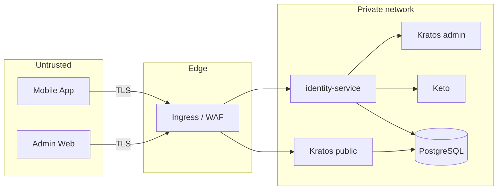

# 6. Security

Target: **OWASP ASVS v4 Level 2** for authentication (V2), session management
(V3) and access control (V4). Kratos covers most of V2/V3 by design; our job
is to configure it correctly and not undo it.

## 6.1 Trust boundaries

Everything a client sends is untrusted — including traits it claims, the
identity id in a path, and headers like `X-User-Id` (stripped at the ingress).

## 6.2 Threat model (STRIDE)

| # | Threat | Where | Control |
| --- | --- | --- | --- |
| T1 | Credential stuffing / brute force | Kratos login | Kratos leaked-password check (HIBP), rate limit at ingress per IP + per identifier, generic error messages |
| T2 | Account enumeration | registration, recovery | Recovery responds identically; registration "email taken" accepted risk (documented), rate limited |
| T3 | Login CSRF / session fixation (web) | Admin login | Browser flows only (CSRF token + cookie), SameSite=Lax, new session on login |
| T4 | Token theft (mobile) | Device | Token only in Keychain/Keystore, never logged, server-side revoke, lifespan limit |
| T5 | XSS steals session (web) | Admin SPA | HttpOnly cookie (not readable by JS), strict CSP, no `dangerouslySetInnerHTML`, React escaping |
| T6 | Privilege escalation: customer → admin | API | Non-selectable admin schema; API checks schema + Keto + AAL2; deny by default |
| T7 | IDOR: customer reads others' profile | `/v1/*` | Customer endpoints act only on `session.identity.id`; no ids in customer paths |
| T8 | Admin account takeover | Admin plane | Mandatory TOTP (AAL2) enrolled inside the invite session, 24 h enrolment deadline, 12 h max admin session (revoked in Kratos when it expires), cookie-only on the admin plane, no email-OTP factor for admins, audit log, invite-only, recovery revokes sessions |
| T8b | Role escalation via role API | `/admin/v1/admins/{id}/role` | Closed role enum mapped server-side to relations; target must be `admin` schema; no self-role change; last `super_admin` can't be removed |
| T9 | Exposed admin APIs | Kratos admin, Keto, `/internal` | ClusterIP / private network only, network policies, no ingress route |
| T10 | Forged webhook / courier relay | `/internal/hooks/*` | Private port + `Authorization` API key from secret store (separate courier key), constant-time compare; the courier sends only to the address of the identity Kratos names (checked via the admin API), codes only, our own templates |
| T11 | SQL injection | identity DB | sqlc / parameterised queries only, least-privilege DB role |
| T12 | Secret leakage | repo, logs | gitleaks in CI, secrets via env/secret manager, log redaction of `Authorization`, `Cookie`, `X-Session-Token`, `password`, `code` |
| T13 | Repudiation of admin actions | Admin plane | Append-only `audit_event` with actor, request id, IP |
| T14 | DoS via expensive hashing | Kratos login | Rate limits, request size limits, autoscaling Kratos |
| T18 | Stolen or over-privileged machine credentials | `/m2m/v1/*` | 5 min JWTs, per-route scopes, PII-free DTOs, rotate kills issued tokens (`tokens_valid_after`), delete ≤ 30 s, per-client rate limit, `m2m_access` log |
| T19 | Unauthenticated Hydra admin API reached by another workload | Hydra `:4445` | Dedicated `hydra` network (compose) / NetworkPolicy (prod), never through ingress, dynamic client registration disabled |
| T16 | PII disclosure via DB dump, backup or SQL access | identity DB | Envelope encryption (08-pii-protection), KEK non-exportable in OpenBao, least-privilege token |
| T17 | Insider browsing / enumeration of customer PII | Admin plane | Masked by default, `reveal_customer_pii` + reason code, per-actor quotas, audit of every reveal and lookup |
| T18 | SMS pumping / mail bombing through Kratos flows | Courier | Per-recipient quota (5/h, 20/day), SMS country allow-list and daily budget, over-quota messages dropped (no retry), metrics `identity_courier_dispatch_total{outcome="dropped"}` |
| T19 | Enumeration / storage spam through the public resolve endpoint | `POST /v1/auth/identifiers` | Per-IP limits by purpose, IPv6 per /64, global insert cap, unbound rows purged after 24 h, no existence signal |
| T15 | Supply chain | deps, images | Pinned versions, `govulncheck`, `pnpm audit`, `dart pub outdated`, image scanning, Dependabot/Renovate with review |

## 6.3 Kratos hardening checklist

- [ ] `serve.public.base_url` / `admin.base_url` set to real URLs; `--dev` never in production.
- [ ] `selfservice.allowed_return_urls` lists only `https://admin.example.com` (+ localhost in dev).
- [ ] `session.cookie`: `same_site: Lax`, `domain: <dedicated platform apex>`, `persistent: false`; secure cookies (HTTPS) in prod (see 05-deployment §5.2).
- [ ] `session.lifespan` set (e.g. 720h) with `earliest_possible_extend`; admin max age (12 h) enforced by the service, which revokes the session through the Kratos admin API.
- [ ] `session.whoami.required_aal: highest_available` and `selfservice.flows.settings.required_aal: highest_available` set explicitly.
- [ ] `selfservice.methods.password.config.haveibeenpwned_enabled: true`, `min_password_length: 12`, `identifier_similarity_check_enabled: true`.
- [ ] `totp` and `lookup_secret` enabled; `totp.config.issuer` set.
- [ ] `selfservice.methods.code.config.passwordless_enabled: false` and `mfa_enabled: false` (email OTP is never a login factor); `admin.v1.json` has no `credentials.code` identifier.
- [ ] Recovery/verification use `code` method; `after recovery` → `revoke_active_sessions`.
- [ ] `selfservice.flows.registration` uses default schema `customer`; `admin` schema `selfservice_selectable: false`.
- [ ] Interrupting after-login webhook rejects the wrong population per flow type (ADR-0004).
- [ ] Webhook to identity-service authenticates with an API key injected from the secret store. No `${VAR}` in YAML, because Kratos doesn't expand it.
- [ ] Secrets supplied as `SECRETS_COOKIE` / `SECRETS_CIPHER` / `SECRETS_DEFAULT` (no `KRATOS_` prefix), ≥ 32 random bytes, rotated via list; startup fails if unset.
- [ ] Courier SMTP over TLS.

## 6.4 identity-service controls

- Authentication middleware on every public route. Health and metrics live on the
  separate ops port `:9090`, and `:8081` serves webhooks only.
- **Credential bound to plane**: `/v1/*` accepts only `Authorization: Bearer`.
  `/admin/v1/*` accepts only the Kratos cookie and rejects `Authorization` /
  `X-Session-Token` with `401`.
- Kratos whoami `403 session_aal2_required` maps to `aal2_required` and is never
  treated as `401`.
- Every `/admin/v1/customers/{id}/*` endpoint checks that the target's
  `schema_id == customer` (otherwise `404`). Admin role changes use the closed
  enum → relation mapping.
- Admin invitation links/codes are emailed by identity-service and are never
  returned in API responses or written to logs.
- Authorization declared per route; startup fails if a route lacks a policy.
- Cookie-authenticated **mutations** require an `Origin` in the CORS allowlist
  (requests without `Origin` are rejected) and, when they carry a body,
  `Content-Type: application/json` (CSRF defence for our own API).
- Database migrations run as a one-shot job with the migrator role. The
  long-running `serve` process only has the DML role's DSN, so the append-only
  audit grant holds even if the process is compromised.
- Admins without TOTP past the 24 h enrolment deadline are deactivated by a
  sweeper. A TOTP credential enrolled after the deadline (for example straight
  through Kratos settings at AAL1) is rejected and the identity deactivated.
- CORS: allowlist `https://admin.example.com` only, `credentials: true`.
- Security headers on API responses: `Cache-Control: no-store`, `X-Content-Type-Options: nosniff`.
- Request body limit 1 MiB; server timeouts (read 10 s, write 15 s, idle 60 s).
- Outbound calls to Ory: 2 s timeout, retries only for idempotent reads.
- Never log full sessions, tokens, cookies, emails in plain debug output.

## 6.5 Admin web controls

- CSP: `default-src 'self'; connect-src 'self' https://auth.example.com https://api.example.com; frame-ancestors 'none'; object-src 'none'`. Send it as an **HTTP response header** from the CDN/static host. `frame-ancestors` is ignored when set in a `<meta>` tag.
- No tokens in `localStorage`/`sessionStorage`; rely on the HttpOnly cookie.
- Authorization in UI is cosmetic; the API is authoritative.

## 6.6 Mobile controls

- `flutter_secure_storage` with `first_unlock_this_device` (iOS) and
  EncryptedSharedPreferences/Keystore (Android).
- HTTPS only in release builds (Android `usesCleartextTraffic=false`, iOS ATS);
  cleartext allowed only for local dev flavour.
- Certificate pinning: optional, evaluate after v1 (operational cost).
- No secrets in the app binary; base URLs via `--dart-define`.
- Obfuscate release builds (`--obfuscate --split-debug-info`).

## 6.7 Accepted risks (v1)

| Risk | Why accepted | Revisit when |
| --- | --- | --- |
| Revocation lag ≤ 30 s due to session cache | Latency target; admin disable purges the local replica | Multi-replica with stricter needs → shared cache / Oathkeeper |
| Registration reveals "email already used" | UX for consumer app | Abuse observed |
| A customer can obtain a **browser** session through paths that don't run the after-login guard: browser registration (`session` hook) and browser recovery. The guard itself works (spike S3 verified on Kratos v26.2.0) | API denies every admin call (`not_admin`) and the web logs out; no admin data is reachable. Owner: identity-service maintainers | Kratos supports flow-type conditions on registration/recovery hooks, or a second Kratos instance is introduced |
| Within the 24 h invitation window, someone holding a new admin's password (only knowable after the invitee sets it) could enrol their own TOTP before the invitee does | Short window, invite link goes only to the invitee's mailbox, enrolment is audited; the invitee notices immediately because their own enrolment fails | Kratos can restrict TOTP enrolment to privileged recovery sessions |
| Crypto-shredded PII stays recoverable from backups/PITR until the KEK version that wrapped its DEK is retired | KEK rotated at least once per backup-retention period, then `min_decryption_version` + `trim`. Erasure ledger re-applied after any restore (08 §8.5). Owner: identity-service maintainers | Backup retention changes, or a managed KMS with per-key destruction is adopted |
| After an erase, other replicas can keep the erased customer's DEK in memory for ≤ 5 min | The ciphertext is already deleted, so there is nothing for the DEK to decrypt | Shared cache / pub-sub eviction |
| Local OpenBao keeps its unseal key and root token on a volume | Local only. Production uses auto-unseal and Kubernetes auth | — |
| A deleted or rotated service client is still accepted for ≤ 30 s by replicas that cached its status | Same bound as the session cache, and tokens live 5 min at most. Owner: identity-service maintainers | Partners need instant revocation → introspection or a shared revocation cache |
| Kratos sessions keep IP address and user agent | Session lifespan limits retention; own DB and role; KMS-encrypted volumes and backups in production. Customer emails and phone numbers are no longer in Kratos: only pseudonyms (ADR-0013, 08 §8.10). Owner: platform lead | Kratos supports session metadata minimisation |
| The login resolve endpoint `POST /v1/auth/identifiers` is an oracle: whoever knows an address can compute its pseudonym, so a Kratos dump plus the endpoint confirms targeted addresses (not bulk reversal: the HMAC key stays in OpenBao) | Goal is data at rest in Kratos, not hiding account existence (registration already reveals "taken"); per-IP limits (IPv6 /64), registration budget, global insert cap; no existence signal in responses. Owner: platform lead | App attestation (Play Integrity / App Attest) is available |
| Kratos's password/identifier similarity check only sees the pseudonym, so a password containing the email or phone is accepted | HIBP + minimum length 12 still apply; the app warns. Owner: mobile lead | Passwords move to passkeys |
| Customer sign-up, sign-in and code delivery depend on identity-service and OpenBao (admins are unaffected) | Resolve is a single Transit call; Kratos retries courier delivery (10 retries); readiness alerts. Owner: platform lead | — |
| Losing the login pseudonym HMAC key locks every customer out | Key is non-exportable and non-deletable; OpenBao snapshots + escrowed unseal/recovery keys with a tested restore. Owner: operator | A managed KMS with key backup is adopted |
| Per-IP resolve limits trust `X-Forwarded-For` by hop count (`TRUSTED_PROXY_HOPS`); if :8080 were reachable without the proxy, a caller could pick its own bucket (SEC-C09) | Production exposes :8080 only through the ingress (NetworkPolicy); the per-/24 and /48 aggregate limit applies too. Owner: platform lead | Follow-up: honour XFF only from `TRUSTED_PROXY_CIDRS` |
| An unverified account can still be registered on someone else's address (squatting) | Unchanged from before ADR-0013; the address owner can take it over through recovery (the code goes to the real address). Owner: identity-service maintainers | Abuse observed → verify before session |
| During a production rollout, customers not yet migrated (08 §8.11) can't be disabled or edit settings, and an outdated client that omits `name` on PUT clears it | Short window; runbook: run `pii migrate-kratos-names` (with `--strip-invalid` if needed) right after the Kratos schema rollout, and enforce a minimum app version first. Owner: identity-service maintainers | — |
| Hydra `/oauth2/revoke` does not stop a JWT at identity-service (offline verification) | Rotate or delete revokes in ≤ 30 s, and tokens live 5 min at most. Runbook: rotate, don't revoke. Owner: identity-service maintainers | Instant revocation needed → introspection |
| The Hydra admin API has no authentication. In compose it is reachable from the `hydra`/`hydra-db` networks and host 127.0.0.1 | Clients created outside identity-service fail the HMAC integrity tag. Production uses a NetworkPolicy plus an authenticating proxy | Hydra gains native admin auth |
| Service clients authenticate with `client_secret_basic` | Internal jobs only in v1. Secrets are 256-bit, hashed by Hydra and shown once | Before external partners onboard → `private_key_jwt` |
| Parent-domain session cookie is visible to all hosts under the platform apex | Apex is dedicated to admin/auth/api only; DNS monitored | Apex can't be dedicated → host-only cookie layout (05-deployment §5.2) |
