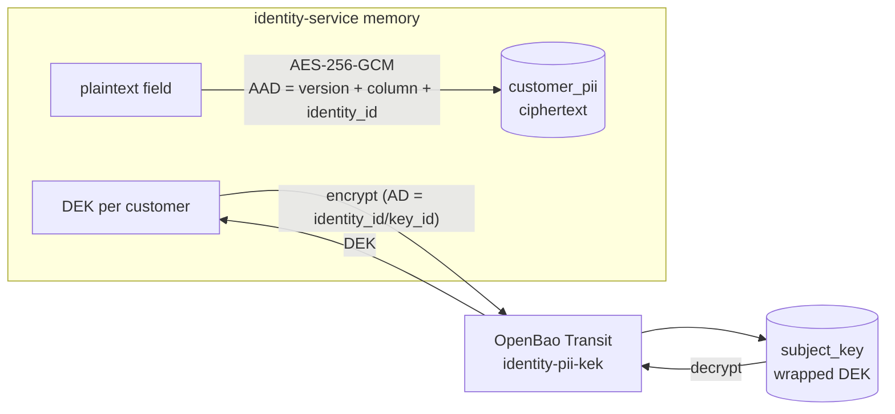

# 8. Personal data (PII) protection

Customer personal information (phone number, date of birth, postal address,
national ID) is encrypted at the application layer before it reaches
PostgreSQL. Decision record: [ADR-0011](../adr/0011-envelope-encryption-for-pii.md).

## 8.1 Classification

| Field | Class | At rest | Search |
| --- | --- | --- | --- |
| `phone_number` (E.164) | confidential | AES-256-GCM | HMAC-SHA256 blind index (equality) |
| `date_of_birth` | confidential | AES-256-GCM | — |
| `address` | confidential | AES-256-GCM (JSON) | — |
| `national_id` {type, number} | restricted | AES-256-GCM (JSON) | — |
| `display_name`, `avatar_url`, `locale` | internal | plaintext | — |
| Kratos traits (email, name) | confidential | Kratos DB, plaintext (Kratos needs the login identifier) — protected by volume encryption and least privilege | Kratos |

## 8.2 Envelope encryption

- **DEK**: 256 random bits per customer, row `subject_key(key_id, identity_id,
  wrapped_dek, kek_name, kek_version)`. The wrapped DEK is bound to its owner
  with Transit `associated_data = identity_id/key_id`.
- **KEK**: `identity-pii-kek` (`aes256-gcm96`) in OpenBao Transit,
  `exportable=false`, `allow_plaintext_backup=false`. The service never sees it.
- **Ciphertext**: `0x01 ‖ nonce(12) ‖ ciphertext ‖ tag(16)`. Random nonce per
  write. AAD = `"identity-service/pii/v1\x00" ‖ format byte ‖ column ‖
  identity_id`, so a ciphertext moved to another row or column, or relabelled
  with another format version, fails authentication.
- **DEK cache**: in-process LRU keyed by `key_id`, TTL 5 min, zeroed on
  eviction. After an erase, other replicas may still hold that DEK in memory
  for ≤ 5 min, but the ciphertext is already deleted.

## 8.3 Blind index

`phone_bidx = HMAC-SHA256(identity-pii-bidx, "phone_number:" ‖ E.164)`,
computed by OpenBao (`transit/hmac`, `key_version=1` pinned, auto-rotation
off). Lookup is equality-only, takes the phone in the request body (never the
URL), returns at most 20 candidates, and **re-checks the decrypted phone** so a
row whose index was tampered with is dropped.

## 8.4 Access

| Who | What | Control |
| --- | --- | --- |
| Customer | read / replace / erase own PII | Bearer session; replace needs a verified email; erase is always allowed |
| supporter, admin, super_admin | masked view, phone lookup | Keto `view_customers`, AAL2; lookup 30/min + 200/day per actor |
| admin, super_admin | reveal | Keto `reveal_customer_pii`, `reason_code` enum + optional `ticket_ref`, optional `fields[]`; 20/hour per actor |

Phone numbers are **self-declared and unverified**, and they are not unique.
A lookup returns at most 20 matches. When more match, it sets
`truncated: true` and logs `pii_lookup_candidate_overflow`, so someone who
registers many accounts with a victim's number can't quietly push the real
owner out of the results. Lookup decrypts only the phone of each candidate,
and decrypts the other fields only for exact matches. The limiter charges one
unit per candidate. Masked reads are limited to 300/min per actor and are not
audited (they reveal no full values).

Masking (domain layer, fixed width so length doesn't leak): phone `+84*******567`,
date of birth `1990-**-**`, address city + country only, national ID `******123`
(last 3 only when ≥ 9 characters).

Reveal order: decrypt in memory → COMMIT audit `customer.pii.revealed` →
respond. If the audit row can't be written, buffers are zeroed and the
response is 500. Audit details hold field names, reason codes, ids and the
keyed index hash, **never values or free text**.

## 8.5 Erasure (crypto-shredding)

`DELETE /v1/me/personal-info`: one transaction writes audit
`customer.pii.erased` and deletes `subject_key` (cascading to `customer_pii`),
then the local DEK cache entry is evicted. Copies of the ciphertext in WAL or
replicas can't be decrypted without the wrapped DEK.

Backups still contain the wrapped DEK while the KEK version that wrapped it
can still decrypt. Controls:

1. Rotate the KEK at least once per backup-retention period, re-wrap, then
   raise `min_decryption_version` and `trim`. Old backups then hold DEKs that
   no KEK can unwrap.
2. **Erasure ledger**: after any restore, run `identity-service pii
   reapply-erasures`. It deletes `subject_key` for every `customer.pii.erased`
   target in the audit log, but only keys created at or before that erase.
   The ledger lives in the same database, so a restore also rolls it back.
   Production must therefore keep a copy outside the DB: audit events
   streamed to the log pipeline or SIEM. Erasures newer than the backup are
   then re-applied from that copy.

Erasure has to finish within the legal deadline: one month under GDPR Art. 12(3),
and 72 hours under Decree 13 Art. 16.

### Memory

DEK buffers and plaintext field buffers are zeroed after use. Decoded values
that become Go strings, such as JSON responses and Transit's base64 plaintext,
can't be zeroed and stay in memory until GC. This is accepted (DD-12), and
memory dumps of the service process are treated as PII.

On mobile, the personal-info screen sets `FLAG_SECURE` on Android and shows an
overlay on iOS when the app is inactive, so OS snapshots don't capture PII.

## 8.6 Key lifecycle (operator runbook)

| Task | Command |
| --- | --- |
| Start / unseal locally | `make up` (or `make bao-init` after restarting `openbao`) |
| Rotate KEK | `make kek-rotate` (short-lived operator token, `identity-pii-operator` policy) |
| Re-wrap DEKs | `make keys-rewrap` → `identity-service keys rewrap`, which decrypts and re-encrypts each wrapped DEK with the same AD. Batched, optimistic, idempotent |
| Retire old KEK versions | operator: `transit/keys/identity-pii-kek/config min_decryption_version=N`. The operator policy allows only `min_decryption_version` and `auto_rotate_period`, so `exportable`, `allow_plaintext_backup` and `deletion_allowed` are out of reach. `trim` needs a root or break-glass token |
| Index key rotation | not supported in v1. It would need a re-index job |

## 8.7 Failure behaviour

| Failure | Result |
| --- | --- |
| OpenBao down or sealed | PII endpoints return 503 `dependency_unavailable`. Other endpoints and readiness are unaffected, and nothing falls back to plaintext |
| GCM authentication failure | 500 `internal`. The log line `pii_decrypt_failed` carries only the identity id and column |
| App token expired | The renew loop logs `openbao_token_renew_failed` and PII requests fail closed |

## 8.8 Local OpenBao (Docker Compose)

- `openbao` uses `file` storage on the `openbao-data` volume and listens on
  `127.0.0.1:8200`.
- `openbao-init` is a one-shot job that runs on every `up`. It initialises the
  server with 1 key share, unseals it, and creates the Transit keys and
  policies. It then issues a periodic app token: orphan, no default policy,
  24 h period, with the previous token revoked. The token goes on the
  `openbao-app-token` volume, which identity-service mounts read-only.
- **Local only**: the unseal key and root token are stored on the
  `openbao-keys` volume, which no other service mounts. In production use
  auto-unseal (cloud KMS), TLS, and Kubernetes auth, or a cloud KMS adapter
  behind the same `KeyManager` port. The service refuses an `http://` OpenBao
  address unless `APP_ENV` is `local` or `test`. `PII_OPENBAO_CA_FILE` sets a
  private CA. The client never follows redirects, so the token is never
  re-sent.
- `make bao-token` copies the app token to `deploy/compose/.local/` (git-ignored)
  for host-run integration tests.

## 8.9 Compliance mapping

| Control | GDPR | Vietnam | OWASP ASVS 4.0.3 | NIST |
| --- | --- | --- | --- | --- |
| Field-level AEAD, KEK in KMS | Art. 32(1)(a) | Decree 13/2023 Art. 26–27 | V6.1.1, V6.2.1–6.2.6, V6.4.1–6.4.2 | SP 800-38D, SP 800-57 Pt 1 |
| Masking, JIT reveal, audit | Art. 5(1)(c), 25 | Decree 13 Art. 3 | V4.1.x, V8.3.4, V8.3.5 | — |
| No PII in URLs, logs, audit | Art. 25, 32 | Decree 13 Art. 26 | V7.1.1–7.1.2, V8.3.1 | — |
| Memory hygiene (best effort) | Art. 32 | — | V8.3.6 | — |
| Crypto-shredding erasure | Art. 17 | Decree 13 Art. 16 | V8.3.2 | SP 800-88 (cryptographic erase) |
| Breach readiness, DPIA | Art. 33, 35 | Decree 13 Art. 23 (72 h), 24 | — | — |

Phone number, date of birth, address and ID number are *basic* personal data
under Decree 13 Art. 2. Vietnam's Personal Data Protection Law No.
91/2025/QH15 (effective 2026-01-01) supersedes much of Decree 13. Confirm the
current article numbers with counsel before relying on this table.
