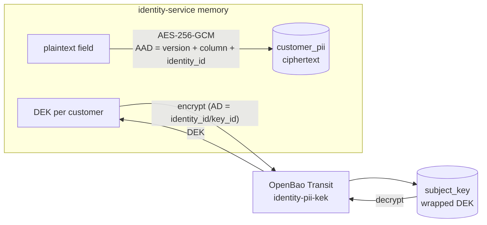

# 8. Personal data (PII) protection

Customer personal information (name, phone number, date of birth, postal
address, national ID) is encrypted at the application layer before it reaches
PostgreSQL. Decision record: [ADR-0011](../adr/0011-envelope-encryption-for-pii.md).

## 8.1 Classification

| Field | Class | At rest | Search |
| --- | --- | --- | --- |
| `name` {first, last} | confidential | AES-256-GCM (JSON) | — |
| `phone_number` (E.164) | confidential | AES-256-GCM | HMAC-SHA256 blind index (equality) |
| `date_of_birth` | confidential | AES-256-GCM | — |
| `address` | confidential | AES-256-GCM (JSON) | — |
| `national_id` {type, number} | restricted | AES-256-GCM (JSON) | — |
| `display_name`, `avatar_url`, `locale` | internal | plaintext — `display_name` is an optional nickname, never the real name | — |
| Login identifier (email or phone the customer signs in with) | confidential | `login_identifier.value_ct`: Transit AEAD (`identity-login-kek`), AAD = kind + handle (§8.12) | HMAC `lookup_key` (Transit `identity-login-pseudonym`), never leaves identity-service; the Kratos `login_id` is a separate random handle (ADR-0014) |

The Kratos `customer` schema holds **only** `login_id`, an opaque handle for
the login identifier ([ADR-0013](../adr/0013-pseudonymous-customer-login-identifiers.md),
[ADR-0014](../adr/0014-customer-login-through-identity-service.md)). The customer's name is not
a Kratos trait (registration with `traits.name` is rejected); it is written
through `PUT /v1/me/personal-info` after email verification. Admin names stay
in the `admin` schema (employee data).

## 8.2 Envelope encryption

- **DEK**: 256 random bits per customer, row `subject_key(key_id, identity_id,
  wrapped_dek, kek_name, kek_version)`. The wrapped DEK is bound to its owner
  with Transit `associated_data = identity_id/key_id`.
- **KEK**: `identity-pii-kek` (`aes256-gcm96`) in OpenBao Transit,
  `exportable=false`, `allow_plaintext_backup=false`. The service never sees it.
- **Ciphertext**: `0x01 ‖ nonce(12) ‖ ciphertext ‖ tag(16)`. Random nonce per
  write. AAD = `"identity-service/pii/v1\x00" ‖ format byte ‖ column ‖
  identity_id`, so a ciphertext moved to another row or column, or relabelled
  with another format version, fails authentication.
- **DEK cache**: in-process LRU keyed by `key_id`, TTL 5 min, zeroed on
  eviction. After an erase, other replicas may still hold that DEK in memory
  for ≤ 5 min, but the ciphertext is already deleted.

## 8.3 Blind index

`phone_bidx = HMAC-SHA256(identity-pii-bidx, "phone_number:" ‖ E.164)`,
computed by OpenBao (`transit/hmac`, `key_version=1` pinned, auto-rotation
off). Lookup is equality-only, takes the phone in the request body (never the
URL), returns at most 20 candidates, and **re-checks the decrypted phone** so a
row whose index was tampered with is dropped.

## 8.4 Access

| Who | What | Control |
| --- | --- | --- |
| Customer | read / replace / erase own PII | Bearer session; replace needs a verified email; erase is always allowed |
| supporter, admin, super_admin | masked view, phone lookup | Keto `view_customers`, AAL2; lookup 30/min + 200/day per actor |
| admin, super_admin | reveal | Keto `reveal_customer_pii`, `reason_code` enum + optional `ticket_ref`, optional `fields[]`; 20/hour per actor |

Phone numbers are **self-declared and unverified**, and they are not unique.
A lookup returns at most 20 matches. When more match, it sets
`truncated: true` and logs `pii_lookup_candidate_overflow`, so someone who
registers many accounts with a victim's number can't quietly push the real
owner out of the results. Lookup decrypts only the phone of each candidate,
and decrypts the other fields only for exact matches. The limiter charges one
unit per candidate. Masked reads are limited to 300/min per actor and are not
audited (they reveal no full values).

Masking (domain layer, fixed width so length doesn't leak): name: first character of
each part + `***` (`{first: "A***", last: "N***"}`), phone `+84*******567`,
date of birth `1990-**-**`, address city + country only, national ID `******123`
(last 3 only when ≥ 9 characters).

Reveal order: decrypt in memory → COMMIT audit `customer.pii.revealed` →
respond. If the audit row can't be written, buffers are zeroed and the
response is 500. Audit details hold field names, reason codes, ids and the
keyed index hash, **never values or free text**.

## 8.5 Erasure (crypto-shredding)

`DELETE /v1/me/personal-info`: one transaction writes audit
`customer.pii.erased` and deletes `subject_key` (cascading to `customer_pii`),
then the local DEK cache entry is evicted. Copies of the ciphertext in WAL or
replicas can't be decrypted without the wrapped DEK.

Backups still contain the wrapped DEK while the KEK version that wrapped it
can still decrypt. Controls:

1. Rotate the KEK at least once per backup-retention period, re-wrap, then
   raise `min_decryption_version` and `trim`. Old backups then hold DEKs that
   no KEK can unwrap.
2. **Erasure ledger**: after any restore, run `identity-service pii
   reapply-erasures`. It deletes `subject_key` for every `customer.pii.erased`
   target in the audit log, but only keys created at or before that erase.
   The ledger lives in the same database, so a restore also rolls it back.
   Production must therefore keep a copy outside the DB: audit events
   streamed to the log pipeline or SIEM. Erasures newer than the backup are
   then re-applied from that copy.

Erasure has to finish within the legal deadline: one month under GDPR Art. 12(3),
and 72 hours under Decree 13 Art. 16.

### Memory

DEK buffers and plaintext field buffers are zeroed after use. Decoded values
that become Go strings, such as JSON responses and Transit's base64 plaintext,
can't be zeroed and stay in memory until GC. This is accepted (DD-12), and
memory dumps of the service process are treated as PII.

On mobile, the personal-info screen sets `FLAG_SECURE` on Android and shows an
overlay on iOS when the app is inactive, so OS snapshots don't capture PII.

## 8.6 Key lifecycle (operator runbook)

| Task | Command |
| --- | --- |
| Start / unseal locally | `make up` (or `make bao-init` after restarting `openbao`) |
| Rotate KEK | `make kek-rotate` (short-lived operator token, `identity-pii-operator` policy) |
| Re-wrap DEKs | `make keys-rewrap` → `identity-service keys rewrap`, which decrypts and re-encrypts each wrapped DEK with the same AD. Batched, optimistic, idempotent |
| Retire old KEK versions | operator: `transit/keys/identity-pii-kek/config min_decryption_version=N`. The operator policy allows only `min_decryption_version` and `auto_rotate_period`, so `exportable`, `allow_plaintext_backup` and `deletion_allowed` are out of reach. `trim` needs a root or break-glass token |
| Index key rotation | not supported in v1. It would need a re-index job |

## 8.7 Failure behaviour

| Failure | Result |
| --- | --- |
| OpenBao down or sealed | PII endpoints return 503 `dependency_unavailable`. Other endpoints and readiness are unaffected, and nothing falls back to plaintext |
| GCM authentication failure | 500 `internal`. The log line `pii_decrypt_failed` carries only the identity id and column |
| App token expired | The renew loop logs `openbao_token_renew_failed` and PII requests fail closed |

## 8.8 Local OpenBao (Docker Compose)

- `openbao` uses `file` storage on the `openbao-data` volume and listens on
  `127.0.0.1:8200`.
- `openbao-init` is a one-shot job that runs on every `up`. It initialises the
  server with 1 key share, unseals it, and creates the Transit keys and
  policies. It then issues a periodic app token: orphan, no default policy,
  24 h period, with the previous token revoked. The token goes on the
  `openbao-app-token` volume, which identity-service mounts read-only.
- **Local only**: the unseal key and root token are stored on the
  `openbao-keys` volume, which no other service mounts. In production use
  auto-unseal (cloud KMS), TLS, and Kubernetes auth, or a cloud KMS adapter
  behind the same `KeyManager` port. The service refuses an `http://` OpenBao
  address unless `APP_ENV` is `local` or `test`. `PII_OPENBAO_CA_FILE` sets a
  private CA. The client never follows redirects, so the token is never
  re-sent.
- `make bao-token` copies the app token to `deploy/compose/.local/` (git-ignored)
  for host-run integration tests.

## 8.9 Compliance mapping

| Control | GDPR | Vietnam | OWASP ASVS 4.0.3 | NIST |
| --- | --- | --- | --- | --- |
| Field-level AEAD, KEK in KMS | Art. 32(1)(a) | Decree 13/2023 Art. 26–27 | V6.1.1, V6.2.1–6.2.6, V6.4.1–6.4.2 | SP 800-38D, SP 800-57 Pt 1 |
| Masking, JIT reveal, audit | Art. 5(1)(c), 25 | Decree 13 Art. 3 | V4.1.x, V8.3.4, V8.3.5 | — |
| No PII in URLs, logs, audit | Art. 25, 32 | Decree 13 Art. 26 | V7.1.1–7.1.2, V8.3.1 | — |
| Memory hygiene (best effort) | Art. 32 | — | V8.3.6 | — |
| Crypto-shredding erasure | Art. 17 | Decree 13 Art. 16 | V8.3.2 | SP 800-88 (cryptographic erase) |
| Breach readiness, DPIA | Art. 33, 35 | Decree 13 Art. 23 (72 h), 24 | — | — |
| Pseudonymous login identifiers, no contact data in the IdP store | Art. 4(5), 25, 32(1)(a) | PDPL 91/2025/QH15; Decree 13 Art. 26 | V6.2.x, V8.3.4 | SP 800-188 (pseudonymisation) |

Phone number, date of birth, address and ID number are *basic* personal data
under Decree 13 Art. 2. Vietnam's Personal Data Protection Law No.
91/2025/QH15 (effective 2026-01-01) supersedes much of Decree 13. Confirm the
current article numbers with counsel before relying on this table.

## 8.10 What remains in the Kratos database

| Where | What | Controls |
| --- | --- | --- |
| `identities.traits`, `identity_credential_identifiers`, `identity_verifiable_addresses`, `identity_recovery_addresses` | customers: the opaque handle `<base32>@login.invalid` only. Admins: their work email (employee data) | Own database and role; KMS-encrypted volumes and backups in production; admin API on a private network only |
| `courier_messages` | recipient (pseudonym or admin email), Kratos-rendered body with the one-time code | Never delivered by Kratos. Retention via `make kratos-scrub` (7 days; `kratos cleanup` does not delete courier messages) |
| `selfservice_*_flows` | the identifier submitted to a flow: a handle, or a random decoy for unknown addresses, sent by identity-service (ADR-0014). A direct call with a plaintext address is rejected by the schema | `kratos cleanup sql --keep-last 24h`, scheduled |
| `sessions` | IP address, user agent | Session lifespan limits retention (accepted risk, 06-security §6.7) |

Before the login migration (§8.12) the same tables hold legacy customers'
plaintext emails. `pii migrate-kratos-logins` rewrites them (Kratos deletes
the old address rows), and `make kratos-scrub PHASE=complete` deletes the
legacy courier messages.

Accepted risk with owner: [06-security §6.7](06-security.md#67-accepted-risks-v1).

## 8.11 Migrating names out of Kratos

Existing customers created before this change still carry `traits.name`.
`identity-service pii migrate-kratos-names [--dry-run]` (run by `./dev up`
locally) pages through customer identities and, per identity:

1. customer has a `customer.pii.erased` audit event → only remove the trait
   (earlier erasure requests win);
2. personal info already has a name → only remove the trait;
3. otherwise seal the name under the customer's DEK and, in one transaction,
   append audit `customer.pii.name_migrated` (field names only) and store
   `name_ct`; after COMMIT re-read the identity, and only if `traits.name` still
   equals the value that was encrypted, remove it with a JSON Patch `remove`
   (Kratos v26.2.0 rejects the `test` op, so this is read-compare-remove; a
   change in between yields a conflict and keeps the name).

An empty `traits.name: {}` is removed without storing anything. A name that
fails validation stays in Kratos and is counted as `failed`; `--strip-invalid`
removes such names without storing them. Every strip-only removal is audited
as `customer.pii.name_trait_removed` with a reason. The store transaction
re-checks the erasure ledger, so an erase that lands mid-run wins. A customer
who erases personal info while a legacy name is still in Kratos gets a
`customer.pii.erased` event and the trait removed, even without a record. If removing
the trait fails, the erase returns 503 `dependency_unavailable` (the key is
already shredded) so the client retries.

Name parts reject control characters and Unicode format characters (category
Cf: zero-width, bidi overrides/isolates, BOM, soft hyphen); a part made only of
whitespace or Cf characters counts as empty.

The trait is never removed before the encrypted copy is committed, so a crash
between the two steps leaves the name in Kratos and a re-run finishes it.

Production rollout order: DB migration `0005` → identity-service → Kratos with
the new `customer` schema → run the CLI. Between the last two steps, identities
still carrying `name` can sign in, but a settings update fails schema
validation until they are migrated, so run the CLI right after the Kratos rollout.
The same validation blocks **admin disable** (state change) of an unmigrated
identity: to block such an account urgently, run the CLI first (with
`--strip-invalid` if its name is invalid), then disable.

`PUT /v1/me/personal-info` replaces the whole record, so a client build that
does not know the `name` field clears a migrated name when it saves. Ship the
clients that send `name` (and enforce a minimum app version) **before** running
the CLI in production.

## 8.12 Login identifiers (ADR-0013, ADR-0014)

End-to-end diagrams: [10-pseudonymous-login](10-pseudonymous-login.md).

| Item | Value |
| --- | --- |
| Handle (`pseudonym`, Kratos `login_id`) | `base32_lower(32 random bytes) + "@login.invalid"` for logins created since migration 0007; older handles equal their lookup key (ADR-0013) |
| Lookup key | `HMAC-SHA256(identity-login-pseudonym v1, "login-id/v1" ‖ 0 ‖ kind ‖ 0 ‖ value)`; finds the row at sign-in, registration, recovery and admin lookup; never returned to a client |
| Normalisation | email: trimmed, lower-cased, strict `net/mail`, no control/format characters, ≤ 254, not `@login.invalid`/`@sms.local`. Phone: separators stripped, `00`→`+`, a leading `0` takes the default country (`84`), E.164, the country must be in `LOGIN_PHONE_ALLOWED_COUNTRIES` |
| Vault row | `login_identifier(pseudonym bytea PK, lookup_key bytea UNIQUE, kind, value_ct "vault:vN:…", kek_version, identity_id UNIQUE NULL, bound_at, legacy_verified, created_at, last_validated_at)` |
| AAD | `"identity-service/login/v1" ‖ 0 ‖ kind ‖ 0 ‖ hex(pseudonym)` |
| Written | only by `POST /v1/auth/registration` (re-uses the row of the same lookup key, else inserts a new random handle; insert-if-absent on either key, re-read on a race) and by the migration CLI |
| Bound | by the after-registration webhook, or lazily on `GET /v1/me` / courier delivery, after checking the identity's `login_id` in Kratos. A row bound to a deleted identity can be re-bound |
| Purged | `pii purge-unbound-logins` (daily): unbound rows not validated for 24 h whose pseudonym has no Kratos identity, and rows bound to deleted identities (audited `customer.login.erased`; `pii reapply-erasures` re-applies them after a restore) |
| Recovery ids | `POST /v1/auth/recovery` returns the Kratos recovery flow id sealed with `identity-login-kek` (associated data `identity-service/recovery-flow/v1`), never in clear: Kratos's public flow lookup shows the handle. Nothing is stored |
| Admin access | masked in lists and detail (one batch decrypt per page); lookup by body `{login:{type,value}}` (audited `customer.login.lookup`); reveal field `login` (audited `customer.pii.revealed`) |
| Keys | the HMAC key is never rotated in place, but a re-key now only rewrites `lookup_key` (Kratos untouched); back it up with OpenBao snapshots. `identity-login-kek` rotates like the PII KEK (`make kek-rotate`, `make keys-rewrap` re-wraps the vault too) |

Migration (existing customers, `./dev migrate-logins` or
`identity-service pii migrate-kratos-logins [--dry-run]`). For each legacy
customer:

1. Seal the email into a vault row bound to the identity under a new random
   handle (or the existing row of the same lookup key), recording whether it
   was verified.
2. Commit audit `customer.login.migrated`.
3. Replace `traits.email` with `traits.login_id` (read-compare-patch).
4. If the email was verified, mark the new address verified (a second
   patch: Kratos resets verification on a trait change).

A crash between 3 and 4 is repaired by the next run (`reverified`).

Rollout order (production):

1. identity-service with migration `0006`.
2. Kratos with the transition schema, the http courier and profile settings
   disabled. Run `LOGIN_MIGRATION_PHASE=transition`.
3. Ship the app that signs in through identity-service (ADR-0014; originally
   the app that resolved first), and enforce the minimum version.
4. Run `pii migrate-kratos-logins` until `failed=0`.
5. Deploy the final `customer.v2.json` with `LOGIN_MIGRATION_PHASE=complete`.
6. Run `make kratos-scrub PHASE=complete`.

During the window the pre-registration webhook also refuses a handle whose
address a legacy customer still uses, and `POST /v1/auth/login` and
`/recovery` use the legacy email when the address has no bound row (login
tries the handle first; recovery asks the Kratos admin API whether an unbound
handle belongs to an identity, and otherwise recovers the legacy email).

ADR-0014 rollout: migration `0007` (adds and backfills `lookup_key`), then
identity-service with the `/v1/auth/*` endpoints and the new limits
(`LOGIN_SIGNIN_RATE`, `LOGIN_REGISTER_RATE`, `LOGIN_NET_RATE`,
`LOGIN_ACCOUNT_RATE`), shipped together with the app. Kratos is unchanged.

### Re-key runbook (lookup HMAC key compromised or retired, A7)

Since ADR-0014 the HMAC key only produces `lookup_key`. Kratos handles do not
depend on it, so a re-key does not touch Kratos:

1. Create `identity-login-pseudonym-v2` in OpenBao (type `hmac`,
   `exportable=false`, `deletion_allowed=false`). Grant the app policy
   `transit/hmac/identity-login-pseudonym-v2/*`, and grant the job role
   UPDATE on `login_identifier.lookup_key`.
2. Pause customer registration (sign-in keeps working on v1 keys).
3. For every vault row, decrypt the address, compute the v2 lookup key and
   update `lookup_key`. Tooling: follow-up CLI `pii rekey-logins` (owner:
   identity-service maintainers). Until it exists, this runbook is executed
   with a reviewed one-off script.
4. Switch `PII_OPENBAO_LOGIN_HMAC_KEY_NAME` to the v2 key and restart.

Handles created before migration 0007 equal their **v1** lookup key. If the
v1 key is compromised, also rotate those handles: assign a random handle,
re-seal the row under it (the AAD binds the handle), and run the Kratos
two-patch rewrite (`replace /traits/login_id`, then re-mark verified).

Back the key up with OpenBao storage snapshots and escrowed unseal/recovery
keys, and rehearse a restore. Transit `backup` is not used: it would need
`exportable` + `allow_plaintext_backup`.

### Alerts

`deploy/observability/login-alerts.yml` alerts on:

- courier drops by reason, and courier errors;
- SMS budget use;
- unbound vault rows;
- pre-registration failures.

Quotas and SMS budgets are counted in `courier_dispatch`, so they survive
restarts and are shared by every replica. The per-IP, per-network and per-account
customer auth limits are kept in memory per replica: the effective limit is the configured value times the
number of replicas.

