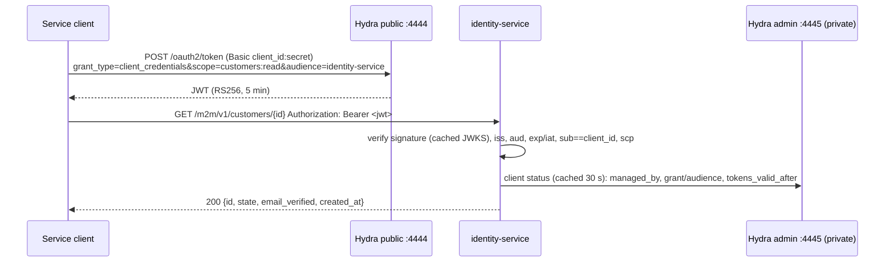

# 9. Machine-to-machine access (Ory Hydra)

> **Current diagrams:** [F14 service clients](../features/F14-service-clients.md) · [F15 M2M API](../features/F15-machine-to-machine-api.md).

Back-office jobs and partner systems call identity-service with OAuth2
**client_credentials** tokens issued by **Ory Hydra**. People keep using Kratos
sessions (ADR-0002); Hydra is used only for machines. Decision record:
[ADR-0012](../adr/0012-hydra-for-machine-to-machine.md).

## 9.1 Flow



Request a token locally:

```sh
curl -s -u "$CLIENT_ID:$CLIENT_SECRET" http://localhost:4444/oauth2/token \
  -d grant_type=client_credentials -d scope=customers:read -d audience=identity-service
```

The `audience` parameter is **required**. Without it Hydra issues a token with
`aud: []`, and identity-service rejects that token.

## 9.2 Planes

| Plane | Prefix | Credential | Authorisation |
| --- | --- | --- | --- |
| Customer | `/v1/*` | Kratos session token | self |
| Admin | `/admin/v1/*` | Kratos cookie, AAL2 | Keto `Console:main` |
| Machine | `/m2m/v1/*` | Hydra JWT | OAuth2 scope per route |

`/m2m` rejects Kratos cookies and `X-Session-Token`, and it has no CORS. `/v1`
rejects JWT-shaped bearers before it calls Kratos, so machine tokens are
never forwarded to Kratos. Every machine route declares a scope; the service
won't start otherwise.

| Scope | Routes |
| --- | --- |
| `customers:read` | `GET /m2m/v1/customers/{id}`: status only, no email, name or PII |
| `audit:read` | `GET /m2m/v1/audit-events`: action allowlist (no `customer.pii.*`) and detail-key allowlist |

## 9.3 Token validation rules

| Rule | Value |
| --- | --- |
| Algorithm | RS256 only. `kid` required. `jku`/`jwk`/`x5u`/`x5c`/`crit` headers rejected. `typ` is `JWT` or `at+jwt` |
| Size | ≤ 8 KiB |
| Issuer | exact `M2M_ISSUER` (`http://localhost:4444` locally) |
| Audience | contains `identity-service` |
| Time | `exp`, `nbf` and `iat` with 30 s leeway; `exp - iat` ≤ 10 min |
| Subject | `sub == client_id`; `scp` is a non-empty array; no `nonce`/`at_hash`/`azp` |
| Client | Exists in Hydra, has `metadata.managed_by = identity-service`, grant `client_credentials` only and audience `identity-service`. `iat ≥ metadata.tokens_valid_after`. Cached 30 s, negatives included |
| JWKS | Cached. Refreshed every 5 min, and on an unknown `kid` at most once per 10 s. Single-flight, 2 s timeout, size-capped. Old keys are kept if a refresh fails |

Errors are `401 invalid_token` and `403 insufficient_scope`. Both also set
`WWW-Authenticate: Bearer error="…"` (RFC 6750).

## 9.4 Managing service clients

Only super_admins can manage service clients (Keto `manage_service_clients`).
They use the admin web page "Service clients", the API
`/admin/v1/service-clients`, or the bootstrap CLI:

```sh
docker compose … exec identity-service /identity-service clients create \
  --name billing-sync --owner team-billing@example.com --scope customers:read
```

| Action | Effect |
| --- | --- |
| Create | Hydra client with `client_credentials`, audience `identity-service`, JWT strategy and `client_secret_basic`. The secret is shown **once**. Audit `service_client.created` |
| Rotate | New 256-bit secret, shown once. The old secret stops working, and `tokens_valid_after = now` kills tokens already issued. Audit |
| Delete | Hydra client deleted. Tokens rejected within ≤ 30 s on every replica. Audit |

Secrets are never stored by identity-service, and they never appear in logs
or audit entries. Every machine call writes an `m2m_access` log line with
`client_id`, `jti`, route, target and status.

## 9.5 Hydra hardening

- The admin API (`:4445`) has no authentication. In compose it is reachable
  only on the `hydra` network, which only identity-service shares, and on host
  `127.0.0.1`. In production, use a NetworkPolicy and never expose it through
  ingress.
- `oidc.dynamic_client_registration.enabled: false`,
  `oauth2.expose_internal_errors: false`, `log.leak_sensitive_values: false`,
  `ttl.access_token: 5m`, bcrypt cost 10 for client secrets.
- `--dev` (HTTP) is for local use only. In production the issuer is https, and
  the service refuses non-https Hydra URLs outside `APP_ENV=local|test`.
- Rate-limit `/oauth2/token` at the ingress, per IP and per `client_id`.
- `SECRETS_SYSTEM` comes from the secret store and rotates as a list.
- Signing-key rotation: `hydra create jwks hydra.jwt.access-token`. The service
  picks up new keys through the JWKS refresh. Keep the old key until its tokens
  expire (> 10 min).
- Before onboarding external partners, move clients to `private_key_jwt`.

## 9.6 Revoking a leaked token

Tokens are verified offline, so Hydra's `/oauth2/revoke` has **no effect** on
identity-service. To kill a leaked token:

- **Rotate** the client secret. Tokens issued before the rotation
  (`tokens_valid_after` = the next whole second) are rejected.
- Or **delete** the client.

Other replicas pick up either change within the 30 s status-cache TTL.
Clients should fetch a new token about 1 s after a rotation.

Every managed client carries `metadata.integrity`: an HMAC over the client
id, scopes, audience and creator, keyed by `M2M_CLIENT_TAG_KEY`. A client
created directly through the Hydra admin API, bypassing identity-service and
its audit, is therefore rejected even if it copies `managed_by`.

## 9.7 Limits

The service allows 600 requests/min per client and 60/min of failed
authentications per IP. The IP budget applies only to rejected requests, so a
valid token is never refused because of other callers sharing the IP. Both
limits are per replica, so the real ceiling is N × the limit. Behind a proxy,
set `TRUSTED_PROXY_HOPS`; otherwise every caller shares one IP.
