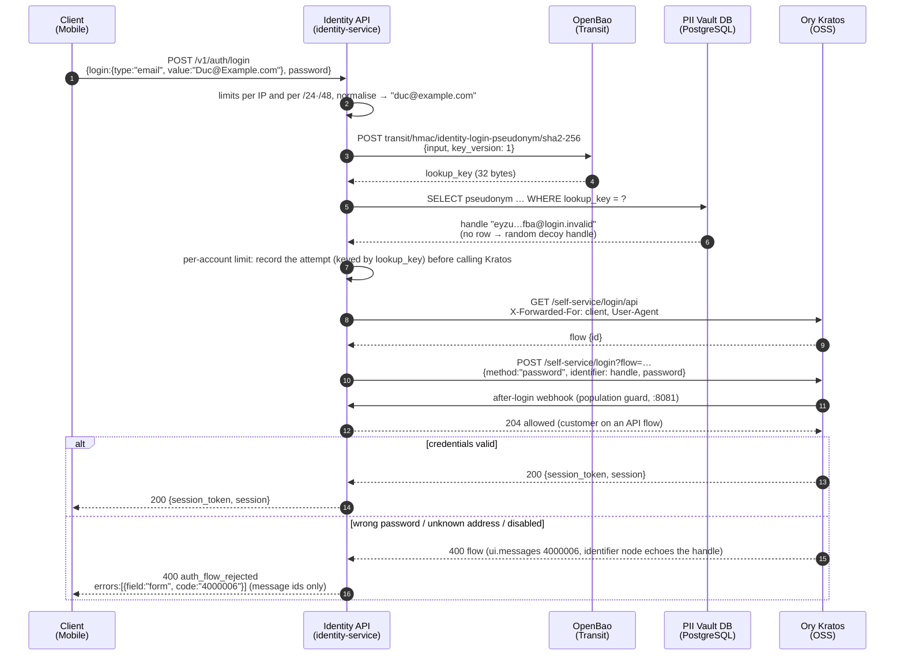
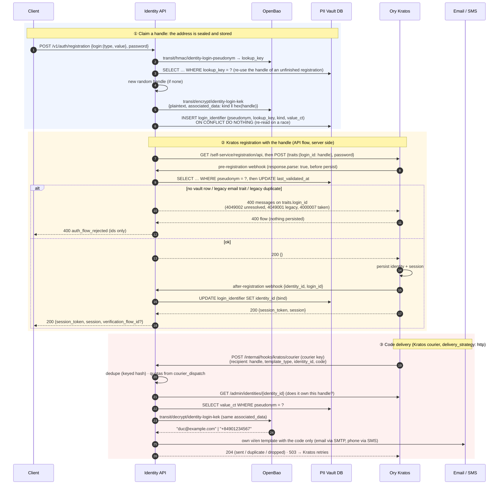
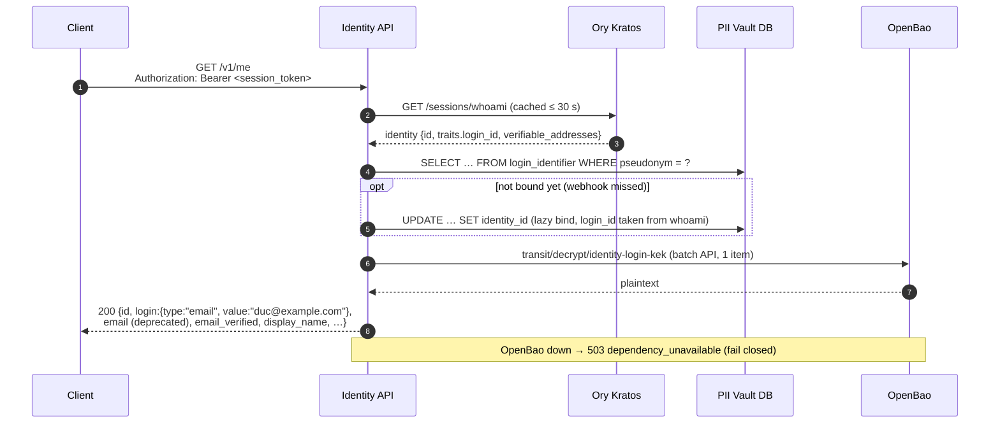
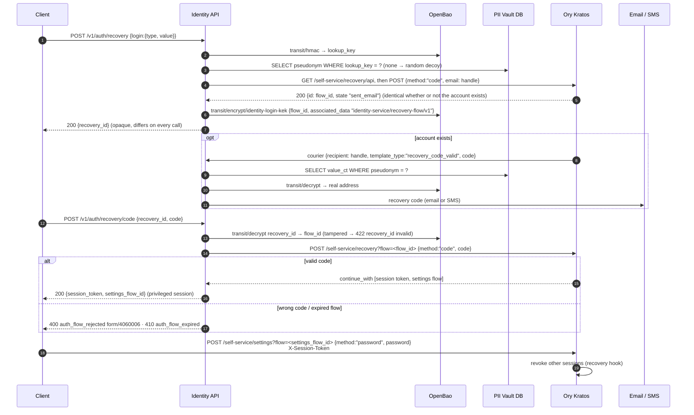
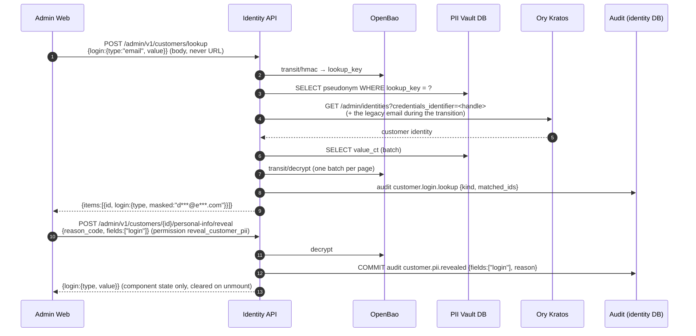

# 10. Pseudonymous customer login: the model end to end

> **Current diagrams:** per-feature pages with every branch: [F01](../features/F01-customer-registration.md) · [F03](../features/F03-customer-login.md) · [F04](../features/F04-customer-recovery.md) · [F07](../features/F07-customer-profile.md) · [F11](../features/F11-customer-management.md) · [F12](../features/F12-admin-pii-access.md).

This chapter shows, on one page, how a customer signs in, registers, loads
their profile and recovers a password. **Ory Kratos never stores a
customer's email address or phone number**, and **no unauthenticated
endpoint maps an address to its Kratos identifier**.

Decision records:

- [ADR-0013](../adr/0013-pseudonymous-customer-login-identifiers.md): the
  vault, the courier, and pseudonyms in Kratos.
- [ADR-0014](../adr/0014-customer-login-through-identity-service.md): sign-in
  through identity-service and opaque handles.

Data and runbooks: [08 §8.12](08-pii-protection.md#812-login-identifiers-adr-0013).

The lanes are the same in every diagram:

| Lane | Component | Holds |
| --- | --- | --- |
| Client | Mobile app; the admin web uses browser flows and is not pseudonymised | its session token; after sign-in, its own handle (whoami) |
| Identity API | identity-service `:8080` (public), `:8081` (Kratos webhooks + courier) | plaintext addresses and passwords only in memory, for one request |
| OpenBao | Transit keys `identity-login-pseudonym` (HMAC, version 1 pinned) and `identity-login-kek` (AES-256-GCM) | the keys; nothing leaves it |
| PII Vault DB | PostgreSQL `identity`, table `login_identifier` | `pseudonym` (the Kratos handle, PK), `lookup_key` (HMAC, unique), `kind`, `value_ct`, `identity_id` |
| Ory Kratos | identities, credentials, sessions, flows, courier queue | `traits.login_id = <handle>@login.invalid`, the password hash |
| Email / SMS | SMTP provider, SMS provider (Mailpit locally) | the delivered message |

Two values stand in for an address:

```
lookup_key = HMAC-SHA256( identity-login-pseudonym v1,
                          "login-id/v1" ‖ 0x00 ‖ kind ‖ 0x00 ‖ normalised value )   -- never leaves identity-service
handle     = base32_lower( 32 random bytes ) + "@login.invalid"                       -- traits.login_id in Kratos
```

The input is normalised first. Email is trimmed and lower-cased. A phone
number becomes E.164, with `0…` read as `+84…`. The lookup key finds the
vault row of an address. The handle is what Kratos knows.

Handles created before migration 0007 equal the lookup key of their address
(ADR-0013), and the backfill set `lookup_key = pseudonym` for them, so
existing customers sign in unchanged. The `.invalid` top-level domain is
reserved (RFC 6761), so no mail server can deliver to it.

## 10.1 Login (password)



Notes:

- The app makes one call. It never sees the handle of an address before
  signing in as that address, and a rejection never carries the flow.
- During the migration `transition` phase, an email address with no bound
  vault row is also tried as the legacy plaintext identifier (PLX-FR-07).
  This can cost a second Kratos call (C13).
- The per-account limit records every attempt before Kratos is called, so
  concurrent guesses cannot slip past. The trade-off is lockout (C15).

## 10.2 Registration and code delivery



Verification after sign-up stays direct to Kratos. The app starts a native
verification flow with its **own** handle (`traits.login_id` from the
session) and submits the code on that flow. Password policy (4000032,
HaveIBeenPwned) and "already exists" (4000007) come back as
`auth_flow_rejected` ids.

## 10.3 Load the profile (`GET /v1/me`)



## 10.4 Forgot password



identity-service starts the flow, submits the code, and decrypts the address
**only** to deliver the message. The Kratos flow id never reaches the client
in clear: `GET /self-service/recovery/flows?id=` is public and shows the
handle in its `email` node, so a plain flow id would re-open the oracle
(found in review). The new password goes to Kratos directly.

During the migration transition, a legacy customer's address with a stray
unbound vault row is checked against the Kratos admin API. If no identity
has that handle, recovery uses the legacy email.

## 10.5 Admin: lookup and reveal



## 10.6 API calls between services

| From → To | Calls |
| --- | --- |
| Client → Identity API | `POST /v1/auth/login`, `POST /v1/auth/registration`, `POST /v1/auth/recovery`, `POST /v1/auth/recovery/code` (public, rate limited); `GET /v1/me` (bearer) |
| Client → Ory Kratos | verification (`/self-service/verification/api`, with the owner's handle), `/self-service/settings` (new password after recovery with the privileged token, password change, refresh login with the owner's handle), `/sessions/whoami`, `DELETE /self-service/logout/api` |
| Identity API → OpenBao | `POST transit/hmac/identity-login-pseudonym/sha2-256` (key_version 1); `POST transit/encrypt/identity-login-kek` and `transit/decrypt/identity-login-kek` (batch) with `associated_data` (vault rows; recovery ids with `identity-service/recovery-flow/v1`) |
| Identity API → PII Vault DB | `login_identifier`: get by lookup key / handle / identity, insert-if-absent, bind, touch, list stale, delete; `courier_dispatch`: reserve, mark sent, count deliveries |
| Identity API → Ory Kratos (public) | `GET /self-service/{login,registration,recovery}/api`, `POST /self-service/{login,registration,recovery}?flow=` (recovery: the address step and the code step) (10 s timeout, `X-Forwarded-For`, `User-Agent`); `GET /sessions/whoami` |
| Identity API → Ory Kratos (admin) | `GET /admin/identities/{id}`, `GET /admin/identities?credentials_identifier=` (also: legacy recovery checks whether an unbound handle is used), `PATCH /admin/identities/{id}` (migration: two-patch) |
| Ory Kratos → Identity API (`:8081`) | `pre-registration` (webhook key), `after-registration`, `after-login`, `courier` (courier key) |
| Identity API → Email / SMS | SMTP (verification and recovery codes, admin mail, invitations); SMS provider HTTP (`{to, text}`) |

## 10.7 Pros and cons of the model

### Pros

| # | Pro | Why it holds |
| --- | --- | --- |
| P1 | **No customer email or phone in any Kratos table** | Traits, credential identifiers, addresses and courier recipients hold only handles; verified by the smoke test's SQL probe (`PLI-NFR-01`) |
| P2 | **No address-to-handle oracle** (closes ADR-0013 C1) | No unauthenticated endpoint returns a handle; new handles are random; rejections carry Kratos message ids only (PLX-FR-06) |
| P3 | **One call to sign in** (closes C3) | identity-service creates and submits the Kratos flow; no device cache |
| P4 | **Kratos used for credentials** | Password policy (HIBP, length), hashing, sessions, recovery and verification are stock Kratos flows; identity-service only drives them |
| P5 | **Same answer for unknown addresses at login and recovery** | A decoy handle runs the same flow; wrong password and unknown address both get `4000006`; recovery always answers an opaque `{recovery_id}` (sealed flow id, different each call). Registration still reveals "taken" (C12) |
| P6 | **One mechanism for email and phone** | Both become `…@login.invalid` on Kratos's email channel; the courier picks SMTP or SMS |
| P7 | **HMAC re-key no longer touches Kratos** | The lookup key is a separate column: decrypt each row, HMAC with v2, update `lookup_key` (eases C4) |
| P8 | **Abuse controls in one place** | Limits per IP, per /24·/48, for registration, and for every sign-in attempt per account, recorded before Kratos is called (Kratos OSS has none); courier quotas and SMS budgets counted in the DB |
| P9 | **No Kratos migration for ADR-0014** | Migration 0007 backfilled `lookup_key = pseudonym`; existing handles stay valid |

### Cons

| # | Con | Mitigation today |
| --- | --- | --- |
| C1 | **Passwords pass through identity-service** (sign-in and registration) | Memory only; strict bodies; access log without bodies; `password` log key redacted; value-free adapter errors; TLS at the ingress (PLX-NFR-01) |
| C2 | **Customer auth depends on identity-service, its DB and OpenBao** | One HMAC call plus one indexed read; Kratos retries the courier; alerts. Admin sign-in does not depend on it |
| C3 | **Handles created before 0007 equal the HMAC of their address**: a Kratos dump plus a leaked HMAC key could link those customers | The key stays in OpenBao; follow-up: rotate old handles (two-patch rewrite) |
| C4 | **HMAC key loss** stops sign-in by address | `deletion_allowed=false`, OpenBao snapshots and restore drill; with the KEK, lookup keys can be rebuilt from the vault |
| C5 | **Kratos sees identity-service's IP** | Client IP and User-Agent forwarded for session devices; all rate limiting is ours; per-replica limits (shared store is a follow-up) |
| C6 | **Customer MFA or passkeys would need proxy support** | Not enabled for customers; WebAuthn needs a design where the ceremony stays between app and Kratos (§10.9) |
| C7 | **Kratos's password similarity check sees only the handle** | HIBP and length still apply; the app shows a hint |
| C8 | **Migration of legacy customers is one-way** (roll forward only) | Phased rollout with a 24 h soak; reverse procedure documented, untested |
| C9 | **Kratos admin views are opaque** (handles) | Admin lookup and masked views; reveal with reason and audit |
| C10 | **Changing the login identifier is not offered** | Follow-up feature (below) |
| C11 | **Per-IP limits trust `X-Forwarded-For` by hop count** | Ingress-only exposure; per-network limits; follow-up `TRUSTED_PROXY_CIDRS` |
| C12 | **Registration reveals that an address has an account** (`4000007`), like native Kratos | Accepted; PLX-NFR-03 covers login and recovery only; registration limits per IP and network |
| C13 | **Timing**: decoy handles rely on Kratos's own unknown-identifier delay; during the transition an unbound row can cost a second Kratos login call | Follow-up: measure and tune against bcrypt so unknown and known match |
| C14 | **Kratos public API stays reachable** (verification, settings and refresh login need it): whoever knows a handle can call `/self-service/login/api` directly and bypass our limits | Follow-up: ingress allows `/self-service/registration/api` and `/self-service/recovery/api` only from identity-service and rate-limits `/self-service/login/api` |
| C15 | **Lockout**: the per-account limit counts every attempt, so anyone can block sign-in to an address for ≤ 15 min | Accepted; follow-up: combined account+IP key or CAPTCHA |

## 10.8 Model history

| Aspect | ADR-0013: resolve, then talk to Kratos | ADR-0014: identity-service drives Kratos |
| --- | --- | --- |
| App calls to sign in | resolve + create flow + submit (3; 2 with the device cache) | 1 |
| Address → identifier | public `POST /v1/auth/identifiers` (oracle) | inside identity-service only |
| Kratos identifier | `base32(HMAC(address))`, deterministic | random handle; HMAC is a separate `lookup_key` |
| Password path | app → Kratos | app → identity-service → Kratos |
| Recovery | app → Kratos with the resolved identifier, then the code | identity-service starts the flow and submits the code (opaque sealed `recovery_id`); app sets the new password at Kratos |
| HMAC re-key | rewrite every Kratos identity | rewrite `lookup_key` only |

The ADR-0014 model follows a sequence diagram proposed by the product owner
(Identity API as proxy, Kratos keyed by an opaque id). Two parts changed in
implementation:

- identity-service drives Kratos **native API flows** server side
  (`/self-service/login/api`), not browser flows. API flows need no
  cookie or CSRF relay, and the app can continue them by id.
- The diagram's `POST /self-service/recovery/browser {identity_id}` does not
  exist in Kratos, and the admin recovery-code API needs the identity id,
  which would treat unknown addresses differently. Recovery therefore runs
  the self-service code flow with the handle, or a decoy. The Kratos flow id
  goes to the app only sealed (`recovery_id`), because a public flow lookup
  shows the handle (found in the security review).

## 10.9 Future directions

| Priority | Direction | What changes | Tracks |
| --- | --- | --- | --- |
| 1 | **Restrict the Kratos public API at the ingress** | Only identity-service may reach `/self-service/registration/api` and `/self-service/recovery/api`; `/self-service/login/api` rate limited; closes C14 | ADR-0014 |
| 1 | **Timing parity for decoy handles** | Measure unknown vs known handle latency with bcrypt; tune Kratos or add a delay; closes C13 | ADR-0014 |
| 2 | **Lockout-resistant account limit** | Combined account+IP key or CAPTCHA after the limit; eases C15 | ADR-0014 |
| 1 | **Trusted proxy CIDRs** for client-IP extraction | Honour `X-Forwarded-For` only from configured proxy networks; closes C11 | SEC-C09 |
| 1 | **Rotate pre-0007 handles** | Give old customers random handles (two-patch Kratos rewrite, vault `pseudonym` update with re-sealed AAD); closes C3 | ADR-0014 |
| 1 | **`pii rekey-logins` CLI** | Decrypt each row, HMAC with v2, update `lookup_key` (needs UPDATE on that column); Kratos untouched | SEC-C12 |
| 2 | **Shared rate-limit store** (Redis) | Exact sign-in, account and network limits across replicas | 08 §8.12 alerts note |
| 2 | **Change login identifier** (email ↔ phone, new email) | Verify the new address by code, then re-seal the vault row under a new lookup key; the handle can stay | C10 |
| 2 | **Passkeys / WebAuthn for customers** | Needs a proxy-compatible design: the WebAuthn origin binds the ceremony to the app and Kratos, so identity-service may only start the flow; removes the password from our path (C1, C7) | 02 §2.1 "Later" |
| 3 | **Several login identifiers per customer** (email **and** phone) | Several vault rows (lookup keys) per identity pointing at one handle | PLI-A-05 |
| 3 | **Production SMS provider** + delivery receipts | Real adapter behind `SMSSender`; per-country routing; webhook receipts into `courier_dispatch` | DD-06 |
| 3 | **Managed KMS** (AWS KMS / GCP KMS) behind the same ports | Key custody and backup by the provider; addresses C4 operationally | ADR-0011 revisit |
| 4 | **Registration hook for every method** | When code, passkey or OIDC registration is enabled, attach the pre-registration hook to it | SEC-C07 |
| 4 | **Kratos native trait encryption**, if Ory ships it | Could replace the handle layer for some fields; re-evaluate ADR-0013/0014 | ADR revisit |
