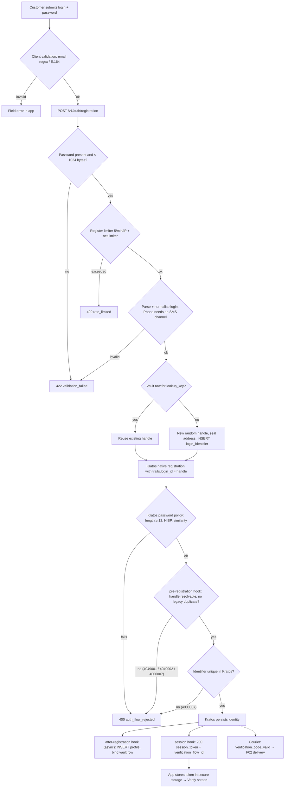
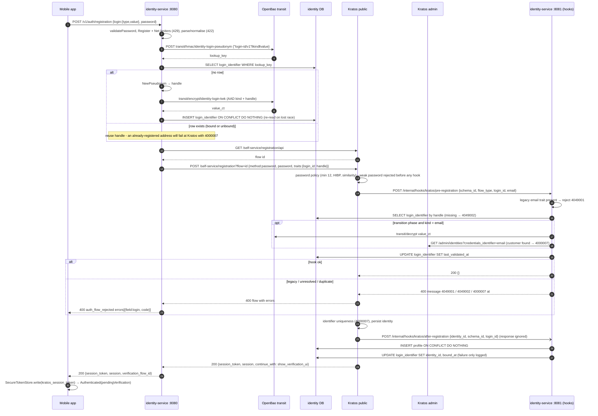
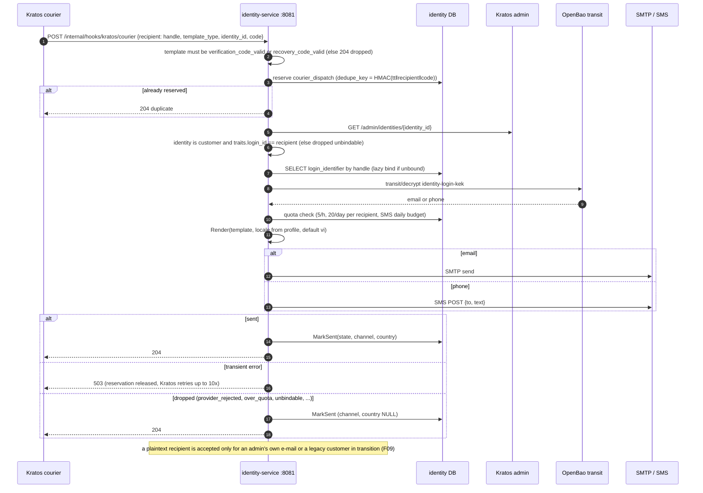

# F01 — Customer registration and code delivery

A customer signs up in the mobile app with an email address or phone number
and a password. identity-service stores the real address in its encrypted
**login vault** (`login_identifier`) and registers the customer in Kratos
under an opaque **handle** (`<52 base32 chars>@login.invalid`). Kratos never
sees the real address. When Kratos sends a verification code, it goes back
through identity-service, which decrypts the address and delivers by email or
SMS.

## Actors and entry points

| Actor | Client | Entry point |
| --- | --- | --- |
| Customer | Mobile app `SignUpScreen` | `POST /v1/auth/registration {login:{type,value}, password}` |
| Kratos | webhooks to `:8081` | `pre-registration`, `after-registration`, `courier` |

## Functional diagram

## Sequence — registration

## Sequence — verification code delivery (courier)

Recovery codes ([F04](F04-customer-recovery.md)) use the same path.

## Errors and outcomes

| Condition | Response | App behaviour |
| --- | --- | --- |
| Missing or too-long password, bad login | 422 `validation_failed` | field error |
| > 5/min or 30/day per IP | 429 `rate_limited`, `Retry-After: 60` | snackbar |
| Address already registered | 400 `auth_flow_rejected` `login`/`4000007` | field error |
| Weak or pwned password | 400 `auth_flow_rejected` `password`/`40000xx` | field error |
| Flow expired | 410 `auth_flow_expired` | restart |
| OpenBao or Kratos down | 503 `dependency_unavailable` | retry |

## Side effects

- `login_identifier`: inserted, then bound by the after-registration hook (or lazily by `GET /v1/me`).
- `profile`: inserted by the after-registration hook.
- `courier_dispatch`: one row per courier message, whether sent or dropped (deduplicated, purged after 24 h).
- Kratos DB: identity with `traits.login_id = handle`.
- **No audit event.** Customer auth flows emit only metrics and logs.

## Code references

- `apps/mobile/lib/features/auth/presentation/sign_up_screen.dart:52`
- `apps/mobile/lib/core/identity/customer_auth_client.dart:61`
- `services/identity-service/internal/app/customerauth.go:228` — `Register`
- `services/identity-service/internal/app/login.go:163` — `claim` / `store`
- `services/identity-service/internal/adapter/kratos/selfservice.go:188` — registration flow
- `services/identity-service/internal/adapter/httpapi/router.go:174` — after-registration / pre-registration hooks
- `services/identity-service/internal/app/login.go:217` — `ValidateRegistration`
- `services/identity-service/internal/app/provisioning.go:25` — profile provisioning
- `services/identity-service/internal/app/courier.go:114` — `Dispatch`
- `deploy/ory/kratos/kratos.yml.tmpl:101` — registration hooks order
- `deploy/ory/kratos/webhooks/pre-registration.jsonnet`, `after-registration.jsonnet`, `courier.jsonnet`

## Related

[ADR-0013](../adr/0013-pseudonymous-customer-login-identifiers.md) ·
[ADR-0014](../adr/0014-customer-login-through-identity-service.md) ·
[ADR-0008](../adr/0008-profile-provisioning.md) ·
[10 §10.2](../architecture/10-pseudonymous-login.md)
