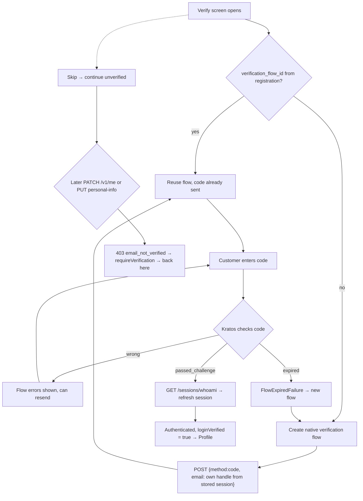
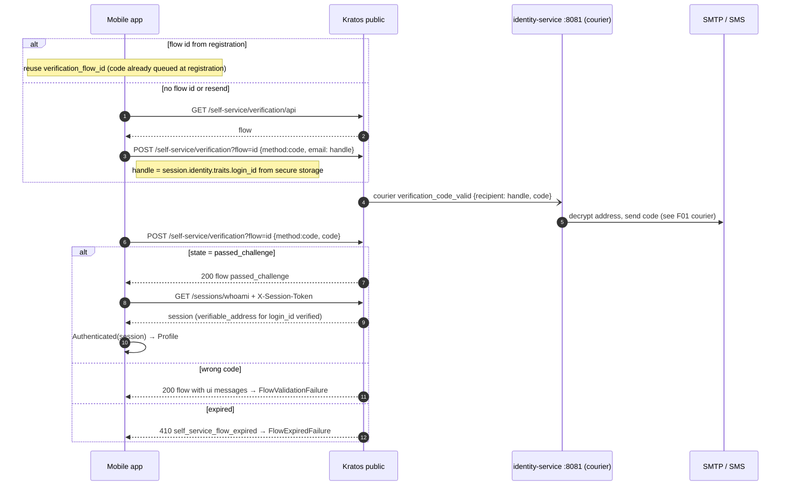

# F02 — Customer verification (email or phone)

After registration the customer proves they own the address by entering a
code. **The mobile app drives the Kratos verification flow directly.**
identity-service is involved only as the courier that delivers the code (see
[F01 courier](F01-customer-registration.md#sequence--verification-code-delivery-courier)).
An unverified customer can sign in and read their data. They cannot change
their profile or personal info (403 `email_not_verified`).

## Actors and entry points

| Actor | Client | Entry point |
| --- | --- | --- |
| Customer | Mobile app `VerifyEmailScreen` | Kratos `GET /self-service/verification/api`, `POST /self-service/verification?flow=` |

## Functional diagram

## Sequence

## How "verified" is computed

The app and the server use the same rule. A customer is verified when the
Kratos `verifiable_addresses` entry whose value equals `traits.login_id` is
verified. On the server this sets `Principal.EmailVerified`; see
[F06](F06-request-authentication.md).

## Code references

- `apps/mobile/lib/features/auth/presentation/verify_email_screen.dart:40`
- `apps/mobile/lib/features/auth/data/auth_repository.dart:129` — start / resend / submit
- `apps/mobile/lib/core/kratos/ory_kratos_client.dart:121`
- `apps/mobile/lib/core/kratos/kratos_models.dart:245` — `loginId`, `loginVerified`
- `services/identity-service/internal/adapter/kratos/model.go:66` — server-side `EmailVerified`
- `services/identity-service/internal/app/me.go:57` — `email_not_verified` gate
- `deploy/ory/kratos/kratos.yml.tmpl:72` — verification `use: code`

## Related

[ADR-0003](../adr/0003-browser-flows-web-native-flows-mobile.md) ·
[03 §3.1](../architecture/03-auth-flows.md)
