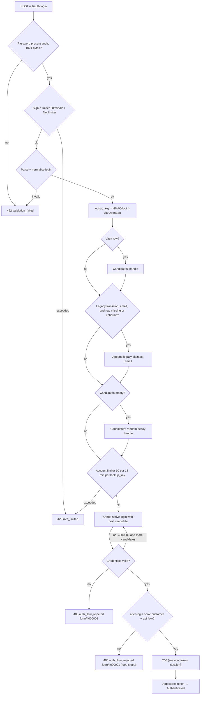
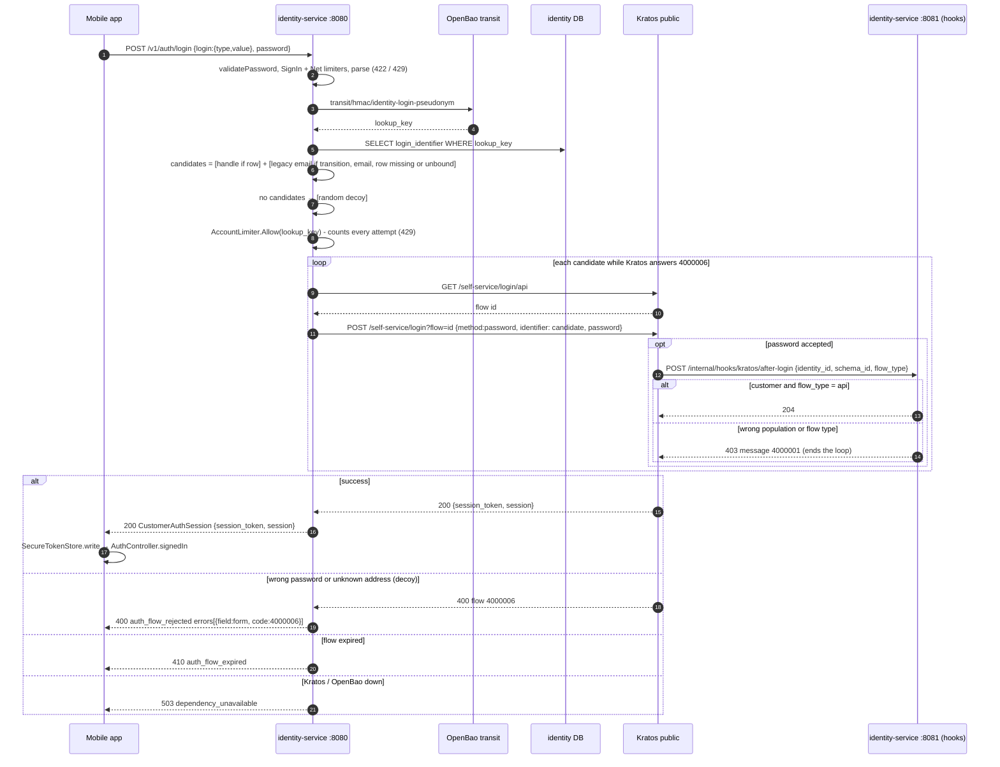
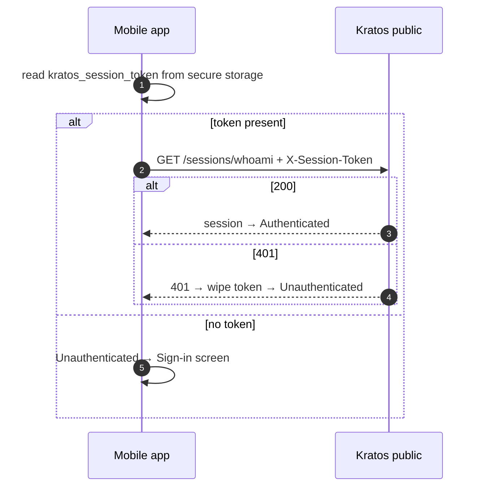

# F03 — Customer login

The customer signs in with email or phone plus password. identity-service turns
the address into a handle and runs the Kratos native login flow. The address
itself never reaches Kratos. Unknown addresses get a random **decoy** handle,
so the response and timing look the same as a wrong password.

## Actors and entry points

| Actor | Client | Entry point |
| --- | --- | --- |
| Customer | Mobile app `SignInScreen` | `POST /v1/auth/login {login:{type,value}, password}` |
| Kratos | webhook | `POST :8081/internal/hooks/kratos/after-login` |

## Functional diagram

## Sequence

## Sequence — app start (session restore)

## Errors and outcomes

| Condition | Response |
| --- | --- |
| Wrong password, unknown address | 400 `auth_flow_rejected` `form`/`4000006` (same for both) |
| Wrong population (admin account, browser flow) | 400 `auth_flow_rejected` `form`/`4000001` |
| Disabled account | 400 `auth_flow_rejected` (Kratos message id) |
| Unverified account | **not blocked**; writes are gated later ([F02](F02-customer-verification.md)) |
| Per-IP, per-net or per-account limit | 429 `rate_limited` |

Rate limiters are in-memory and kept **per replica**.

## Code references

- `apps/mobile/lib/features/auth/presentation/sign_in_screen.dart:50`
- `apps/mobile/lib/features/auth/data/auth_repository.dart:74` — restore, `:116` login
- `services/identity-service/internal/adapter/httpapi/server.go:439` — `CustomerLogin`
- `services/identity-service/internal/app/customerauth.go:170` — `candidates`, `:195` `Login`
- `services/identity-service/internal/app/login.go:56` — limiters
- `services/identity-service/internal/adapter/kratos/selfservice.go:168` — login flow
- `services/identity-service/internal/app/provisioning.go:41` — `LoginAllowed`
- `services/identity-service/internal/adapter/httpapi/router.go:259` — after-login hook
- `services/identity-service/internal/domain/login/pseudonym.go:86` — lookup input

## Related

[ADR-0014](../adr/0014-customer-login-through-identity-service.md) ·
[10 §10.1](../architecture/10-pseudonymous-login.md)
