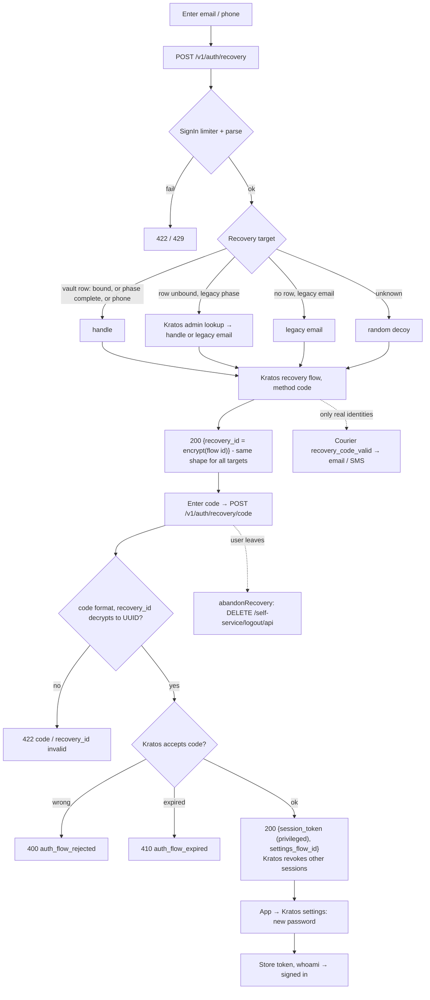
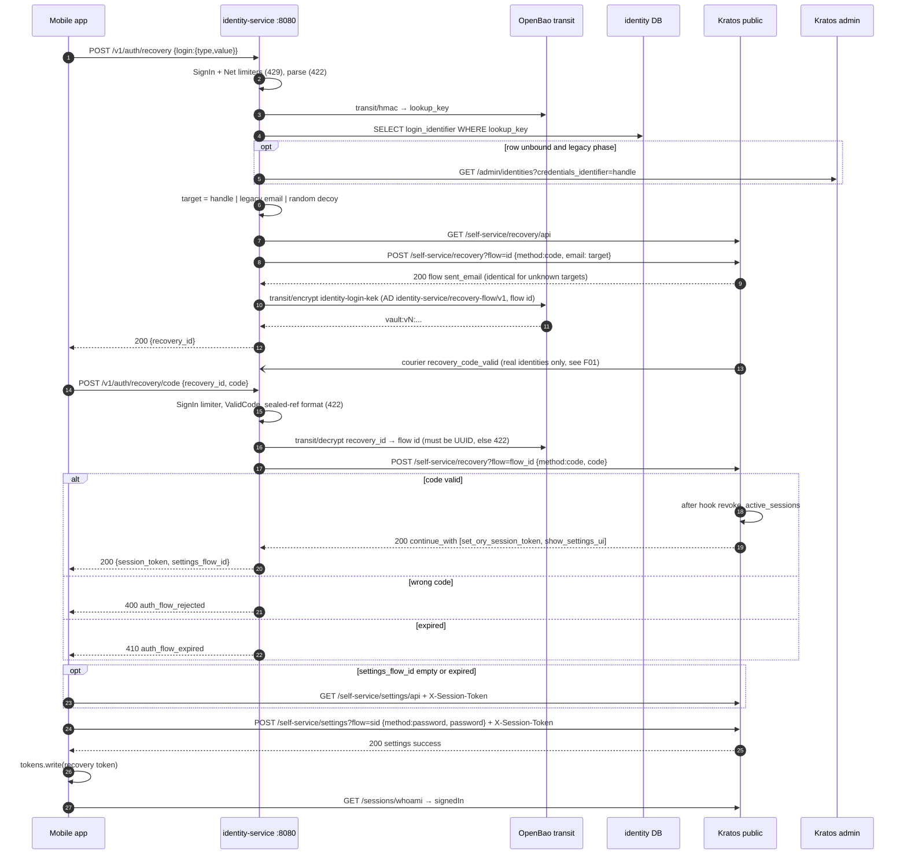

# F04 — Customer password recovery

A customer who forgot their password asks for a code, enters it, and sets a
new password. identity-service starts the Kratos recovery flow with the
customer's handle, or with a decoy if the address is unknown. It returns an
**encrypted** `recovery_id`, so the client never learns the Kratos flow id.
The final password change goes straight to Kratos, using the privileged
session that the recovery issues.

## Actors and entry points

| Actor | Client | Entry point |
| --- | --- | --- |
| Customer | Mobile app `ForgotPasswordScreen` (email → code → new password) | `POST /v1/auth/recovery`, `POST /v1/auth/recovery/code`, Kratos settings flow |

## Functional diagram

## Sequence

## Errors and outcomes

| Condition | Response |
| --- | --- |
| Unknown address | 200 with a `recovery_id` anyway (decoy), and no message is sent |
| Malformed code or tampered `recovery_id` | 422 `validation_failed` (`code`/`invalid_format`, `recovery_id`/`invalid`) |
| Wrong code | 400 `auth_flow_rejected` |
| Flow expired | 410 `auth_flow_expired` |
| Rate limit (per IP, net) | 429. **The per-account limiter is not applied to recovery.** |

## Code references

- `apps/mobile/lib/features/auth/presentation/forgot_password_screen.dart:74`
- `apps/mobile/lib/features/auth/data/auth_repository.dart:169` — request, `:183` complete, `:225` abandon
- `services/identity-service/internal/app/customerauth.go:269` — `StartRecovery`, `:297` `recoveryTarget`, `:338` `SubmitRecoveryCode`
- `services/identity-service/internal/adapter/kratos/selfservice.go:208` — recovery flow
- `services/identity-service/internal/adapter/httpapi/server.go:475`
- `deploy/ory/kratos/kratos.yml.tmpl:64` — recovery `use: code`, `revoke_active_sessions`

## Related

[ADR-0014](../adr/0014-customer-login-through-identity-service.md) ·
[10 §10.4](../architecture/10-pseudonymous-login.md)
