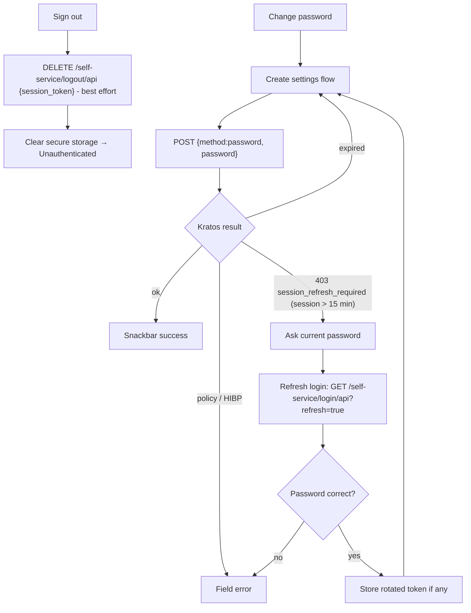
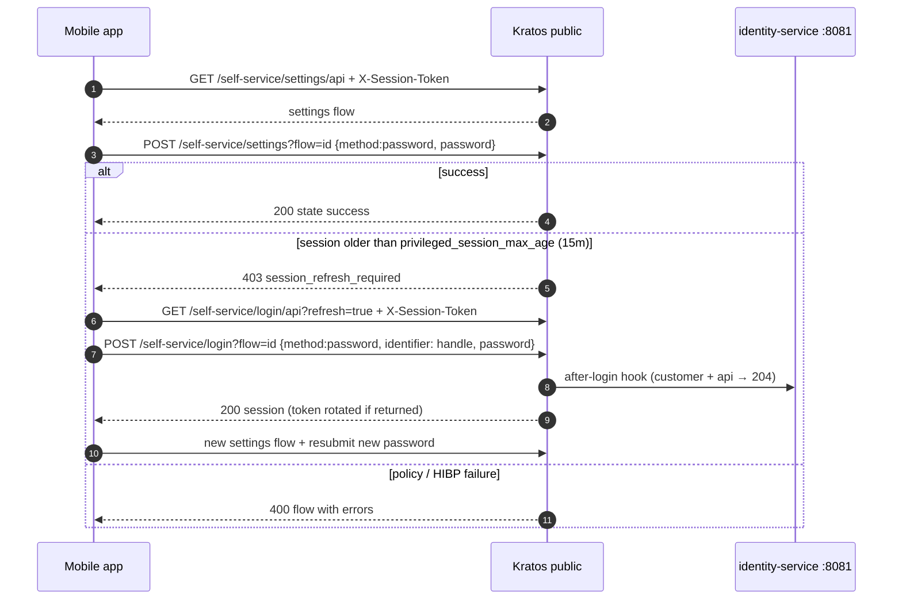
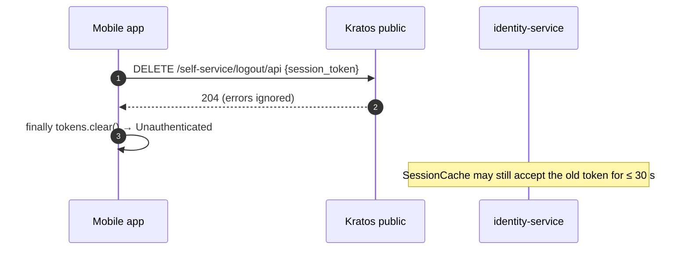

# F05 — Customer settings (change password) and logout

Changing a password and logging out talk to **Kratos directly** from the
mobile app. identity-service is not involved. The Kratos `profile` settings
method is disabled, so only `password` applies. Profile data is changed
through [F07](F07-customer-profile.md).

## Actors and entry points

| Actor | Client | Entry point |
| --- | --- | --- |
| Customer | `SettingsScreen` | Kratos `GET /self-service/settings/api`, `POST /self-service/settings?flow=` |
| Customer | `SettingsScreen` → Sign out | Kratos `DELETE /self-service/logout/api` |

## Functional diagram

## Sequence — change password

## Sequence — logout

## Notes

- The refresh login goes straight to Kratos with the handle. It bypasses
  identity-service's per-IP, per-account and decoy logic. Kratos still runs
  its own checks and the after-login hook.
- No audit events.

## Code references

- `apps/mobile/lib/features/settings/data/settings_repository.dart:22`
- `apps/mobile/lib/features/settings/presentation/settings_screen.dart:35` — change, `:80` refresh, `:166` sign out
- `apps/mobile/lib/features/auth/presentation/auth_controller.dart:84` — `signOut`
- `apps/mobile/lib/features/auth/data/auth_repository.dart:237` — logout
- `deploy/ory/kratos/kratos.yml.tmpl:49` — profile method disabled, `:59` privileged age

## Related

[ADR-0003](../adr/0003-browser-flows-web-native-flows-mobile.md)
