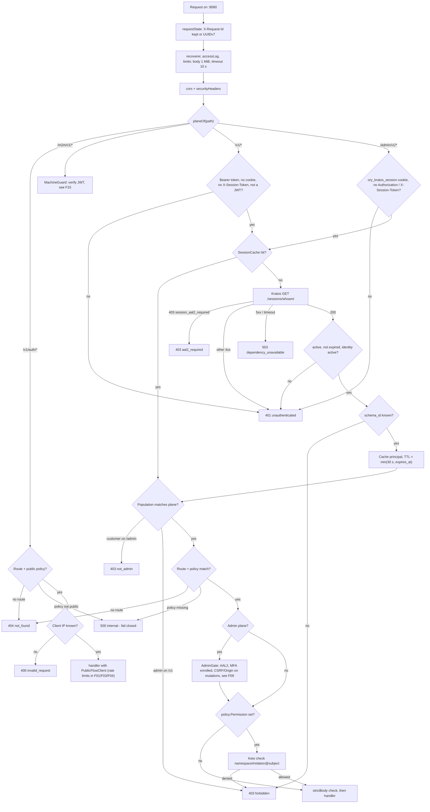
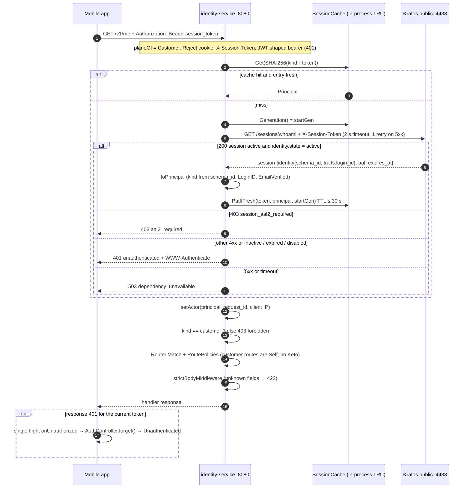
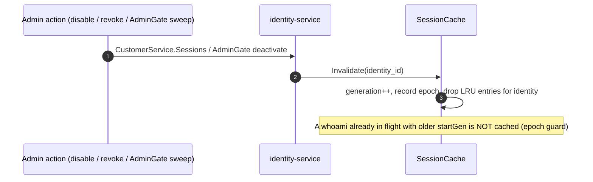

# F06 — Request authentication (all planes)

Every request to identity-service passes through one middleware chain and one
**Guard**. The Guard picks a *plane* from the path, then checks the
credential, the population, the route policy, and the permission. This
cross-cutting flow comes before every feature on F07–F15.

## Actors and entry points

| Plane | Path prefix | Credential | Verified by |
| --- | --- | --- | --- |
| Public | `/v1/auth/*` | none (client IP required) | rate limiters ([F03](F03-customer-login.md)) |
| Customer | `/v1`, `/v1/*` | `Authorization: Bearer <session_token>` | Kratos `GET /sessions/whoami` |
| Admin | `/admin/v1/*` | `ory_kratos_session` cookie | Kratos whoami + AdminGate + CSRF + Keto |
| Machine | `/m2m/v1/*` | `Authorization: Bearer <JWT>` | Hydra JWKS ([F15](F15-machine-to-machine-api.md)) |
| Webhook | `:8081 /internal/hooks/kratos/*` | `Authorization: <api key>` | constant-time compare |

## Functional diagram

## Sequence — customer request (`/v1/*`)

## Sequence — cache invalidation

## Errors and outcomes

| Condition | Status / problem |
| --- | --- |
| No credential or wrong credential type for the plane | 401 `unauthenticated` |
| Session inactive, expired, or identity disabled | 401 `unauthenticated` |
| Kratos requires AAL2 | 403 `aal2_required` |
| Unknown schema, or admin on `/v1` | 403 `forbidden` |
| Customer on `/admin/v1` | 403 `not_admin` |
| No route | 404 `not_found` |
| Policy missing | 500 `internal` (fail closed); the service refuses to start if policies are invalid |
| Body > 1 MiB, or unknown field | 422 `validation_failed` |
| Kratos 5xx or timeout | 503 `dependency_unavailable` |

## Code references

- `services/identity-service/internal/adapter/httpapi/router.go:87` — middleware order
- `services/identity-service/internal/adapter/httpapi/context.go:36` — `planeOf`
- `services/identity-service/internal/adapter/httpapi/middleware.go:215` — `Guard.Middleware`
- `services/identity-service/internal/adapter/httpapi/middleware.go:347` — `credentialFor`
- `services/identity-service/internal/adapter/kratos/verifier.go:42` — whoami and status mapping
- `services/identity-service/internal/adapter/kratos/cache.go:64` — cache key, `PutIfFresh`, `Invalidate`
- `services/identity-service/internal/adapter/kratos/model.go:104` — `toPrincipal`
- `services/identity-service/internal/adapter/httpapi/policy.go:43` — route policies
- `services/identity-service/internal/adapter/httpapi/bodycheck.go:92` — strict body
- `services/identity-service/internal/adapter/httpapi/problem.go:51` — problem → status
- `apps/mobile/lib/core/network/interceptors.dart:86` — bearer + 401 handling

## Related

[ADR-0006](../adr/0006-session-validation-in-service.md) ·
[ADR-0005](../adr/0005-keto-for-authorization.md) ·
[03 §3.5](../architecture/03-auth-flows.md)
