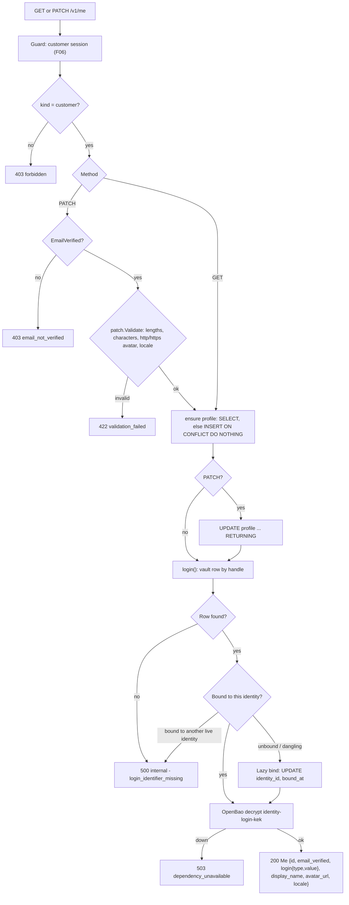
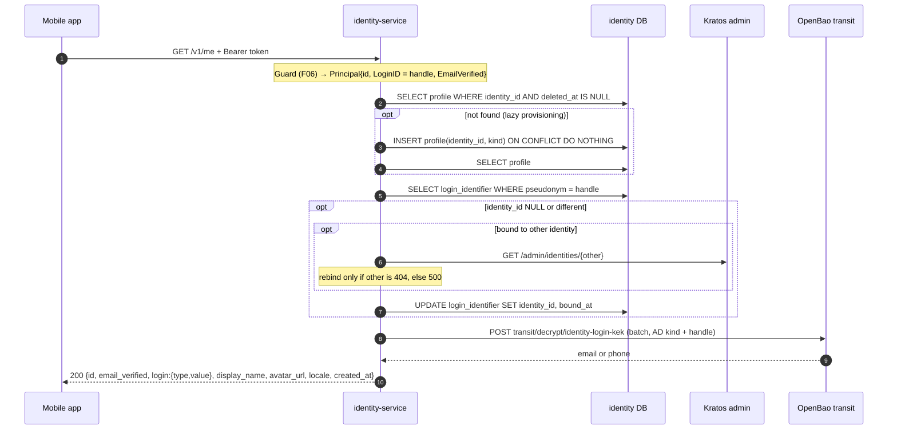
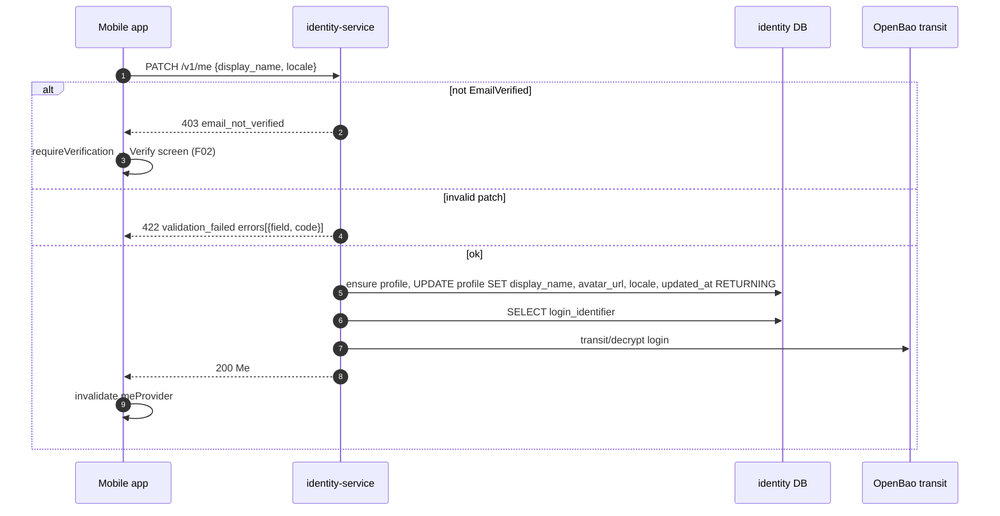

# F07 — Customer profile (`/v1/me`)

The customer reads and updates their own profile: display name, avatar,
locale, and their login shown in plain text. The profile row is created
lazily. The login value is decrypted from the login vault on every read, so
**`/v1/me` depends on OpenBao**.

## Actors and entry points

| Actor | Client | Endpoint | Gate |
| --- | --- | --- | --- |
| Customer | `ProfileScreen` | `GET /v1/me` | authenticated customer |
| Customer | `EditProfileScreen` | `PATCH /v1/me {display_name?, avatar_url?, locale?}` | + verified login |

## Functional diagram

## Sequence — GET /v1/me

## Sequence — PATCH /v1/me

## Side effects

- `profile`: insert, the first time only, then update on PATCH.
- `login_identifier`: lazy bind.
- **No audit, no Idempotency-Key, no Keto check.** Customer routes are
  `Self` policies.

## Code references

- `apps/mobile/lib/features/profile/data/profile_repository.dart:15`
- `apps/mobile/lib/features/profile/presentation/edit_profile_screen.dart:56`
- `services/identity-service/internal/adapter/httpapi/server.go:49` — `GetMe` / `UpdateMe`, `:388` `toMe`
- `services/identity-service/internal/app/me.go:31` — `GetMe`, `:55` `UpdateMe`, `:80` `ensure`
- `services/identity-service/internal/app/login.go:271` — `bind`, `:319` `Own`
- `services/identity-service/db/queries/profile.sql:1`

## Related

[ADR-0008](../adr/0008-profile-provisioning.md) ·
[10 §10.3](../architecture/10-pseudonymous-login.md)
