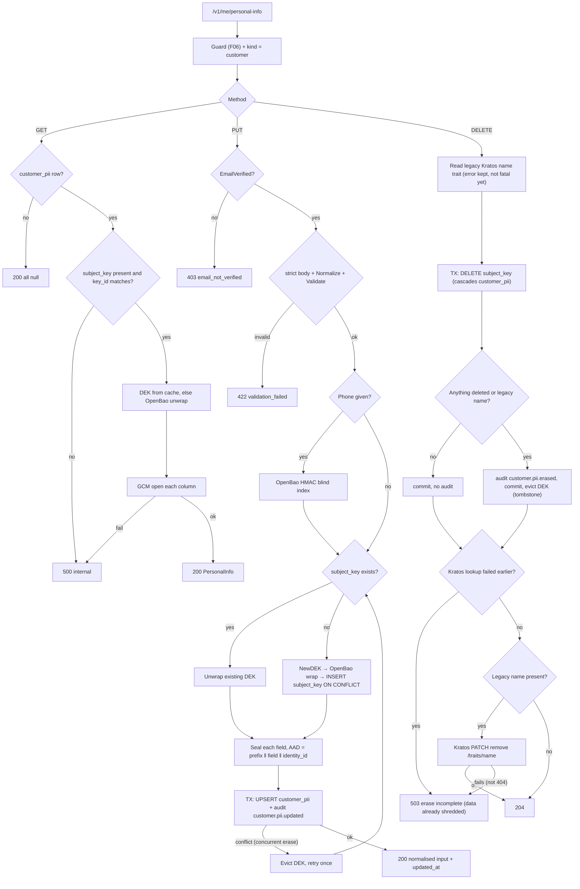
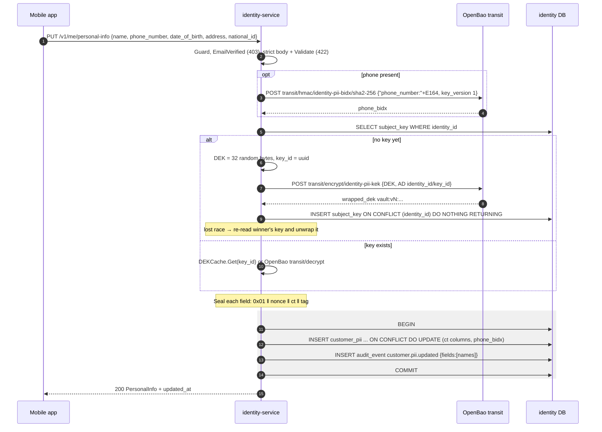
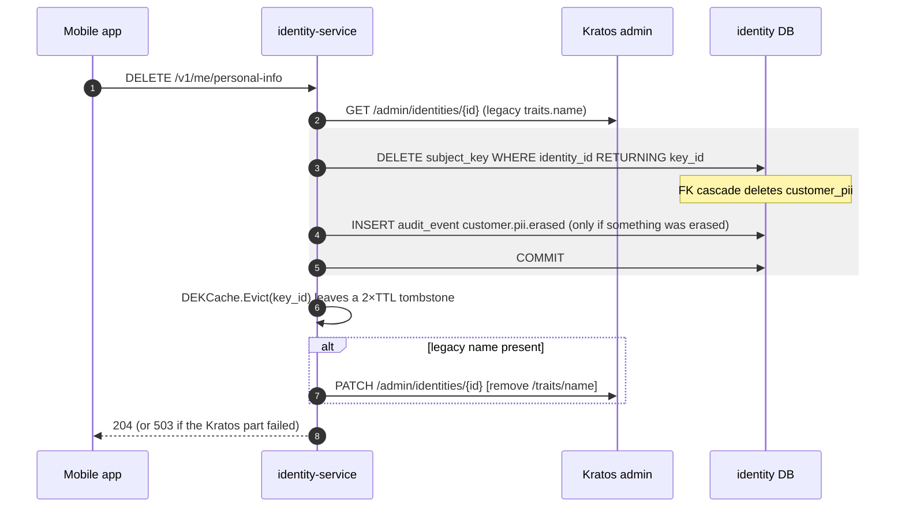

# F08 — Customer personal info (PII)

The customer reads, replaces, and erases their own name, phone number, date of
birth, address, and national ID. Each field is sealed with **AES-256-GCM**
under a per-customer **DEK**. OpenBao Transit (`identity-pii-kek`) wraps the
DEK. The phone number also gets an HMAC **blind index**, which admin lookup
uses ([F12](F12-admin-pii-access.md)). Erasing deletes the DEK, so the data
can no longer be decrypted (crypto-shredding).

## Actors and entry points

| Actor | Client | Endpoint | Gate |
| --- | --- | --- | --- |
| Customer | `PersonalInfoScreen` | `GET /v1/me/personal-info` | customer |
| Customer | `PersonalInfoScreen` save | `PUT /v1/me/personal-info` (full replace) | + verified login |
| Customer | `PersonalInfoScreen` erase | `DELETE /v1/me/personal-info` | customer (no verification needed) |

## Functional diagram

## Sequence — PUT (first write)

## Sequence — DELETE (crypto-shred)

## Side effects

| Table / system | GET | PUT | DELETE |
| --- | --- | --- | --- |
| `subject_key` | read | insert, first write only | delete |
| `customer_pii` | read | upsert | cascade delete |
| `audit_event` | — | `customer.pii.updated` | `customer.pii.erased` |
| OpenBao | decrypt DEK | HMAC, encrypt or decrypt DEK | — |
| Kratos admin | — | — | read, then remove legacy name |

`identity_app` may update only the listed columns (migrations 0004 and 0005).
It cannot delete `customer_pii` directly.

## Code references

- `apps/mobile/lib/features/profile/presentation/personal_info_screen.dart:188` — save, `:226` erase
- `services/identity-service/internal/adapter/httpapi/personalinfo.go:17`
- `services/identity-service/internal/app/personalinfo.go:123` — `GetMine`, `:133` `PutMine`, `:235` `EraseMine`, `:689` `keyForCreated`
- `services/identity-service/internal/app/dekcache.go` — LRU, TTL 5 m, tombstones
- `services/identity-service/internal/crypto/envelope/envelope.go:46` — DEK, seal, AAD
- `services/identity-service/internal/adapter/openbao/openbao.go:306` — wrap, unwrap, HMAC
- `services/identity-service/db/queries/pii.sql`
- `services/identity-service/db/migrations/0003_customer_pii.sql`, `0004_pii_column_grants.sql`, `0005_customer_pii_name.sql`

## Related

[ADR-0011](../adr/0011-envelope-encryption-for-pii.md) ·
[08 PII protection](../architecture/08-pii-protection.md)
