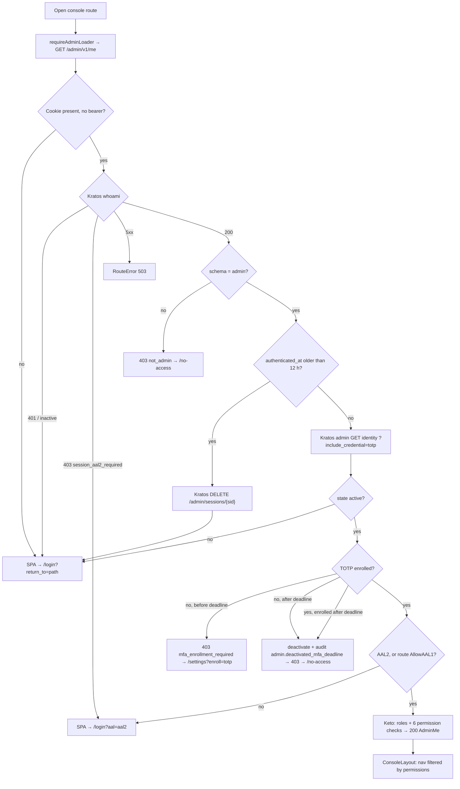
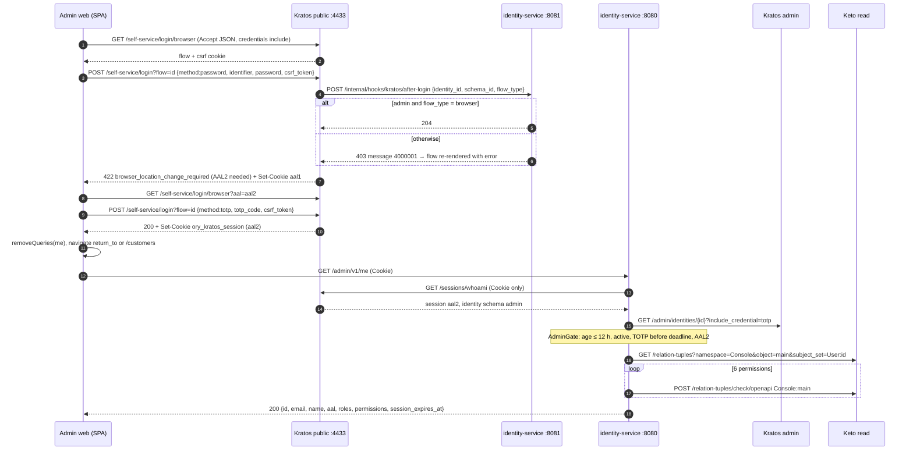
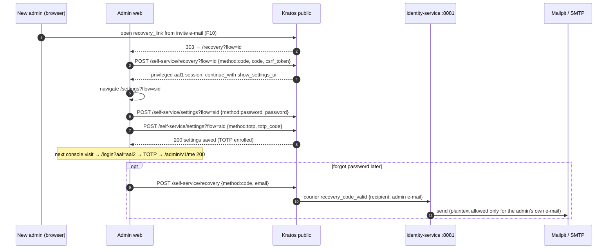
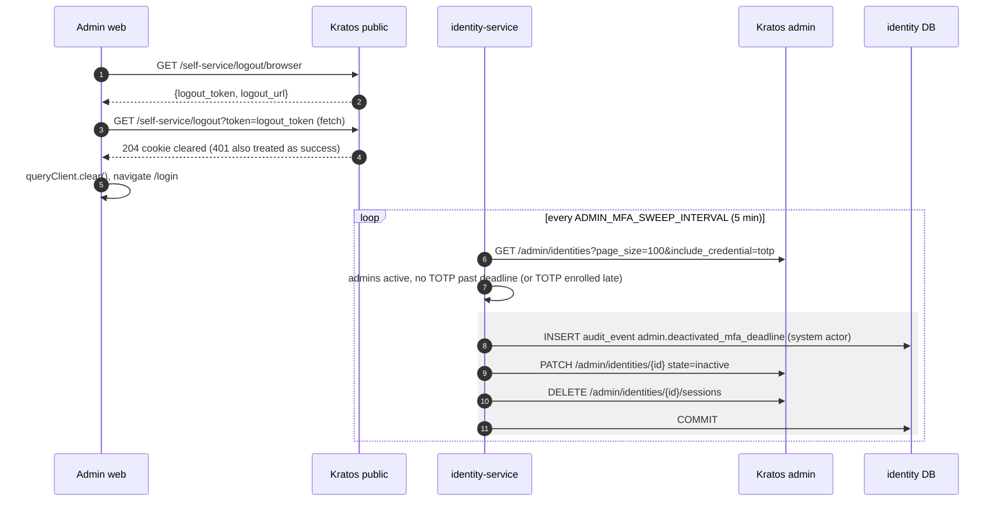

# F09 — Admin sign-in, MFA, recovery, settings and logout

Admins use the React console. The SPA drives Kratos **browser flows**
directly, using the `ory_kratos_session` cookie and CSRF tokens. It then asks
identity-service `GET /admin/v1/me` whether this admin may enter. Admins are
invite-only ([F10](F10-admin-management.md)). TOTP is required within 24 h of
the invitation. The `AdminGate` re-checks this on every request and caps
session age at 12 h.

## Actors and entry points

| Actor | SPA route | Calls |
| --- | --- | --- |
| Admin | `/login` | Kratos `GET /self-service/login/browser`, `POST /self-service/login?flow=` |
| Admin | console routes (`requireAdminLoader`) | identity-service `GET /admin/v1/me` |
| Admin | `/settings` (no guard) | Kratos settings flow: password, TOTP, lookup secrets |
| Admin | `/recovery`, `/verification` | Kratos recovery/verification flows (code) |
| Admin | Sign out | Kratos `GET /self-service/logout/browser`, `GET /self-service/logout?token=` |
| System | every 5 min | `AdminGate.Sweep` |

## Functional diagram — console guard

## Sequence — password + TOTP sign-in

## Sequence — first-time enrolment (from invitation)

## Sequence — logout and MFA sweeper

## SPA error routing

| Response | SPA route |
| --- | --- |
| 401 | `/login?return_to=…` |
| 403 `aal2_required` | `/login?aal=aal2` |
| 403 `mfa_enrollment_required` | `/settings?enroll=totp` |
| 403 `not_admin` / other 403 | `/no-access` (manual sign-out) |
| Kratos `session_refresh_required` | `/login?refresh=true` |
| Kratos CSRF violation / 404 / 410 | restart the flow (at most 2 times) |

## Code references

- `apps/admin-web/src/app/routes.tsx:30` — route tree
- `apps/admin-web/src/auth/requireAdmin.ts:15` — `authRedirectFor`, loader
- `apps/admin-web/src/auth/useKratosFlow.ts:64` — flow init and error mapping
- `apps/admin-web/src/features/login/LoginPage.tsx:42`
- `apps/admin-web/src/features/settings/SettingsPage.tsx:35`
- `apps/admin-web/src/features/recovery/RecoveryPage.tsx:25`
- `apps/admin-web/src/auth/useLogout.ts:20`
- `services/identity-service/internal/app/admingate.go:49` — `Check`, `:111` `Sweep`, `:139` `deactivate`
- `services/identity-service/internal/app/admins.go:81` — `Me`
- `services/identity-service/internal/adapter/httpapi/middleware.go:330` — CSRF / Origin
- `deploy/ory/kratos/identity-schemas/admin.v1.json`

## Related

[ADR-0003](../adr/0003-browser-flows-web-native-flows-mobile.md) ·
[ADR-0004](../adr/0004-single-kratos-two-identity-schemas.md) ·
[03 §3.4–3.5](../architecture/03-auth-flows.md)
