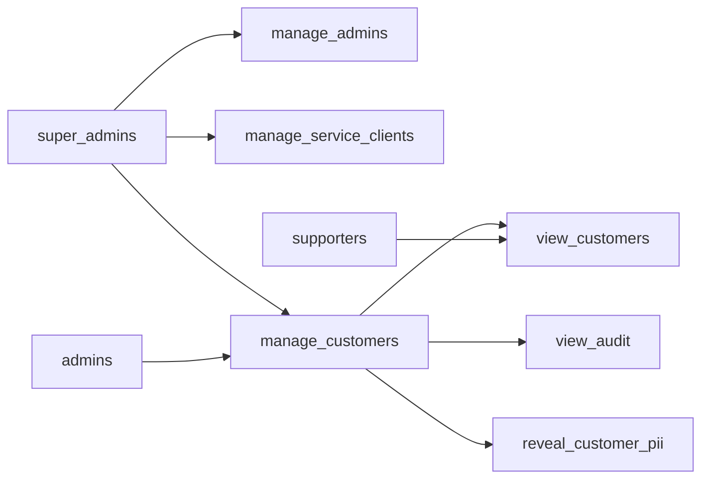
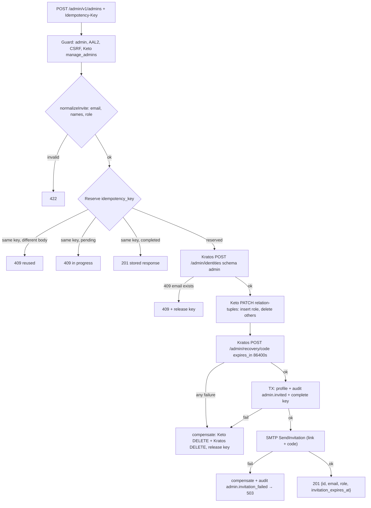
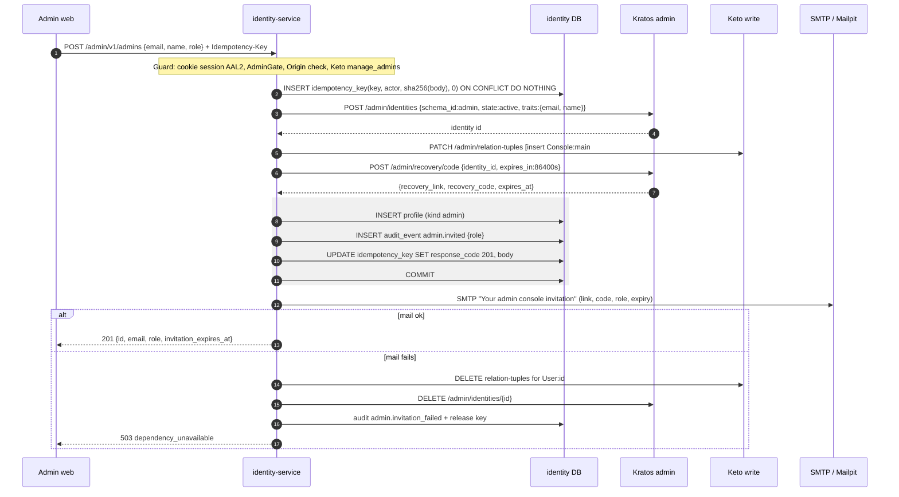
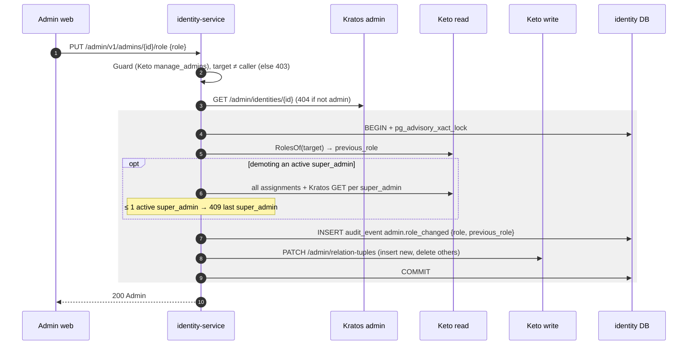
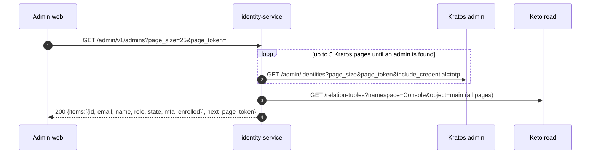

# F10 — Admin management (list, invite, change role)

A **super_admin** manages console users. An invite creates a Kratos admin
identity, writes a Keto role tuple, and issues a 24 h recovery code that is
sent by email. Role changes rewrite the Keto tuples under an advisory lock, so
the last super_admin can never be demoted.

## Authorization model (Keto OPL)

Roles map to Keto relations on `Console:main`: `super_admin` → `super_admins`,
`admin` → `admins`, `support` → `supporters`. The subject is the subject set
`User:<uuid>#` (empty relation).

## Actors and entry points

| Endpoint | Keto permission | Extra |
| --- | --- | --- |
| `GET /admin/v1/admins` | `manage_admins` | cursor = Kratos page token |
| `POST /admin/v1/admins` | `manage_admins` | `Idempotency-Key` (uuid) required |
| `PUT /admin/v1/admins/{id}/role` | `manage_admins` | cannot change own role or demote last super_admin |
| CLI `identity-service admin bootstrap --email` | none (system) | first super_admin, prints link + code |

## Functional diagram — invite

## Sequence — invite

## Sequence — change role

## Sequence — list

## Code references

- `deploy/ory/keto/namespaces.keto.ts`
- `services/identity-service/internal/adapter/httpapi/policy.go:35`
- `services/identity-service/internal/app/admins.go:103` — `List`, `:161` `Invite`, `:307` `provision`, `:352` `ChangeRole`
- `services/identity-service/internal/adapter/keto/keto.go:124` — check, `:239` patch
- `services/identity-service/internal/adapter/kratos/admin.go:122` — create, `:221` recovery code
- `services/identity-service/internal/adapter/mailer/smtp.go:73`
- `services/identity-service/internal/app/mutation.go:30` — `audited()`
- `services/identity-service/cmd/identity-service/main.go:691` — bootstrap CLI
- `apps/admin-web/src/features/admins/InviteAdminForm.tsx:22`, `AdminsPage.tsx:67`

## Related

[ADR-0005](../adr/0005-keto-for-authorization.md) ·
[03 §3.6](../architecture/03-auth-flows.md)
