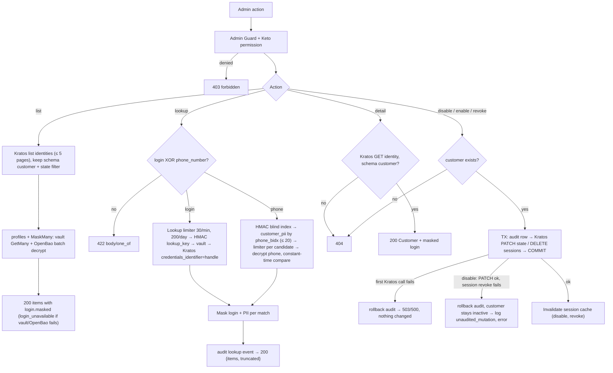
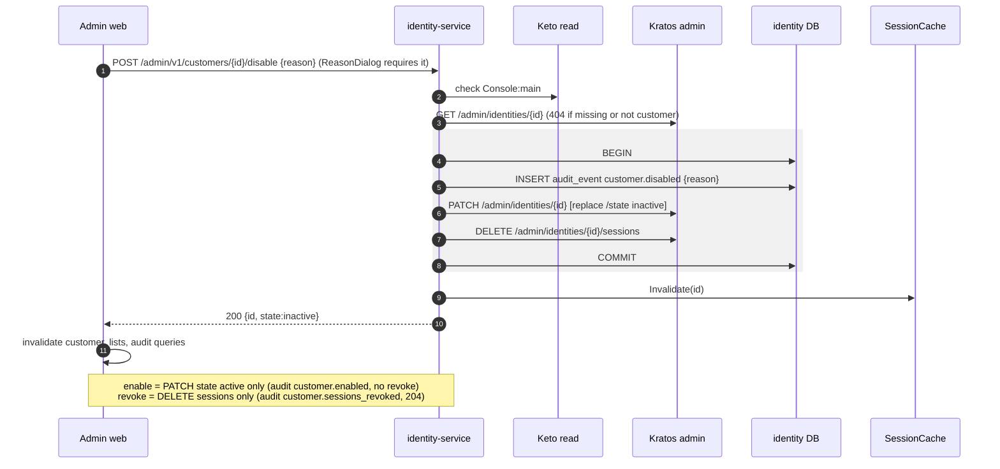
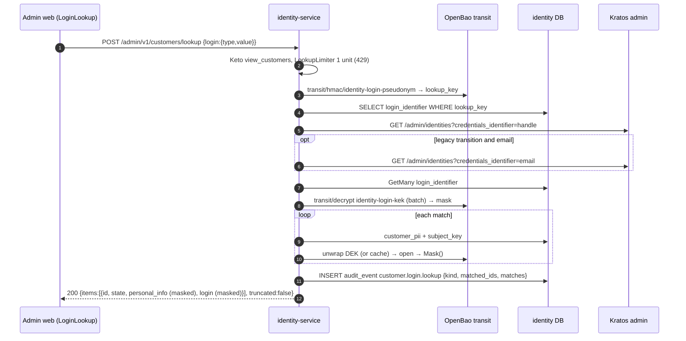
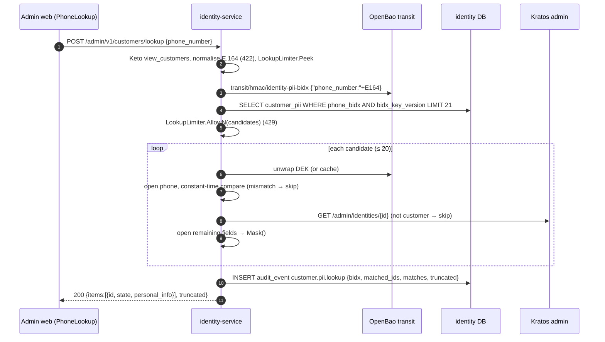

# F11 — Customer management (admin)

Support staff list customers, look them up by login or phone, open a
customer's detail, and disable, enable, or revoke sessions. Lists show
**masked** login values only. Every mutation writes an audit row in the same
transaction as the Kratos call, before the call is made.

## Actors and entry points

| Endpoint | Keto permission | Audit |
| --- | --- | --- |
| `GET /admin/v1/customers?state=&page_size=&page_token=` | `view_customers` | — |
| `POST /admin/v1/customers/lookup` `{login}` or `{phone_number}` | `view_customers` | `customer.login.lookup` / `customer.pii.lookup` |
| `GET /admin/v1/customers/{id}` | `view_customers` | — |
| `POST /admin/v1/customers/{id}/disable` `{reason?}` | `manage_customers` | `customer.disabled` |
| `POST /admin/v1/customers/{id}/enable` `{reason?}` | `manage_customers` | `customer.enabled` |
| `DELETE /admin/v1/customers/{id}/sessions` | `manage_customers` | `customer.sessions_revoked` |

Every route first passes the admin Guard: cookie session, AAL2, AdminGate,
the CSRF check on mutations, and the Keto check
([F06](F06-request-authentication.md), [F09](F09-admin-sign-in.md)).

## Functional diagram

## Sequence — disable customer

## Sequence — lookup by login

## Sequence — lookup by phone

## Errors and outcomes

| Condition | Response |
| --- | --- |
| Bad `page_size`, `state`, `page_token` | 422 |
| Lookup over quota | 429 `rate_limited` |
| Customer not found, or not a customer schema | 404 |
| Kratos or OpenBao down | 503 (the list degrades to `login_unavailable`) |
| Audit insert fails | 500, and nothing changes |

The server treats `reason` as optional (≤ 500 runes). Only the admin web makes
it mandatory for disable. Disable, enable and revoke take **no**
`Idempotency-Key`.

## Code references

- `services/identity-service/internal/app/customers.go:74` — `List`, `:108` `Get`, `:126` `Disable`, `:152` `Enable`, `:174` `Sessions`
- `services/identity-service/internal/app/personalinfo.go:427` — `LookupByPhone`, `:481` `LookupByLogin`
- `services/identity-service/internal/app/login.go:361` — `MaskMany`, `:419` `FindCustomers`
- `services/identity-service/internal/app/mutation.go:30` — `audited()`
- `services/identity-service/internal/adapter/httpapi/server.go:106` — list handler
- `apps/admin-web/src/features/customers/CustomersPage.tsx:31`, `CustomerDetailPage.tsx:114`, `LoginLookup.tsx:54`, `PhoneLookup.tsx:18`

## Related

[ADR-0013](../adr/0013-pseudonymous-customer-login-identifiers.md) ·
[10 §10.5](../architecture/10-pseudonymous-login.md)
