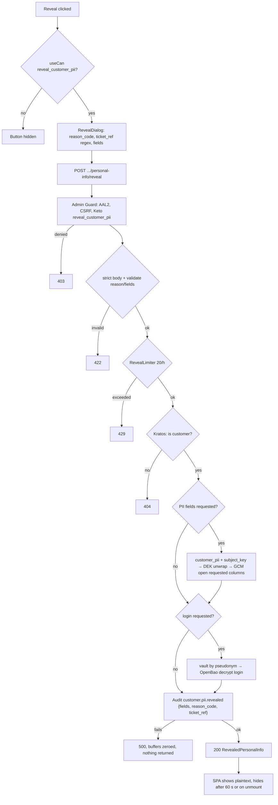
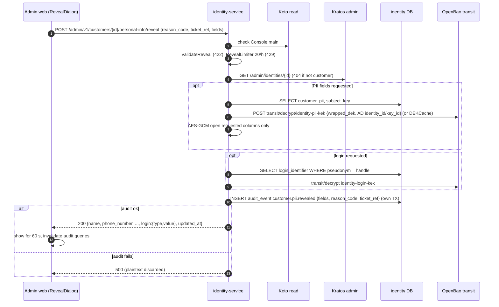
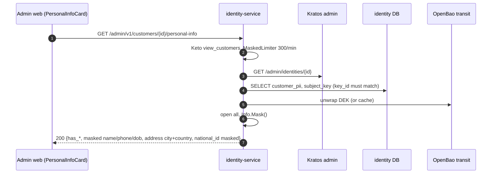

# F12 — Admin PII access (masked view and reveal)

The customer detail page shows a **masked** personal-info card. An admin with
`reveal_customer_pii` can reveal chosen fields in plain text. The admin must
give a reason code, and may add a ticket reference. Each reveal is rate
limited (20/hour per admin) and **audited before any plaintext leaves the
service**. The SPA hides the revealed values after 60 s.

## Actors and entry points

| Endpoint | Keto | Limiter | Audit |
| --- | --- | --- | --- |
| `GET /admin/v1/customers/{id}/personal-info` | `view_customers` | 300/min per admin | — |
| `POST /admin/v1/customers/{id}/personal-info/reveal` `{reason_code, ticket_ref?, fields?}` | `reveal_customer_pii` | 20/hour per admin | `customer.pii.revealed` |

`reason_code` ∈ `customer_support_request`, `identity_verification`,
`fraud_investigation`, `legal_request`. `fields` ⊆ `name`, `phone_number`,
`date_of_birth`, `address`, `national_id`, `login`. Omitting `fields` reveals
all of them.

## Functional diagram

## Sequence — reveal

## Sequence — masked view

## Code references

- `services/identity-service/internal/app/personalinfo.go:302` — `GetMasked`, `:324` `Reveal`, `:390` `revealFields`
- `services/identity-service/internal/app/login.go:345` — login `Reveal`
- `services/identity-service/internal/app/ratelimit.go:21` — lookup / reveal / masked limits
- `services/identity-service/internal/adapter/httpapi/personalinfo.go:113`, `:200` `toRevealed`
- `apps/admin-web/src/features/customers/PersonalInfoCard.tsx:111`, `RevealDialog.tsx:21`

## Related

[ADR-0011](../adr/0011-envelope-encryption-for-pii.md) ·
[08 §8.4](../architecture/08-pii-protection.md)
