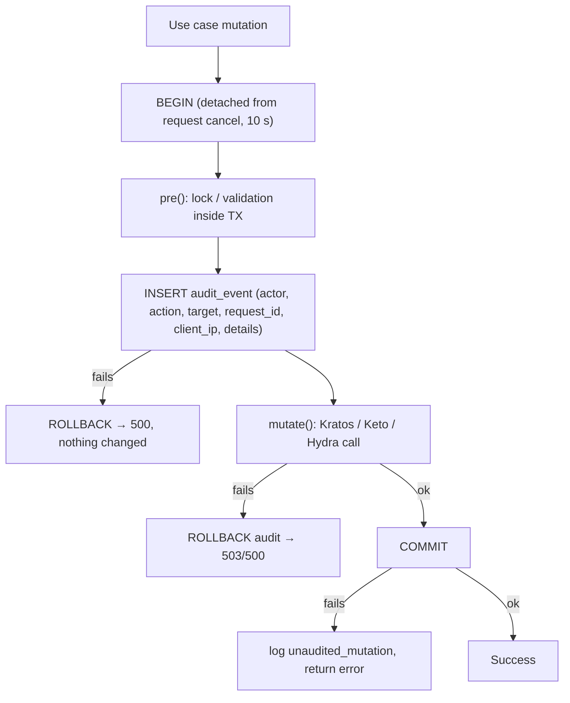
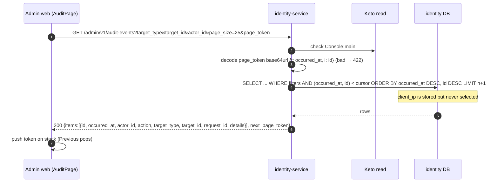

# F13 — Audit log

Every security-relevant mutation appends one row to `audit_event`. The
application role can only `SELECT` and `INSERT` on that table, so it is
append-only. Admins with `view_audit` browse the log with filters and
keyset pagination. Partner services read a filtered subset through
[F15](F15-machine-to-machine-api.md).

## Write path — the `audited()` pattern

Two-phase variant (service-client rotate and delete). First commit
`*_started`, then call Hydra, then commit `*_rotated` / `*_deleted` or
`*_failed`.

## Action catalogue

| Area | Actions |
| --- | --- |
| Customer | `customer.disabled`, `customer.enabled`, `customer.sessions_revoked` |
| PII | `customer.pii.updated`, `customer.pii.erased`, `customer.pii.revealed`, `customer.pii.lookup`, `customer.pii.name_migrated`, `customer.pii.name_trait_removed` |
| Login vault | `customer.login.lookup`, `customer.login.migrated`, `customer.login.erased` |
| Admin | `admin.invited`, `admin.invitation_failed`, `admin.role_changed`, `admin.bootstrapped`, `admin.deactivated_mfa_deadline` |
| Service client | `service_client.created`, `…secret_rotation_started`, `…secret_rotated`, `…secret_rotation_failed`, `…deletion_started`, `…deleted`, `…deletion_failed` |

**Not audited:** customer or admin login, logout, recovery, settings, TOTP
enrolment, `PATCH /v1/me`, and M2M reads (these produce a log line only).

## Sequence — browse audit events

## Code references

- `services/identity-service/db/migrations/0001_init.sql:16` — table and grants, `0002_audit_indexes_idempotency.sql`
- `services/identity-service/internal/app/mutation.go:30` — `audited()`
- `services/identity-service/internal/domain/audit/audit.go:26` — action names
- `services/identity-service/internal/app/audit.go:25` — `List`
- `services/identity-service/internal/adapter/httpapi/server.go:268` — handler + cursor
- `apps/admin-web/src/features/audit/AuditPage.tsx:20`

## Related

[06 Security](../architecture/06-security.md) ·
[07 Cross-cutting](../architecture/07-cross-cutting.md)
