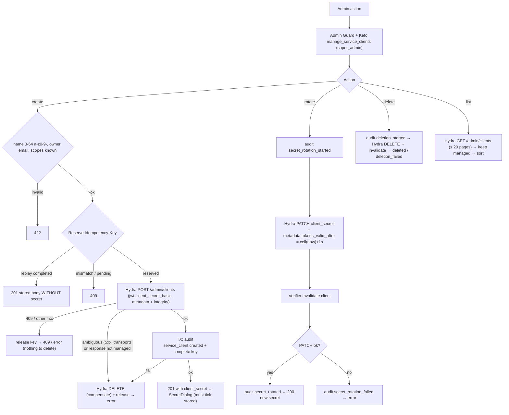
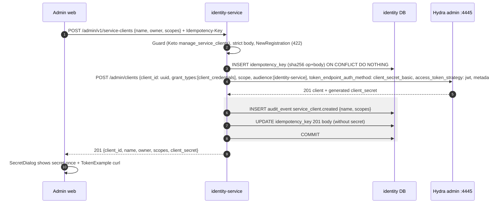
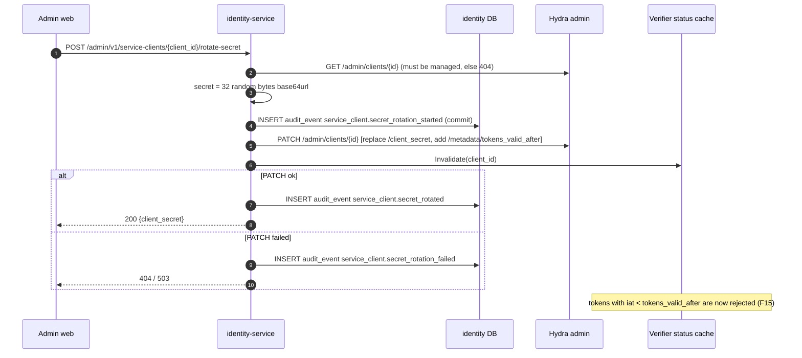

# F14 — Service clients (OAuth2 client credentials)

A super_admin registers partner services as Hydra OAuth2 clients
(`client_credentials`, JWT access tokens). identity-service creates only
**managed** clients. It tags each one with an HMAC integrity tag, so clients
created outside the service stay invisible. Hydra shows the secret **once**,
on create or rotate.

## Actors and entry points

| Endpoint | Keto | Notes |
| --- | --- | --- |
| `GET /admin/v1/service-clients` | `manage_service_clients` | managed clients only, never secrets |
| `POST /admin/v1/service-clients` `{name, owner, scopes}` | `manage_service_clients` | `Idempotency-Key` required, 201 with `client_secret` |
| `GET /admin/v1/service-clients/{client_id}` | `manage_service_clients` | not used by admin web |
| `POST /admin/v1/service-clients/{client_id}/rotate-secret` | `manage_service_clients` | 200 with new secret |
| `DELETE /admin/v1/service-clients/{client_id}` | `manage_service_clients` | 204 |
| CLI `identity-service clients create` | system | no Keto, no idempotency |

Scopes form a closed set: `customers:read`, `audit:read`.

## Functional diagram

## Sequence — create

## Sequence — rotate secret

## Code references

- `services/identity-service/internal/app/serviceclients.go:66` — `List`, `:121` `Create`, `:212` `RotateSecret`, `:242` delete, `:263` `twoPhase`
- `services/identity-service/internal/adapter/hydra/admin.go:111` — `managed`, `:149` create, `:236` list
- `services/identity-service/internal/domain/machine/machine.go:22` — scopes, `:96` validation
- `apps/admin-web/src/features/service-clients/CreateServiceClientDialog.tsx:55`, `SecretDialog.tsx`
- `deploy/ory/hydra/hydra.yml`

## Related

[ADR-0012](../adr/0012-hydra-for-machine-to-machine.md) ·
[09 Machine access](../architecture/09-machine-access.md)
