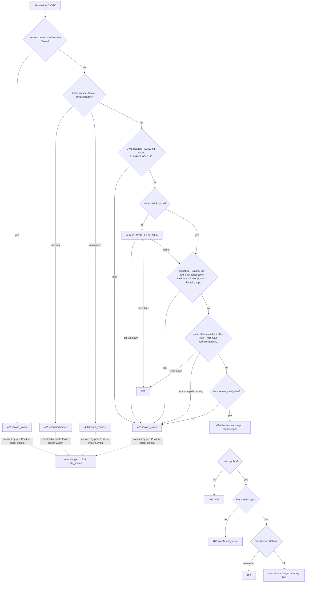
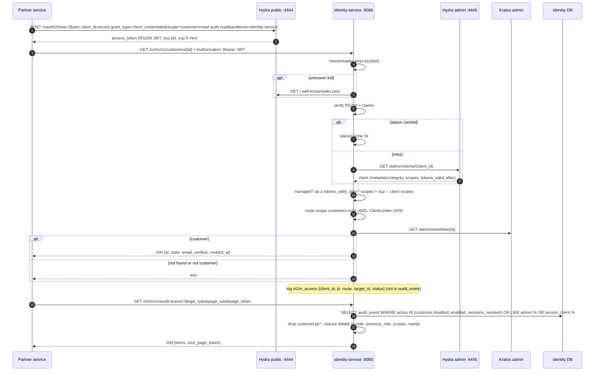

# F15 — Machine-to-machine API (`/m2m/v1`)

A partner service gets a short-lived RS256 JWT from Hydra with
`client_credentials`. It then calls the read-only `/m2m/v1` plane.
identity-service verifies the token **offline** against the JWKS, plus a
cached client-status lookup. It does not use token introspection. The
effective scopes are the token's `scp` intersected with the client's
**current** Hydra scopes.

## Actors and entry points

| Endpoint | Required scope | Returns |
| --- | --- | --- |
| Hydra `POST /oauth2/token` | — | JWT (TTL 5 min, `scp` list) |
| `GET /m2m/v1/customers/{id}` | `customers:read` | `{id, state, email_verified, created_at}`, no PII |
| `GET /m2m/v1/audit-events` | `audit:read` | allowlisted actions with reduced `details` |

## Functional diagram — MachineGuard

## Sequence

## Code references

- `services/identity-service/internal/adapter/httpapi/machine.go:81` — `MachineGuard.serve`
- `services/identity-service/internal/adapter/hydra/verifier.go:106` — `Verify`, `:164` header, `:219` claims, `:254` status
- `services/identity-service/internal/adapter/hydra/jwks.go:61` — key cache and refresh
- `services/identity-service/internal/adapter/hydra/clientcache.go`
- `services/identity-service/internal/app/machine.go:63` — `Customer`, `:84` `AuditEvents`
- `services/identity-service/internal/domain/audit/machine.go:13` — allowlist filter
- `services/identity-service/internal/adapter/httpapi/policy.go:75` — m2m scopes
- `deploy/ory/hydra/hydra.yml`

## Related

[ADR-0012](../adr/0012-hydra-for-machine-to-machine.md) ·
[09 Machine access](../architecture/09-machine-access.md)
