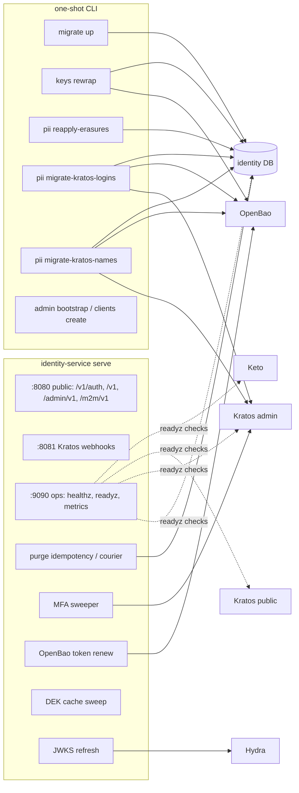
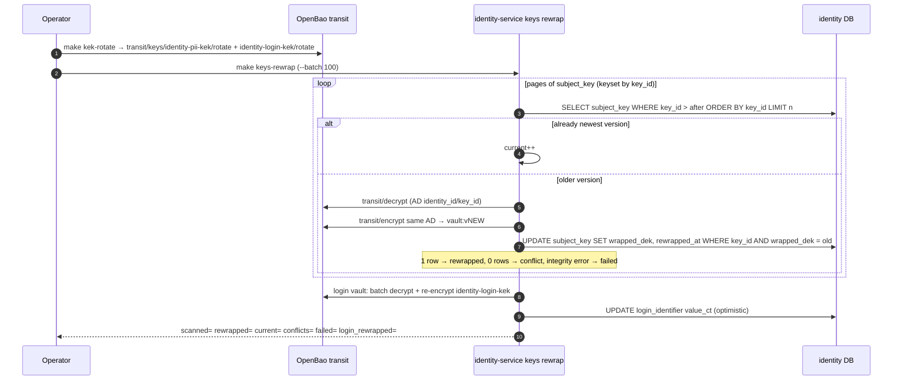
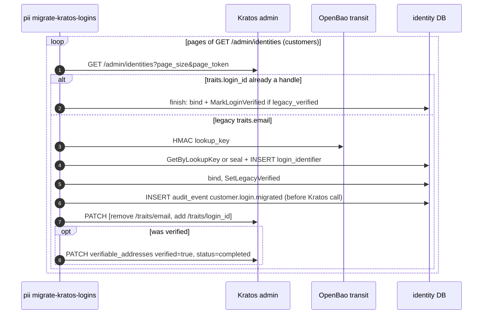
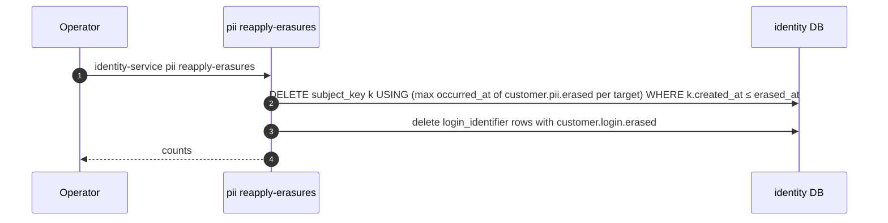

# F16 — Background jobs and operator commands

identity-service runs several goroutines inside `serve`. It also ships
one-shot CLI subcommands that operators run for key rotation, data repair and
migrations.

## Inventory

| Job | Trigger | What it does |
| --- | --- | --- |
| `purgeIdempotencyKeys` | hourly, in-process | delete `idempotency_key` older than 24 h |
| `purgeCourierDispatches` | hourly, in-process | delete `courier_dispatch` older than 24 h, update unbound-logins gauge |
| `sweepAdmins` | `ADMIN_MFA_SWEEP_INTERVAL` (5 min) | deactivate admins past MFA deadline ([F09](F09-admin-sign-in.md)) |
| `RenewLoop` | TTL/2 | OpenBao `POST /v1/auth/token/renew-self` (retry 30 s) |
| `sweepDEKCache` | 1 min | drop expired DEKs and tombstones |
| `machineVerifier.Run` | 5 min | refresh Hydra JWKS ([F15](F15-machine-to-machine-api.md)) |
| `keys rewrap` | `make kek-rotate && make keys-rewrap` | re-wrap DEKs and login ciphertexts under the newest KEK |
| `pii reapply-erasures` | manual, after DB restore | re-delete keys erased according to the audit ledger |
| `pii migrate-kratos-logins` | `make login-migrate`, `./dev` | move plaintext Kratos emails into the login vault |
| `pii migrate-kratos-names` | `./dev`, manual | move the Kratos `name` trait into `customer_pii.name_ct` |
| `pii purge-unbound-logins` | `make login-purge` | delete vault rows never bound to an identity |
| `admin bootstrap`, `clients create` | manual | first super_admin / first service client |

## Process topology

`readyz` checks the database, Kratos public and admin, and Keto. **OpenBao is
not a readiness check.** Migrations run as a separate `identity-migrate` job,
because `MIGRATE_ON_START` defaults to `false`.

## Sequence — KEK rotation and rewrap

## Sequence — migrate Kratos logins into the vault

## Sequence — reapply erasures after restore

## Code references

- `services/identity-service/cmd/identity-service/main.go:160` — `serve`, `:319` goroutines, `:465` rewrap, `:504` reapply-erasures, `:647` name migration, `:691` bootstrap
- `services/identity-service/internal/app/keys.go:49` — `Rewrap`, `:118` reapply
- `services/identity-service/internal/app/loginmigration.go`
- `services/identity-service/internal/app/namemigration.go:153` — `decide`, `:193` `store`
- `services/identity-service/internal/adapter/openbao/openbao.go:385` — `RenewLoop`
- `services/identity-service/internal/adapter/httpapi/router.go:330` — ops listener
- `deploy/openbao/init.sh` — rotate
- `Makefile` — `kek-rotate`, `keys-rewrap`, `login-migrate`, `login-purge`

## Related

[08 §8.6 key lifecycle](../architecture/08-pii-protection.md) ·
[05 Deployment](../architecture/05-deployment.md)
