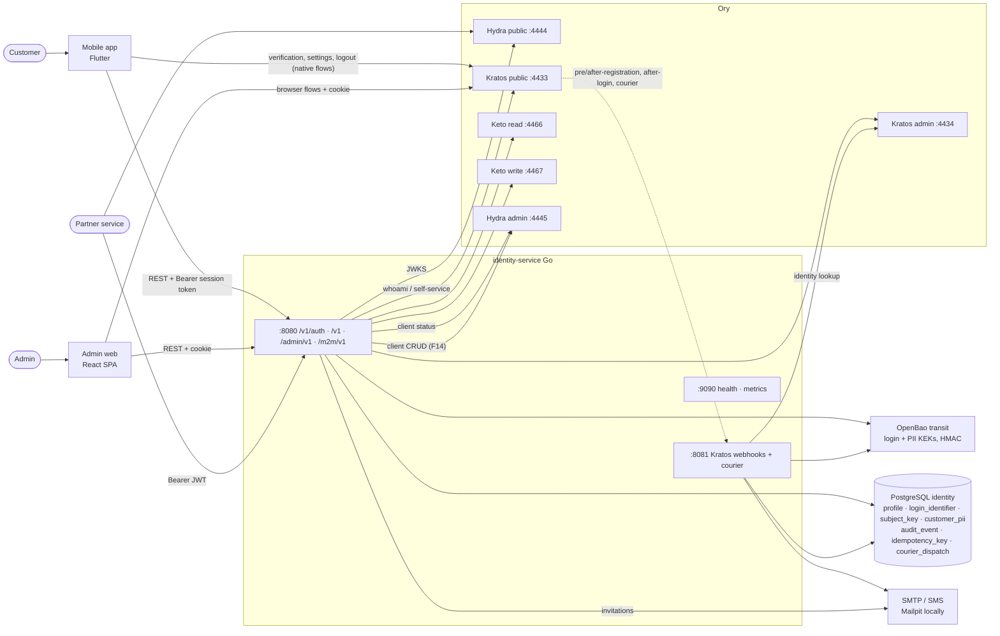
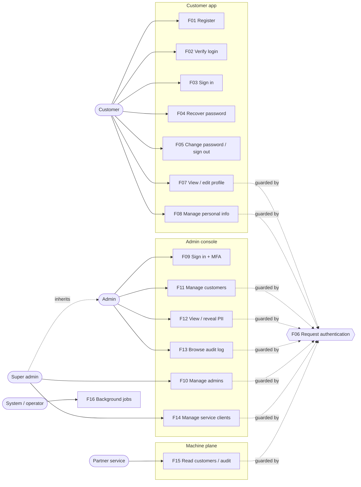

# Feature diagrams

This section has one page per feature. Each page has a **functional diagram**
(a flowchart of the decision logic) and **sequence diagrams** (who calls
whom, with real paths, Keto relations, tables and audit events). Every page
ends with `file:line` code references. The diagrams were redrawn on
2026-10-04 from the code on branch `doitsu2014/plankton`. If a diagram and
the code disagree, the code wins.

## System context



## Functional overview (use cases)



## Catalogue

| ID | Feature | Actor | Main endpoints | Audit |
| --- | --- | --- | --- | --- |
| [F01](F01-customer-registration.md) | Customer registration and code delivery | Customer | `POST /v1/auth/registration`, hooks, courier | — |
| [F02](F02-customer-verification.md) | Customer verification | Customer | Kratos verification flow | — |
| [F03](F03-customer-login.md) | Customer login | Customer | `POST /v1/auth/login` | — |
| [F04](F04-customer-recovery.md) | Customer password recovery | Customer | `POST /v1/auth/recovery`, `/recovery/code` | — |
| [F05](F05-customer-settings-logout.md) | Customer settings and logout | Customer | Kratos settings / logout | — |
| [F06](F06-request-authentication.md) | Request authentication (all planes) | All | middleware + Guard | — |
| [F07](F07-customer-profile.md) | Customer profile | Customer | `GET/PATCH /v1/me` | — |
| [F08](F08-customer-personal-info.md) | Customer personal info (PII) | Customer | `GET/PUT/DELETE /v1/me/personal-info` | `customer.pii.updated/erased` |
| [F09](F09-admin-sign-in.md) | Admin sign-in, MFA, recovery, logout | Admin | Kratos browser flows, `GET /admin/v1/me` | `admin.deactivated_mfa_deadline` |
| [F10](F10-admin-management.md) | Admin management | Super admin | `/admin/v1/admins`, `/admins/{id}/role` | `admin.invited`, `admin.role_changed` |
| [F11](F11-customer-management.md) | Customer management | Admin / support | `/admin/v1/customers…` | `customer.disabled/enabled/sessions_revoked`, lookups |
| [F12](F12-admin-pii-access.md) | Admin PII access | Admin | `…/personal-info`, `…/reveal` | `customer.pii.revealed` |
| [F13](F13-audit-log.md) | Audit log | Admin | `GET /admin/v1/audit-events` | (reads) |
| [F14](F14-service-clients.md) | Service clients | Super admin | `/admin/v1/service-clients…` | `service_client.*` |
| [F15](F15-machine-to-machine-api.md) | Machine-to-machine API | Partner service | `/m2m/v1/customers/{id}`, `/m2m/v1/audit-events` | log only |
| [F16](F16-background-jobs.md) | Background jobs and operator commands | System / operator | CLI, goroutines | migrations, erasures |

## Legend

| Alias | Component |
| --- | --- |
| MA / AW / PS | Mobile app / Admin web / Partner service |
| IS | identity-service `:8080` (public), `:8081` (webhooks) |
| KP / KA | Kratos public / admin |
| KR / KW | Keto read / write |
| HY | Hydra (public `:4444`, admin `:4445`) |
| OB | OpenBao Transit (`identity-login-pseudonym`, `identity-login-kek`, `identity-pii-kek`, `identity-pii-bidx`) |
| DB | PostgreSQL `identity` database |
| ML | SMTP / SMS (Mailpit locally) |

Grey `rect` blocks in the sequence diagrams mark one database transaction.

## Checking the diagrams

Every Mermaid block in `docs/` parses with Mermaid 11. To re-check after you
edit:

```bash
npm i mermaid jsdom   # in a scratch dir
node check.mjs docs/**/*.md   # parses each ```mermaid block with mermaid.parse under jsdom
```

Do not put `;` inside message text, because Mermaid reads it as a statement
separator.
